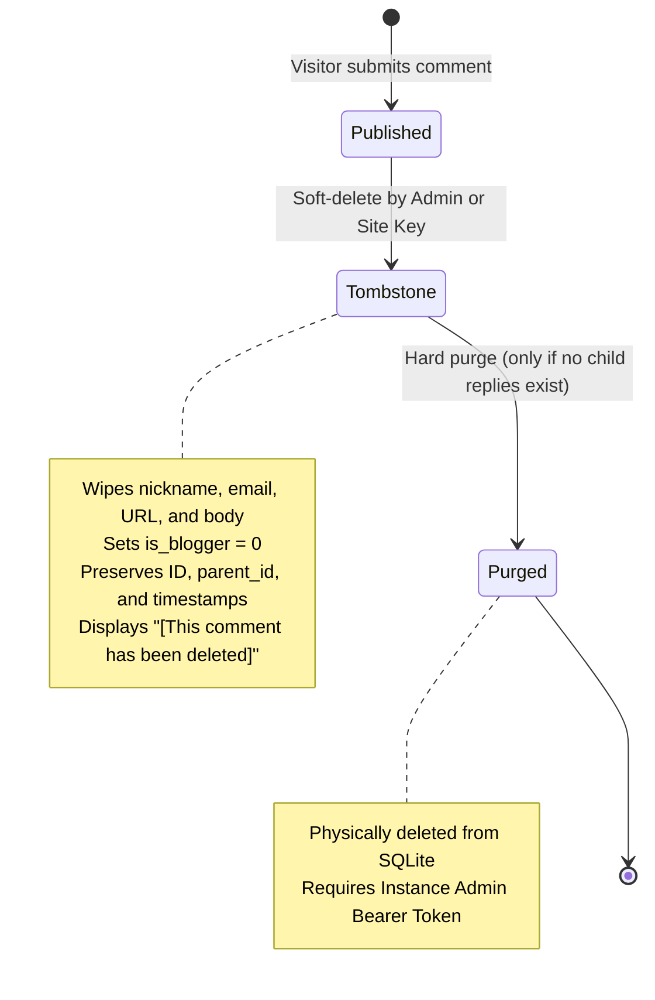
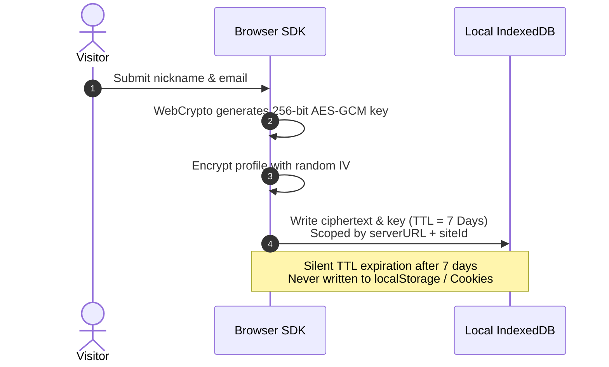
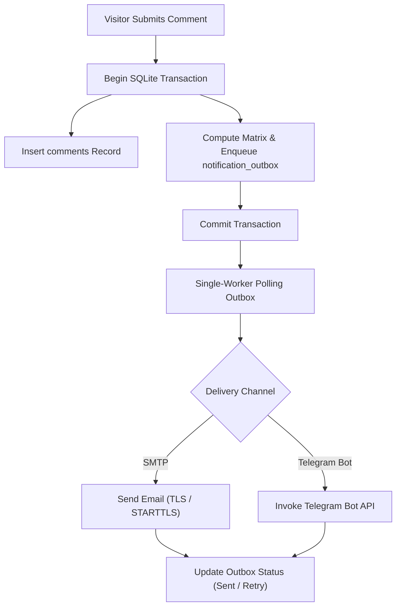

# Core Concepts & Mechanisms

This document covers Ecoku's internal models, data structures, and architectural algorithms.

---

## Threaded Comment and Pagination Model

Ecoku balances deep tree-structured discussions with mobile readability using an **Infinite Semantics + Max 3-Level Indentation** model.

### 1. Visual and Semantic Layers

```text
[Root Comment 1] (aria-level=1, indent: 0)
  ├── [Child 1.1] (aria-level=2, indent: 22px)
  │     └── [Child 1.1.1] (aria-level=3, indent: 44px)
  │           └── [Child 1.1.1.1] (aria-level=4, indent: 66px cap) -> @Child 1.1.1
```

- **Semantic Depth**: `aria-level` and `data-depth` mirror the actual nesting depth in the database for assistive technologies.
- **Visual Indentation**: Calculated as `min(depth, 3)` (up to 66px on desktop, 42px on mobile).
- **Context Anchors**: For comments at depth $\ge 3$, an `@Author` anchor is rendered in the meta header linking directly to the immediate parent comment.

### 2. Root-Thread Pagination

- `page` and `pageSize` operate strictly on root comments (`parent_id IS NULL`).
- Within the resource budget, a successful page includes **all public descendants** of its roots. Exceeding 200 nodes, 16 descendant levels, 1 MiB JSON, or the 10,000-record count probe returns 422, never a truncated tree. The current SDK shows a load failure; custom integrations can use the [single-level cursor API](../reference/api.md) on demand.
- Pagination switches the entire discussion batch rather than appending disconnected "load more" items.

---

## Tombstone Lifecycle (Soft Delete & Hard Purge)



1. **Soft Delete (Tombstone)**:
   - Erases author nickname, email, website, and raw body. Sets `deleted_at`.
   - Preserves `id` and `parent_id` so child replies retain their context.
   - Public DTO returns `deleted: true` with text `[This comment has been deleted]`.
   - Replies to tombstones are rejected.
2. **Hard Purge**:
   - Only allowed if the tombstone has **no descendant comments**.
   - Accessible only by Instance Admin (site management keys cannot hard-purge).

---

## Encrypted Visitor Identity Storage

Ecoku stores visitor credentials strictly on the client side using WebCrypto AES-GCM:



- **Isolated Namespace**: Scoped by `serverURL + "::" + siteId`.
- **Zero Disk Leakage**: Stored in IndexedDB; never written to `localStorage`, `sessionStorage`, or cookies.
- **7-Day Automatic TTL**: Decryption keys and ciphertext expire after 7 days.

---

## Blogger Passphrase Authentication

Site owners authenticate without entering private emails on public devices:

- Configured as a bcrypt hash in `sites.blogger_passphrase_hash`.
- **Usage**: The blogger simply types their secret passphrase into the **Nickname** input field.
- **Server Verification**: The server verifies the hash, replaces author fields with the configured blogger profile, sets `is_blogger = 1`, and returns the public badge.
- **Retroactive Backfill**: Saving a new passphrase triggers an atomic update backfilling `is_blogger` across all historical comments matching the blogger's nickname and email.

---

## Transactional Outbox Notifications

Ecoku guarantees notification delivery by enqueuing notification events in the same SQLite transaction that commits the comment:



| Scenario | Blogger Channels (Email/TG) | Recipient Visitor Email |
| :--- | :---: | :---: |
| **Visitor posts root comment** | ✅ Sent | — |
| **Visitor replies to visitor** | ✅ Sent | ✅ Sent |
| **Visitor replies to blogger** | ✅ Sent (once) | — |
| **Blogger posts root comment** | ❌ Not sent | — |
| **Blogger replies to visitor** | ❌ Not sent | ✅ Sent |
| **Blogger replies to blogger** | ❌ Not sent | ❌ Not sent |
| **Self-reply with same email** | — | ❌ Not sent |
