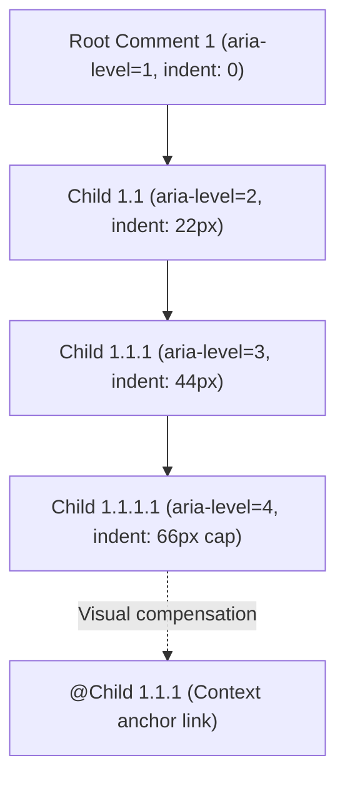
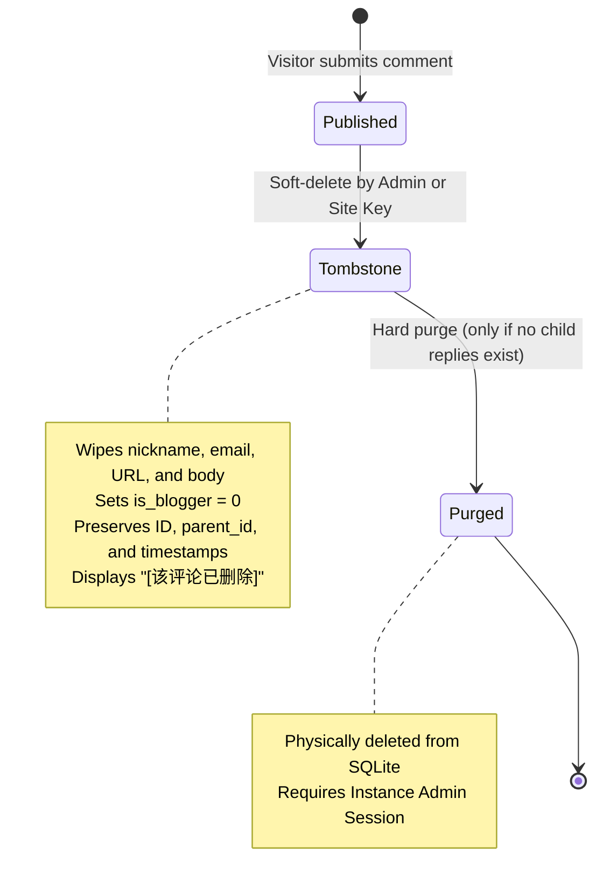
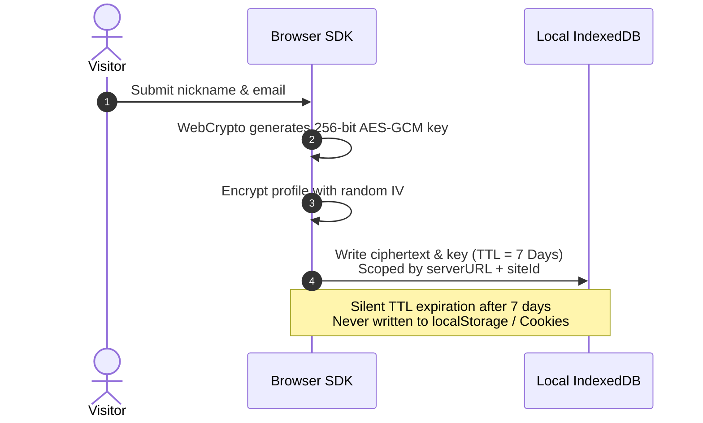
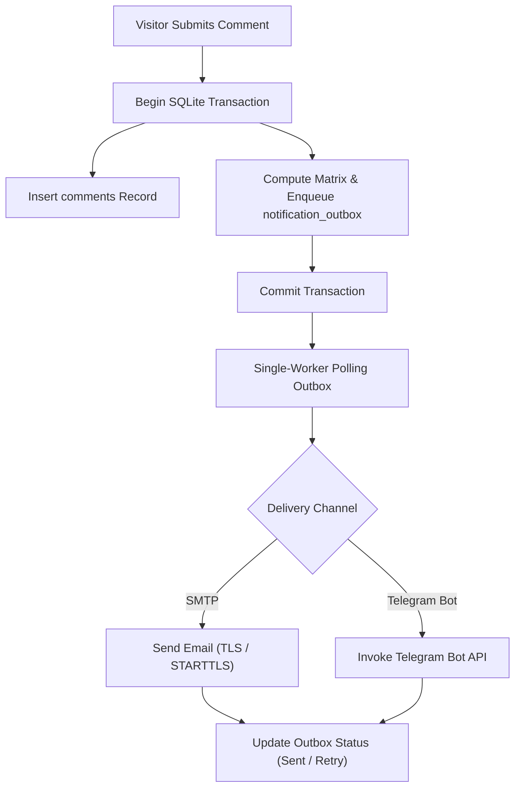

# Core Concepts & Mechanisms

This document covers Ecoku's internal models, data structures, and architectural algorithms.

---

## Threaded Comment and Pagination Model

Ecoku balances deep tree-structured discussions with mobile readability using an **Up to 16 Reply Levels + Max 3-Level Indentation** model.

### 1. Visual and Semantic Layers

- **Semantic Depth**: `aria-level` and `data-depth` mirror the actual nesting depth in the database for assistive technologies.
- **Visual Indentation**: Calculated as `min(depth, 3)` (up to 66px on desktop, 42px on mobile).
- **Context Anchors**: For comments at depth $\ge 3$, an `@Author` anchor is rendered in the meta header linking directly to the immediate parent comment.

### 2. Root-Thread Pagination

- `page` and `pageSize` operate strictly on root comments (`parent_id IS NULL`).
- Within the resource budget, a successful page includes **all public descendants** of its roots. Exceeding 200 nodes, 16 descendant levels, 1 MiB JSON, or the 10,000-record count probe returns 422, never a truncated tree. The current SDK shows a load failure; custom integrations can use the [single-level cursor API](../reference/api.md) on demand.
- Pagination switches the entire discussion batch rather than appending disconnected "load more" items.

---

## Tombstone Lifecycle (Soft Delete & Hard Purge)

1. **Soft Delete (Tombstone)**:
   - Erases author nickname, email, website, and raw body. Sets `deleted_at`.
   - Preserves `id` and `parent_id` so child replies retain their context.
   - Public DTO returns `deleted: true` with text `[该评论已删除]`.
   - Replies to tombstones are rejected.
2. **Hard Purge**:
   - Only allowed if the tombstone has **no descendant comments**.
   - Accessible only by Instance Admin (site management keys cannot hard-purge).

---

## Encrypted Visitor Identity Storage

Ecoku stores visitor credentials strictly on the client side using WebCrypto AES-GCM:

- **Isolated Namespace**: Scoped by `serverURL + "::" + siteId`.
- **Encrypted Local Storage**: Stored in IndexedDB; never written to `localStorage`, `sessionStorage`, or cookies.
- **7-Day Automatic TTL**: Saved identities are ignored after 7 days. Stored ciphertext and keys are not automatically deleted; use the browser’s site-data controls to remove them.

---

## Blogger Passphrase Authentication

Site owners authenticate without entering private emails on public devices:

- Configured as a bcrypt hash in `sites.blogger_passphrase_hash`.
- **Usage**: The blogger simply types their secret passphrase into the **Nickname** input field.
- **Server Verification**: The server verifies the hash, replaces author fields with the configured blogger profile, sets `is_blogger = 1`, and returns the public badge.
- **Historical backfill (v0.2.3)**: Limited to the original schema v5 migration and the empty-site Twikoo import transaction. Saving settings, first setting a passphrase or rotating it does not grant blogger status retroactively. Existing flags are preserved.

---

## Transactional Outbox Notifications

Ecoku guarantees notification delivery by enqueuing notification events in the same SQLite transaction that commits the comment:

| Scenario | Blogger Channels (Email/TG) | Recipient Visitor Email |
| :--- | :---: | :---: |
| **Visitor posts root comment** | ✅ Sent | — |
| **Visitor replies to visitor** | ✅ Sent | ✅ Sent |
| **Visitor replies to blogger** | ✅ Sent (once) | — |
| **Blogger posts root comment** | ❌ Not sent | — |
| **Blogger replies to visitor** | ❌ Not sent | ✅ Sent |
| **Blogger replies to blogger** | ❌ Not sent | ❌ Not sent |
| **Self-reply with same email** | — | ❌ Not sent |

---

## Session & Dynamic CSP Security Model

1. **Revocable administrator sessions**:
   - Administrator sessions use an HttpOnly cookie; SQLite stores only the credential digest and expiry. Sessions expire exactly eight hours after login. Reloading or reopening restores a valid session without extending its deadline. Logout revokes the current session on the server; a failed logout keeps the current screen and offers retry. Credentials do not enter JavaScript, localStorage, sessionStorage or URLs.
   - Production uses HTTPS and a Secure, HttpOnly, SameSite=Strict, host-only cookie scoped to `/api/admin`. Only explicitly allowed loopback HTTP development origins may omit Secure. Rotating the administrator password hash or signing key and restarting invalidates existing sessions.
2. **Dynamic Content-Security-Policy (CSP) Convergence**:
   - When self-hosted Cap is active, the server dynamically permits Cap's HTTPS instance origin, WASM, Blob Worker, and nonce-scoped `'unsafe-eval'` required by Cap's sandboxed instrumentation.
   - When switching to Turnstile or disabling CAPTCHA, the server immediately strips Cap's origins and evaluation directives, reverting to a strictly locked-down CSP baseline.

UTF-8 encoding must also fit within 72 bytes. Passphrases are never truncated; existing bcrypt hashes remain valid.
