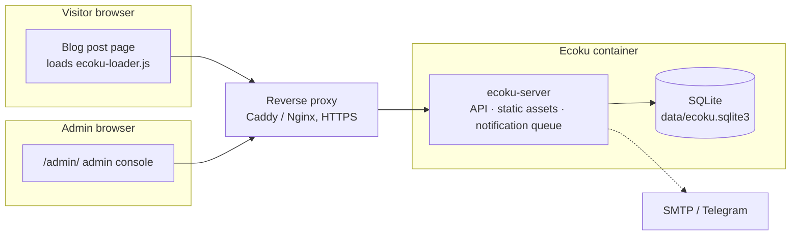

# Introduction

Ecoku is a self-hosted comment system for static blogs and personal websites. You run an Ecoku instance with Docker on your own server, add a snippet of HTML to your post template, and your pages have a comment section.

It is deliberately simple:

- **Comments are plain text only.** HTML and Markdown are not parsed, and there is no rich-text editor.
- **Comments go live on submit.** There is no moderation queue. An admin deletes inappropriate comments after the fact.
- **Visitors do not register.** They enter a nickname, an email address (which a site can make optional), and an optional website, and then they can post.
- **One instance serves multiple websites.** Each website is registered as a site in the admin console, with its own comments and settings.
- **All data lives in one SQLite file.** You do not need MySQL, Redis, or any other external service. A backup is a copy of one directory.

## Who it is for

- People who build static sites with Hugo, Hexo, Astro, VitePress, Jekyll, or similar tools and need a comment section.
- People who want to keep comment data on their own server instead of depending on a third-party comment service.
- People who run several websites and want to manage all their comments from one service.

## What it does not provide

The following features are outside the scope of Ecoku:

- Rich text, Markdown, and image uploads ([Smoji stickers](../integration/smoji) are the only form of image);
- Visitor accounts, third-party login, and avatars;
- Likes, dislikes, and emoji reactions;
- A comment moderation queue;
- MySQL, PostgreSQL, or any other database.

If you need any of these, Ecoku may not be the right fit.

## Components {#components}

The container runs a single Go program, `ecoku-server`, which handles:

- The comment API `/api/comment/*` and the admin API `/api/admin/*`;
- The admin console page `/admin/`;
- The script and styles you embed in your blog, under `/client/`;
- Sending email and Telegram notifications in the background.

The container runs as a non-root user and listens only on `127.0.0.1:12123` on the host. A reverse proxy on the same machine provides HTTPS.

## Getting started

1. [Docker deployment](../self-hosting/docker): prepare the directories, config file, and secrets, then start the container.
2. [Reverse proxy](../self-hosting/reverse-proxy): set up an HTTPS domain for Ecoku.
3. [Admin console](../self-hosting/admin): sign in, register your website, and set up the blogger identity if you want one.
4. [Embed the comment section](../integration/html): add the embed code to your post template.

After that, you can set up [notifications](../self-hosting/notifications) and [CAPTCHA](../self-hosting/captcha), or [migrate](../self-hosting/twikoo) existing comments from Twikoo.

Before you start, read [How it works](./concepts) to learn how Ecoku handles page keys, deletion, and privacy.
