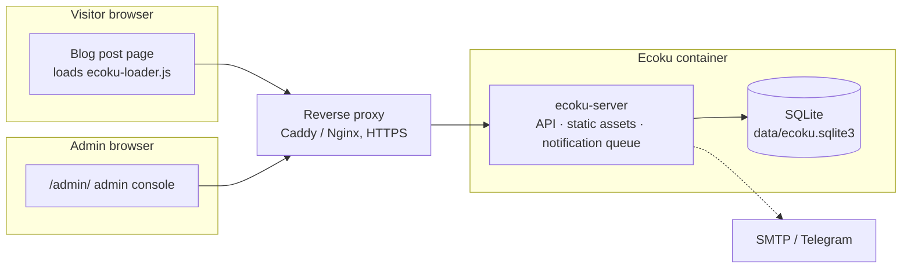

# Introduction

Ecoku is a self-hosted comment system engineered for static blogs and personal websites. Deploying a single Docker container and embedding a snippet of HTML into your page template brings live comments to your site.

The design philosophy emphasizes restraint and simplicity:

- **Plain text conversations**: HTML and Markdown are not parsed, and there is no rich-text editor.
- **Live on submit**: No moderation queue; inappropriate comments are pruned by administrators after posting.
- **No visitor accounts**: Visitors only need a nickname; email (optional by site setting) and website are optional.
- **Unified multi-site hosting**: A single instance supports multiple sites with strictly isolated comments, allowlists, and settings.
- **Embedded storage with separate secrets**: Application data resides in SQLite, while cryptographic secrets persist independently. No external database or Redis is required—a cold backup of a single directory restores the full state.

## Who it is for

- Static site creators using Hugo, Hexo, Astro, VitePress, Jekyll, or similar generators who need a streamlined comment section.
- Site owners who want full sovereignty over their comment data rather than relying on third-party commercial services.
- Operators managing multiple websites through a single consolidated backend.

## Boundaries and non-goals

The following features fall outside Ecoku's scope:

- Rich text, Markdown rendering, and user image uploads ([Smoji stickers](../integration/smoji) are the sole form of image display);
- Visitor accounts, third-party social logins, and external avatars;
- Likes, downvotes, and emoji reaction counters;
- Pre-publication moderation queues;
- MySQL, PostgreSQL, or other external databases.

If these features are essential to your workflow, Ecoku may not be the right fit.

## System architecture {#components}

The container runs a single Go binary, `ecoku-server`, which concurrently manages:

- Comment endpoints `/api/comment/*` and admin endpoints `/api/admin/*`;
- The `/admin/` management interface;
- Embeddable scripts and styles under `/client/`;
- Background asynchronous email and Telegram notification dispatching.

The container runs as an unprivileged user and listens strictly on host loopback `127.0.0.1:12123`. A co-located reverse proxy terminates HTTPS.

## Getting started

1. [Docker deployment](../self-hosting/docker): Prepare run directories and configuration; startup automatically creates administrator credentials and persistent keys.
2. [Reverse proxy](../self-hosting/reverse-proxy): Configure a reverse proxy and bind an HTTPS domain.
3. [Admin console](../self-hosting/admin): Sign in, register your site, and configure blogger credentials and form rules.
4. [Embed the comment section](../integration/html): Place the embed snippet into your blog template.

Subsequently, you can configure [notifications](../self-hosting/notifications) and [CAPTCHA](../self-hosting/captcha), or [migrate](../self-hosting/twikoo) existing comments from Twikoo.
Before deploying, review [How it works](./concepts) to understand page keys, deletion semantics, and privacy boundaries.
