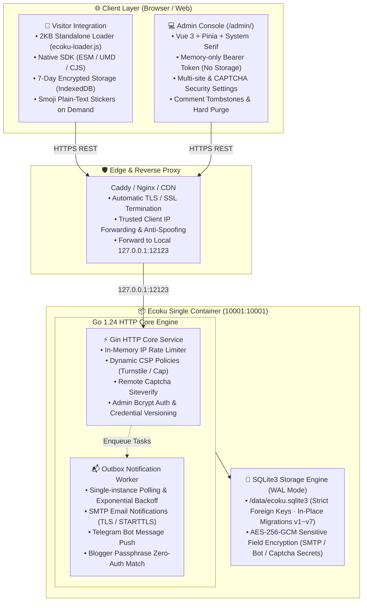

# Introduction & Architecture

Ecoku is a **self-hosted, multi-site plain-text comment system** engineered for static blogs, documentation hubs, and independent websites.

It eliminates bloated moderation queues, user registration databases, and third-party tracking services. Delivered as a single container with SQLite3, comments become live immediately after basic security checks.

---

## Design Philosophy

- **Minimal Single Container**: A single Go binary simultaneously serves the REST API, the embedded admin panel (`/admin/`), and the client SDK assets (`/client/`). SQLite3 acts as the single-file transactional storage.
- **Pure Text Conversations**: Comment bodies are never parsed as arbitrary HTML or Markdown, preventing XSS attacks by design.
- **Live on Submit**: No artificial moderation delays. Safety is maintained via in-memory rate limiting, blogger passphrases, and modern CAPTCHA (Turnstile / Cap).
- **Zero Privacy Leakage**: Public APIs never return email addresses, IP addresses, User-Agents, or internal database IDs. Visitor identity is stored strictly on the client side in IndexedDB with AES-GCM encryption for 7 days.
- **In-Place Schema Evolution**: Versioned SQLite schema migrations (v1–v7) upgrade sequentially in a single transaction without external migration binaries.

---

## Architecture Overview

---

## Scope & Boundaries

### What Ecoku Is
- Multi-site hosting from a single deployment instance.
- Direct posting with instant availability.
- Privacy-first storage with zero client-side tracking.
- Resilient notifications via SMTP (TLS/STARTTLS) and Telegram.

### What Ecoku Is Not
- ❌ **No Rich Text / Markdown Parsing**: Bodies remain pure text (except structured Smoji stickers).
- ❌ **No User Registration**: Visitors post with a nickname, private email, and optional website.
- ❌ **No Avatars, Likes, or Reactions**: No calls to Gravatar, external IP databases, or analytics scripts.
- ❌ **No MySQL / Postgres Requirement**: Built exclusively on SQLite3 with WAL mode.
