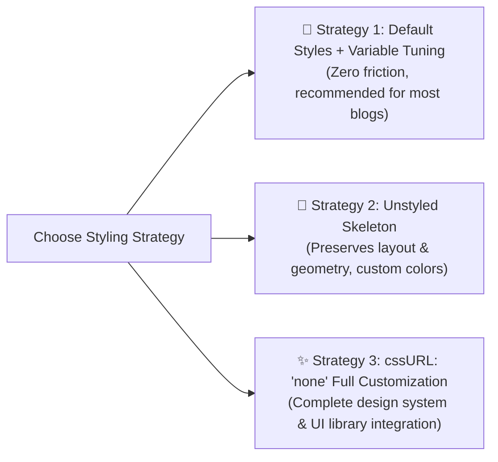

# Custom CSS & Design Tokens

Ecoku provides flexible styling strategies. You can fine-tune color schemes using native CSS custom properties, load a minimal unstyled skeleton, or build a bespoke visual presentation from scratch.

---

## Three Styling Strategies



### 1. Strategy 1: Default Styles + Variable Tuning (Recommended)
Keep `data-css-url` empty (or omitted) and override `--ecoku-*` custom properties in your site's stylesheet.

### 2. Strategy 2: Unstyled Skeleton (`ecoku.unstyled.css`)
Link `<link rel="stylesheet" href=".../client/ecoku.unstyled.css">` and set `data-css-url="none"`.
The skeleton includes Flexbox/Grid layouts, box model rules, and 3ch fixed-width geometries, stripping away all backgrounds, borders, and colors.

### 3. Strategy 3: Complete Customization (`none`)
Set `cssURL` to `'none'` and define all visual styles for `.ecoku-*` selectors in your own project.

---

## Complete Design Tokens / CSS Variables

All visual properties in Ecoku are driven by standard CSS custom properties.

> [!TIP]
> **Scoping Recommendations**:
> - If using themes like Hugo PaperMod, declaring generic variables like `--theme`, `--primary`, or `--border` on `:root` will automatically be inherited by Ecoku.
> - For scoped overrides targeting the comment widget specifically, apply `--ecoku-*` variables under the `.ecoku-comments` container selector.

```css
/* Customizing comment container variables */
.ecoku-comments {
  /* Background Color System */
  --ecoku-theme: rgb(250, 249, 245);          /* Deepest container background / Identity field fill */
  --ecoku-entry: rgb(252, 251, 247);          /* Submission card background / Button default fill */
  --ecoku-code-bg: rgb(243, 239, 231);        /* Button hover fill / Secondary badge background */
  --ecoku-surface-muted: rgba(243, 239, 231, 0.72); /* Preview area fill / Menu hover fill */

  /* Typography Color System */
  --ecoku-primary: rgb(20, 20, 19);           /* Primary text / Header title / Accent border */
  --ecoku-secondary: rgb(96, 91, 82);         /* Muted metadata (timestamps, character counter, collapse hint) */
  --ecoku-content: rgb(58, 54, 44);           /* Comment body text / Active input text */

  /* Border System */
  --ecoku-border: rgb(150, 143, 132);         /* Solid borders / Button hover outline */
  --ecoku-border-soft: rgba(20, 20, 19, 0.14);/* Subtle dividers / Card border / Input box outline */

  /* Focus Indicator (dynamically blends with primary by default) */
  --ecoku-focus: #2f73ff;                     /* Focus ring color for inputs and buttons */
}

/* Dark mode overrides */
@media (prefers-color-scheme: dark) {
  .ecoku-comments {
    --ecoku-theme: rgb(26, 29, 32);
    --ecoku-entry: rgb(34, 38, 42);
    --ecoku-code-bg: rgb(44, 48, 53);
    --ecoku-surface-muted: rgba(48, 53, 58, 0.88);

    --ecoku-primary: rgb(242, 236, 226);
    --ecoku-secondary: rgb(188, 181, 169);
    --ecoku-content: rgb(216, 209, 197);

    --ecoku-border: rgb(109, 114, 120);
    --ecoku-border-soft: rgba(242, 236, 226, 0.14);
    --ecoku-focus: #3b82f6;
  }
}
```

---

## Typography Guidelines & Baseline Alignment

To ensure harmonious visual rendering across arbitrary host fonts, Ecoku adheres to strict typographic rules:

1. **Monospace Collapse Controls (3ch Fixed Width)**:
   - The collapse button `.ecoku-collapse-button` is fixed to `3ch` width with `font-variant-numeric: tabular-nums`.
   - Toggling between expanded `[-]` and collapsed `[+]` states guarantees **zero horizontal jitter** for author nicknames, timestamps, and reply actions.
2. **Baseline Alignment**:
   - The comment meta row `.ecoku-comment-meta` uses `display: flex; align-items: baseline;`, ensuring the 14px author nickname, 12px timestamp, and underlined "Reply" action align on the identical typographic baseline.
3. **Monospace Timestamp Font Stack**:
   - Timestamps prioritize monospace fonts (host-provided Maple Mono, falling back to system monospace `ui-monospace, SFMono-Regular, Menlo, monospace`).
