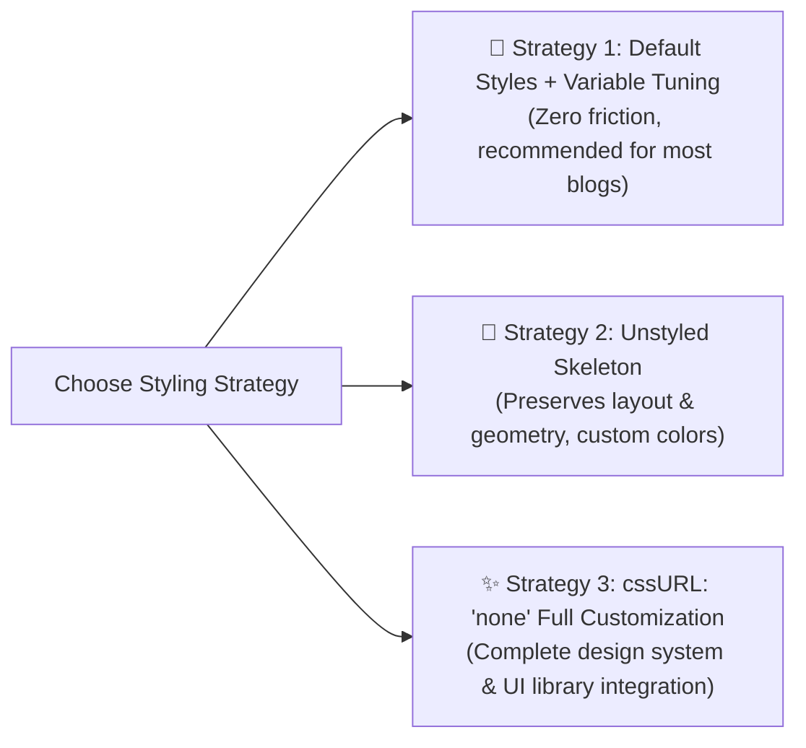

# Custom CSS & Design Tokens

Ecoku provides flexible styling strategies. You can fine-tune color schemes using native CSS custom properties, load a minimal unstyled skeleton, or build a bespoke visual presentation from scratch.

---

## Three Styling Strategies



### 1. Strategy 1: Default Styles + Variable Tuning (Recommended)
Keep `data-css-url` empty (or omitted) and override `--ecoku-*` custom properties in your site's stylesheet.

### 2. Strategy 2: Unstyled Skeleton (`ecoku.unstyled.css`)
Link `<link rel="stylesheet" href=".../client/ecoku.unstyled.css">` and set `data-css-url="none"`.
The skeleton includes Flexbox/Grid layouts, box model rules, and 3ch fixed-width geometries, stripping away all backgrounds, borders, and colors.

### 3. Strategy 3: Complete Customization (`none`)
Set `cssURL` to `'none'` and define all visual styles for `.ecoku-*` selectors in your own project.

---

## Design Tokens / CSS Variables

Colours, the accent, corner radii, shadows, the monospace font and the type scale of the default stylesheet are controlled by `--ecoku-*` custom properties.

### How overrides work

- Ecoku declares its defaults at zero specificity. Set the same variable on the comment root `.ecoku-comments` to override it; you do not need a stronger selector, and stylesheet order does not matter.
- Colour variables first read the host's PaperMod names (`--theme`, `--entry`, `--primary`, `--secondary`, `--content`, `--border`, `--border-soft`, `--code-bg`, `--surface-muted`). A PaperMod theme usually needs no extra setup.
- With `data-theme="auto"` the comment area inherits the host page's `color-scheme`, so host variables written with `light-dark()` follow the site's own light/dark toggle rather than only the operating system. When the host provides no colour variables, Ecoku uses its built-in light or dark palette based on the system preference.
- `data-theme="light"` or `"dark"` fixes the comment palette and stops reading host colour variables.

```css
/* Override comment variables in your site stylesheet */
.ecoku-comments {
  --ecoku-accent: #a8412c;        /* Blogger badge, link hover, form errors */
  --ecoku-radius: 6px;            /* Composer card, menus, sticker panel, Cap frame */
  --ecoku-radius-sm: 3px;         /* Menu items, sticker cells, Cap checkbox */
  --ecoku-font-size: 15px;        /* Comment body and inputs */
  --ecoku-font-size-small: 13px;  /* Metadata, labels, buttons */
  --ecoku-font-size-title: 22px;  /* "N 条评论" heading */
}
```

### Variable reference

| Variable | Default | Used for |
| --- | --- | --- |
| `--ecoku-theme` | `var(--theme, #f7f4ee)` | Paper background; primary button text; Cap checkbox fill |
| `--ecoku-entry` | `var(--entry, #fbf9f5)` | Composer card, service error notice, sort menu, sticker panel |
| `--ecoku-primary` | `var(--primary, #1e1c19)` | Heading, nicknames, input text, solid primary button, focused rule |
| `--ecoku-secondary` | `var(--secondary, #6b655b)` | Timestamps, character count, field labels, text buttons |
| `--ecoku-content` | `var(--content, #35312b)` | Comment body and body input |
| `--ecoku-border` | `var(--border, #cbc3b5)` | Identity field rules, secondary button border, "回复" underline |
| `--ecoku-border-soft` | `var(--border-soft, rgb(30 28 25 / 0.12))` | Card outline, thread dividers, reply guides |
| `--ecoku-surface-muted` | `var(--surface-muted, #efebe3)` | Sticker cell hover fill |
| `--ecoku-code-bg` | `var(--code-bg, #ece7de)` | Reserved for custom styles; unused by the default sheet |
| `--ecoku-accent` | Cinnabar mixed with `--ecoku-primary` | Blogger badge, link hover; darker on light pages, lighter on dark pages |
| `--ecoku-danger` | `var(--ecoku-accent)` | Form errors and invalid fields |
| `--ecoku-focus` | 40% of `--ecoku-primary` | 1px keyboard focus ring; set `transparent` to hide it |
| `--ecoku-radius` | `6px` | Cards, menus, panels and buttons |
| `--ecoku-radius-sm` | `3px` | Menu items, sticker cells and checkboxes |
| `--ecoku-shadow` | Light two-layer shadow | Sort menu and sticker panel |
| `--ecoku-font-mono` | Maple Mono, then system monospace | Timestamps, `[+]`/`[-]`, character count, page status |
| `--ecoku-font-size` | `15px` | Body text and inputs |
| `--ecoku-font-size-small` | `13px` | Metadata, labels, buttons |
| `--ecoku-font-size-title` | `22px` (`20px` on narrow screens) | Comment count heading |

The comment area inherits the host font. On touch devices inputs stay at 16px or larger so iOS does not zoom the page on focus.

---

## Typography Guidelines & Baseline Alignment

To render well with arbitrary host fonts, Ecoku follows these typographic rules:

1. **Monospace Collapse Controls (3ch Fixed Width)**:
   - The collapse button `.ecoku-collapse-button` is fixed to `3ch` width with `font-variant-numeric: tabular-nums`.
   - Toggling between expanded `[-]` and collapsed `[+]` never shifts the nickname, timestamp, or reply action horizontally.
2. **Baseline Alignment**:
   - The comment meta row `.ecoku-comment-meta` uses `display: flex; align-items: baseline;`, so the 15px nickname, 12px timestamp, and 13px underlined "回复" action share one baseline.
3. **Monospace Font Stack**:
   - Timestamps, collapse controls, the character count and page status use `--ecoku-font-mono` (host-provided Maple Mono, falling back to system monospace `ui-monospace, SFMono-Regular, Menlo, monospace`).
