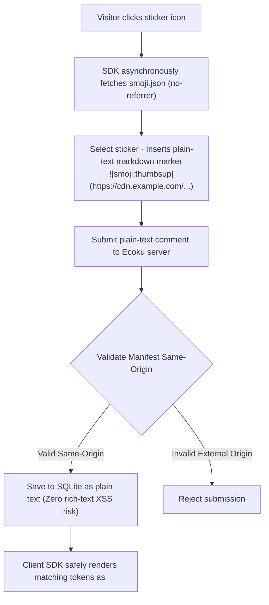

# Smoji Stickers Protocol & Self-Hosted Sources

Smoji is the **plain-text lightweight sticker protocol** adopted by Ecoku.

It balances an expressive emoji/sticker experience with strict plain-text security boundaries: stickers are stored solely as plain-text markdown tokens in the SQLite database, while client SDKs render them on demand under strict same-origin guarantees.

---

## Protocol Workflow



---

## `smoji.json` Manifest Schema Specification (v1)

To host a custom sticker source, serve a `smoji.json` file compliant with the following JSON schema at an accessible HTTPS URL:

```json
{
  "version": 1,
  "packs": [
    {
      "id": "paopao",
      "label": "PaoPao",
      "items": [
        {
          "id": "smile",
          "label": "Smile",
          "src": "https://stickers.example.com/paopao/smile.png"
        },
        {
          "id": "thumbsup",
          "label": "Thumbs Up",
          "src": "https://stickers.example.com/paopao/thumbsup.png"
        }
      ]
    }
  ]
}
```

### Field Constraints & Technical Specifications

- `version`: Must be integer `1`.
- `packs`: Array of sticker pack groupings (1–64 packs).
- `packs[].id`: Unique pack identifier (regex `/^[A-Za-z0-9][A-Za-z0-9._-]{0,63}$/`).
- `packs[].label`: Pack display name (trimmed, up to 40 characters).
- `packs[].items`: List of sticker items (1–600 items per pack; total items across the entire manifest cannot exceed 6,000).
- `items[].id`: Unique item identifier (regex `/^[A-Za-z0-9][A-Za-z0-9._-]{0,63}$/`).
- `items[].label`: Sticker display label (trimmed, 1–40 characters, no `]` or newlines).
- `items[].src`: Sticker image URL (same-origin absolute URL, or relative path resolved against `smoji.json`, no username, password, query, or hash).
- **Exact Keys Enforcement**: The JSON structure strictly permits only these keys. Any undefined or extraneous fields cause immediate validation failure.
- **Payload & Network Limits**: Manifest file size is capped at **1 MiB**. Total request-to-read timeout is 8 seconds.
- **Strict Same-Origin Enforcement**: The `src` of every sticker image **must share the exact same Origin as `smoji.json` itself**. Production manifests must use the `https://` scheme.

---

## Plain-Text Marker Syntax

- **Syntax**: ``
- **Example**: ``

### Safe Degradation Rules
If a comment contains an image marker whose origin does not match the active site manifest, or if Smoji is disabled for the site, the client SDK renders the marker verbatim as plain text. It is never interpreted as an HTML image tag, eliminating cross-site IP tracking and phishing vectors.

---

## Configuration & Asset Updates

Click the sticker button in a comment or reply form to open the picker. The panel opens above the form footer, aligned to its right edge, and shrinks to fit narrow forms. Both the default and unstyled stylesheets use this layout.

Enable Smoji in the admin console under Site Settings and enter your manifest URL. Manifest and image URLs must not contain usernames, passwords, query parameters, or hash fragments. HTTP is permitted exclusively on loopback development hosts (`localhost`). If hosting the manifest cross-origin, your resource server must allow CORS requests from your blog domain.

The "Ecoku Response Example" exported by the Smoji workbench illustrates the public endpoint's `formConfig.smoji` structure—it is not an admin import file. The admin form uses `smojiEnabled` / `smojiManifestUrl`, while the management API uses `smoji_enabled` / `smoji_manifest_url`.

Comments persist full, absolute image URLs in the database. When updating sticker assets, preserve your domain name and historical image paths. When publishing builds from the Smoji workbench, deploy the full `demo/dist` folder including compatibility copies of old assets. Replacing a manifest alone cannot repair broken URLs in historical comments. Switching to a new Origin will cause existing markers to fall back to plain-text display.

## Compact manifests (v0.2.1)

```json
{"version":1,"base":"https://s3-cdn.zsh.moe/smoji/{pack}/{id}.webp","packs":[{"id":"douyin-current","label":"抖音","items":[{"id":"fehpikklicec","label":"微笑"}]}]}
```

The optional `base` URL template must contain `{pack}` and `{id}`, expanded from the pack and item IDs. Items without `src` use this template; custom groups and other file extensions can override it with `src`. The parser still returns full URLs and comments retain their existing marker format. Legacy per-item `src` manifests remain supported; unknown fields are rejected.

Expanded images must share the manifest origin, without credentials, queries or fragments. Do not publish localhost image URLs. Local Smoji workbench exports use the configured CDN `https://s3-cdn.zsh.moe/smoji/`. Serve JSON with `application/json` or a `+json` media type. The size limit counts UTF-8 bytes; the 8-second timeout covers body reading.

v0.2.0 cannot read `base` and allows only 32 packs, 300 items per pack, 2000 total items and 256 KiB. Export a smaller per-item `src` manifest for that version; switch to compact manifests after upgrading. Publish both the manifest and assets to the CDN. Replacing JSON does not deploy application code or repair old comment URLs.
