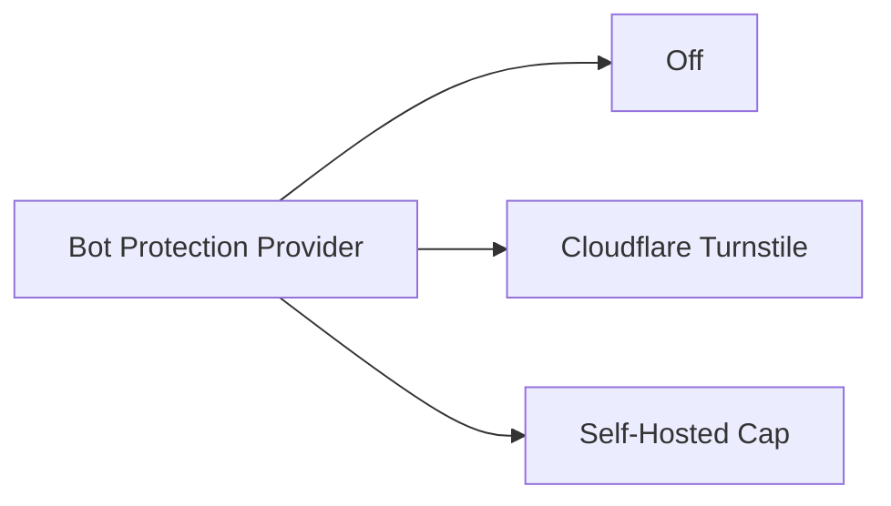

# Admin Console

The management interface is located at `/admin/`.

---

## 1. Authentication & In-Memory Session
- **Credentials**: `ECOKU_ADMIN_USERNAME` and password from `ecoku.env`.
- **In-Memory Bearer Token**: Stored strictly in JavaScript memory during runtime. Never written to `localStorage`, `sessionStorage`, or cookies. Refreshing the browser or closing the tab immediately terminates the session.
- **Session Duration**: Defaults to 8 hours (480 minutes).

---

## 2. Multi-Site Management
- **Site ID**: Unique immutable identifier used by client SDKs.
- **Canonical URL**: Base URL used to assemble comment links in emails and admin views.
- **Allowed Origins**: Strict list of `https://` origins allowed to make CORS requests.
- **Form Controls**: Configure mandatory email/website fields, placeholder text, character limits (1~10,000), and empty state text.
- **Smoji Stickers**: Enable Smoji support and provide a remote HTTPS `smoji.json` manifest URL.

---

## 3. Blogger Identity & Passphrases
- Configure blogger nickname, private email, and an optional public badge (`[Blogger]`).
- Set a secret 12~80 character passphrase.
- In the public comment form, entering the passphrase into the Nickname field authenticates the blogger without exposing their email.

---

## 4. Comment Moderation
- **Tombstone Soft-Delete**: Erases author name, email, website, and raw body while preserving comment IDs and discussion threads.
- **Hard Purge**: Only allowed on isolated tombstones with zero descendant replies.

---

## 5. Bot Protection (CAPTCHA)

Ecoku provides instance-wide bot protection supporting three states, protecting both **visitor comment submission** and **admin console login**:



> [!NOTE]
> Turnstile and Cap secret keys are encrypted with AES-256-GCM using your master key and never displayed in plaintext. Switching between providers preserves saved credentials.

### 1. Cloudflare Turnstile

[Cloudflare Turnstile Documentation](https://developers.cloudflare.com/turnstile/)

- Navigate to Cloudflare Dashboard and create a Turnstile Widget (Managed or Non-interactive mode recommended).
- Add your blog domain (e.g. `blog.example.com`) and Ecoku domain (e.g. `ecoku.example.com`) to the **Domains** whitelist.
- Copy your `Site Key` and `Secret Key`, choose **Cloudflare Turnstile** in `/admin/` -> **Security**, paste and save.
- A 300px compact widget will automatically mount on the public comment form and admin login page.

### 2. Self-Hosted Cap (Capjs)

[Cap (Capjs) Official Site](https://capjs.org/) · [GitHub Repository](https://github.com/tiago2/cap)

Cap is a modern, lightweight, privacy-focused open-source CAPTCHA service. Ecoku natively integrates with Cap, automatically adjusting admin Content-Security-Policy (CSP) headers when Cap is enabled.

#### Cap Deployment Template

Assuming deployment under `~/capjs` with Valkey as the cache backend:

```bash
# 1. Create data directories
mkdir -p ~/capjs/data/cap ~/capjs/data/valkey && cd ~/capjs

# 2. Set Valkey permissions (UID/GID 999:1000)
sudo chown -R 999:1000 data/valkey
chmod 750 data/cap data/valkey
```

Write `compose.yml` using `cat <<'EOF'`:

```bash
cd ~/capjs

cat <<'EOF' > compose.yml
services:
  cap:
    image: tiago2/cap:3.1.8
    restart: unless-stopped
    init: true
    stop_grace_period: 30s
    depends_on:
      valkey:
        condition: service_healthy
    ports:
      - "127.0.0.1:3000:3000"
    environment:
      ADMIN_KEY: ${ADMIN_KEY:?ADMIN_KEY is required}
      REDIS_URL: redis://valkey:6379
      SERVER_PORT: "3000"
      CORS_ORIGIN: ${CORS_ORIGIN:?CORS_ORIGIN is required}
      ENABLE_ASSETS_SERVER: "true"
      WIDGET_VERSION: ${WIDGET_VERSION:?WIDGET_VERSION is required}
      WASM_VERSION: ${WASM_VERSION:?WASM_VERSION is required}
    volumes:
      - ./data/cap:/usr/src/app/data
    networks:
      - public
      - data
    read_only: true
    cap_drop:
      - ALL
    security_opt:
      - no-new-privileges:true
    tmpfs:
      - /tmp:rw,noexec,nosuid,nodev,size=64m
    healthcheck:
      test:
        - CMD
        - bun
        - -e
        - "fetch('http://127.0.0.1:3000/').then(r=>process.exit(r.ok?0:1)).catch(()=>process.exit(1))"
      interval: 30s
      timeout: 5s
      retries: 5
      start_period: 20s

  valkey:
    image: valkey/valkey:9.1.1-alpine
    restart: unless-stopped
    stop_grace_period: 30s
    user: "${VALKEY_UID:?VALKEY_UID is required}:${VALKEY_GID:?VALKEY_GID is required}"
    command:
      - valkey-server
      - --save
      - "60"
      - "1"
      - --appendonly
      - "yes"
      - --appendfsync
      - everysec
      - --loglevel
      - warning
      - --maxmemory-policy
      - noeviction
    volumes:
      - ./data/valkey:/data
    networks:
      - data
    read_only: true
    cap_drop:
      - ALL
    security_opt:
      - no-new-privileges:true
    tmpfs:
      - /tmp:rw,noexec,nosuid,nodev,size=32m
    healthcheck:
      test:
        - CMD
        - valkey-cli
        - ping
      interval: 5s
      timeout: 3s
      retries: 10
      start_period: 5s

networks:
  public:
  data:
    internal: true
EOF
```

Write `.env` using `cat <<'EOF'`:

```bash
cd ~/capjs

cat <<'EOF' > .env
CAP_IMAGE=tiago2/cap:3.1.8
VALKEY_IMAGE=valkey/valkey:9.1.1-alpine

# Admin key for Cap console (generate via openssl rand -hex 32)
ADMIN_KEY=your_secure_admin_key_here

# Allowed CORS origins (blog and comment instance)
CORS_ORIGIN=https://blog.example.com,https://ecoku.example.com

# Pinned widget and WASM versions
WIDGET_VERSION=0.1.56
WASM_VERSION=0.0.7

# Valkey container UID/GID
VALKEY_UID=999
VALKEY_GID=1000
EOF

chmod 600 .env
```

#### Reverse Proxy (Caddy Example)

Cap listens on `127.0.0.1:3000`. Expose it with HTTPS:

```caddyfile
cap.example.com {
    reverse_proxy 127.0.0.1:3000
}
```

#### Connect to Ecoku

1. Start Cap: `cd ~/capjs && sudo docker compose pull && sudo docker compose up -d`.
2. Visit `https://cap.example.com` in your browser, log in with `ADMIN_KEY`.
3. Create a Key, add `blog.example.com` and `ecoku.example.com` to allowed hosts.
4. Copy the generated `Site Key` and `Secret Key`.
5. Open Ecoku Admin `/admin/` -> **Security**:
   - Select **Self-hosted Cap**
   - **Instance URL**: `https://cap.example.com` (HTTPS, no trailing slash)
   - **Site Key**: paste generated Site Key
   - **Secret Key**: paste generated Secret Key
6. Click Save.

---

## 6. Emergency Recovery (CLI)

If misconfigured CAPTCHA locks you out of the admin panel:

```bash
sudo docker compose down
sudo docker compose run --rm --no-deps ecoku captcha disable
sudo docker compose up -d
```
