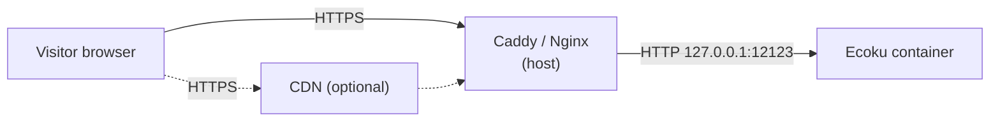

# Reverse proxy

The Ecoku container serves plain HTTP only, on `127.0.0.1:12123` on the host. For public access, Caddy or Nginx on the same host terminates HTTPS and forwards requests to this port.

This page covers two tasks:

1. Set up HTTPS forwarding so that `https://ecoku.example.com` is reachable;
2. Let Ecoku see each visitor's real IP address, so rate limits apply per person instead of all visitors sharing one quota.

## Request path



When the reverse proxy connects to `127.0.0.1:12123`, Docker hands the connection over to the container. The peer address the container sees is not the visitor but the gateway of the Docker bridge network (usually something like `172.18.0.1`). The visitor's real IP address can therefore only reach Ecoku through the `X-Forwarded-For` request header written by the reverse proxy, and Ecoku reads that header only when it has confirmed that the request really comes from this gateway.

## Direct to origin

### Caddy

Caddy obtains and renews certificates automatically.

```caddyfile
ecoku.example.com {
    encode zstd gzip

    reverse_proxy 127.0.0.1:12123 {
        # Overwrite with the direct peer address, discarding any X-Forwarded-For sent by the browser
        header_up X-Forwarded-For {remote_host}
        header_up X-Forwarded-Proto {scheme}
    }
}
```

### Nginx

The certificate paths use Certbot's default locations as an example.

```nginx
server {
    listen 443 ssl;
    listen [::]:443 ssl;
    http2 on;
    server_name ecoku.example.com;

    ssl_certificate     /etc/letsencrypt/live/ecoku.example.com/fullchain.pem;
    ssl_certificate_key /etc/letsencrypt/live/ecoku.example.com/privkey.pem;

    gzip on;
    gzip_types text/plain text/css application/json application/javascript;

    location / {
        proxy_pass http://127.0.0.1:12123;
        proxy_set_header Host $host;
        # Overwrite instead of append: $remote_addr is the current TCP peer
        proxy_set_header X-Forwarded-For $remote_addr;
        proxy_set_header X-Forwarded-Proto $scheme;
    }
}
```

The key point in both configs is that they **overwrite** `X-Forwarded-For`. If you append instead (such as Nginx's `$proxy_add_x_forwarded_for`), a browser can send its own forged value and bypass rate limiting.

## Through a CDN

Once your domain is behind a CDN such as Cloudflare, the reverse proxy's direct peer becomes a CDN node. You then need to take the visitor IP from a request header provided by the CDN. For example, with Cloudflare and Caddy:

```caddyfile
ecoku.example.com {
    encode zstd gzip

    reverse_proxy 127.0.0.1:12123 {
        header_up X-Forwarded-For {http.request.header.CF-Connecting-IP}
        header_up X-Forwarded-Proto {scheme}
    }
}
```

`CF-Connecting-IP` can be trusted only when the request really went through Cloudflare. In your firewall or in Caddy, allow only Cloudflare's IP ranges, so nobody can connect to the origin directly and set this header themselves.

The Ecoku side of the config does not change: `trusted_proxies` still contains only the Docker gateway. Do not add the CDN's ranges to it.

## Configure trusted_proxies {#trusted-proxies}

`site.trusted_proxies` in `app/config.yaml` decides whose `X-Forwarded-For` Ecoku trusts:

- **Empty (default)**: no forwarding headers are read, and rate limits always use the peer address the container sees. Behind a reverse proxy, that address is the Docker gateway, so all visitors share the same rate limit quota. By default only 5 comment submissions per minute are allowed, so even modest traffic will get some visitors a `429`.
- **Set to the Docker gateway**: the visitor IP is taken from `X-Forwarded-For` only when the direct peer is exactly the gateway.

Find the gateway of the network Ecoku is on:

```bash
sudo docker inspect ecoku --format '{{range .NetworkSettings.Networks}}{{.Gateway}}{{"\n"}}{{end}}'
```

If the output is `172.18.0.1`, add this to `app/config.yaml`:

```yaml
site:
  trusted_proxies:
    - "172.18.0.1/32"
```

Then restart the container:

```bash
cd ~/Ecoku && sudo docker compose up -d --force-recreate ecoku
```

::: danger
Do not use `0.0.0.0/0` or `::/0`. Ecoku refuses to start with them. Trusting every source means letting anyone forge an IP address.
:::

## Check

Run this on any machine with internet access:

```bash
for path in /api/health /client/ecoku-loader.js /admin/; do
  curl -sS -o /dev/null -w "%{http_code} $path\n" "https://ecoku.example.com$path"
done
```

All three lines should start with `200`. It is fine to expose the health endpoint publicly; it returns only a status and a timestamp.

Once everything checks out, open `https://ecoku.example.com/admin/` and continue with [setting up the admin console](./admin).
