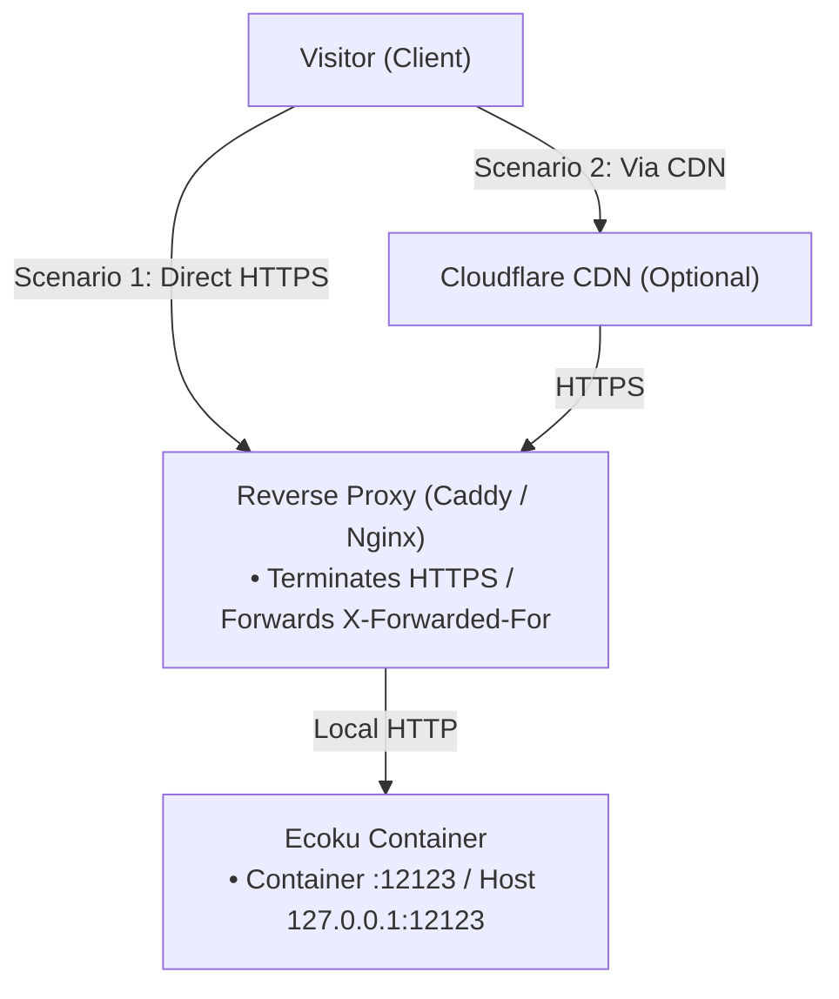

# Reverse Proxy & Rate Limiting

Ecoku listens on `:12123` inside the container; Compose publishes the port only on the host loopback `127.0.0.1:12123`. In production, a front-end web server (such as Caddy or Nginx) must terminate HTTPS and reverse-proxy requests to the container port.

---

## Network Topology Model



---

## Scenario 1: Direct Origin Reverse Proxy

### Caddy (Recommended)

Caddy provides automatic TLS certificate provisioning and renewal with minimal configuration:

```caddyfile
ecoku.example.com {
    encode zstd gzip

    reverse_proxy 127.0.0.1:12123 {
        # Force overwrite X-Forwarded-For with the direct peer IP to prevent client header spoofing
        header_up X-Forwarded-For {remote_host}
        header_up X-Forwarded-Proto {scheme}
    }
}
```

### Nginx

```nginx
server {
    listen 443 ssl http2;
    server_name ecoku.example.com;

    ssl_certificate /etc/letsencrypt/live/ecoku.example.com/fullchain.pem;
    ssl_certificate_key /etc/letsencrypt/live/ecoku.example.com/privkey.pem;

    # Enable Gzip compression
    gzip on;
    gzip_types text/plain text/css application/json application/javascript;

    location / {
        proxy_pass http://127.0.0.1:12123;
        proxy_set_header Host $host;
        # Overwrite X-Forwarded-For with the direct TCP peer IP
        proxy_set_header X-Forwarded-For $remote_addr;
        proxy_set_header X-Forwarded-Proto $scheme;
    }
}
```

---

## Scenario 2: Reverse Proxy via CDN (e.g. Cloudflare)

When traffic passes through Cloudflare CDN, the direct TCP peer is a Cloudflare edge node. Configure your reverse proxy to extract the authenticated visitor IP injected by the CDN into `X-Forwarded-For`.

### Cloudflare + Caddy

```caddyfile
ecoku.example.com {
    encode zstd gzip

    reverse_proxy 127.0.0.1:12123 {
        # Forward Cloudflare-authenticated real visitor IP into X-Forwarded-For
        header_up X-Forwarded-For {http.request.header.CF-Connecting-IP}
        header_up X-Forwarded-Proto {scheme}
    }
}
```

> [!WARNING]
> - When using a CDN, your origin firewall must strictly allow incoming connections from Cloudflare IP ranges only, preventing attackers from bypassing CDN protection via your origin IP.
> - In Ecoku's `trusted_proxies` configuration, **still only specify the local Docker gateway IP**. Never add wide CDN ranges into `trusted_proxies`.

---

## Client IP Determination & `trusted_proxies`

Ecoku includes built-in protection against IP spoofing:

1. **Default Zero-Trust**: If `trusted_proxies` is empty (`[]`), Ecoku does not parse incoming `X-Forwarded-For` headers. All requests are attributed to the direct TCP socket peer IP (usually the reverse proxy gateway IP), meaning all visitors share a single rate-limit bucket.
2. **Exact Trust Matching**: Only when the direct TCP peer IP **strictly matches** an IP or CIDR declared in `trusted_proxies` will Ecoku parse `X-Forwarded-For` to isolate client IPs for per-visitor rate limiting.

### Query Docker Gateway IP

Run the following command on your host to find the container's bridge network gateway:

```bash
sudo docker inspect ecoku --format '{{range .NetworkSettings.Networks}}{{.Gateway}}{{"\n"}}{{end}}'
```

If the output is `172.18.0.1`, configure `app/config.yaml` as follows:

```yaml
site:
  trusted_proxies:
    - "172.18.0.1/32"
```

> [!CAUTION]
> Never configure `0.0.0.0/0` or `::/0` in `trusted_proxies`. Doing so allows any external request to bypass rate limiting via forged `X-Forwarded-For` headers.

---

## Connectivity Verification

```bash
# Verify reverse proxy health check endpoint
curl -i https://ecoku.example.com/api/health

# Verify client SDK loader script
curl -i https://ecoku.example.com/client/ecoku-loader.js

# Verify admin console entry point
curl -i https://ecoku.example.com/admin/
```
