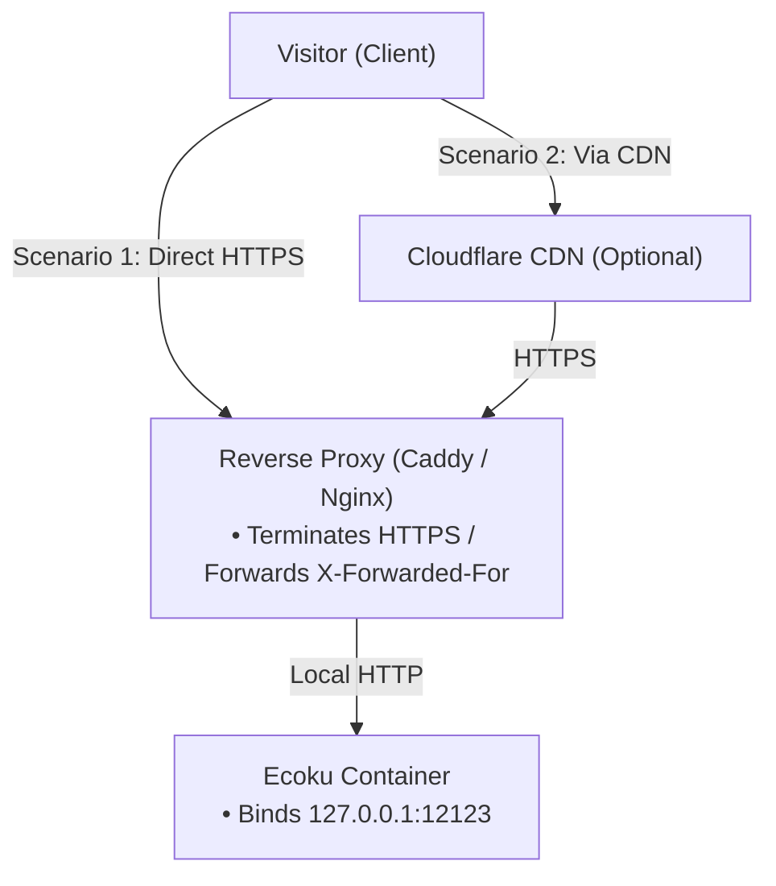

# Reverse Proxy & Rate Limiting

Ecoku binds exclusively to `127.0.0.1:12123`. A front-end web server (Caddy / Nginx) must terminate HTTPS.

---

## Network Topology Model



---

## Direct Origin Proxy (Caddy & Nginx)

### Caddy (Recommended)

```caddyfile
ecoku.example.com {
    encode zstd gzip

    reverse_proxy 127.0.0.1:12123 {
        header_up X-Forwarded-For {remote_host}
        header_up X-Forwarded-Proto {scheme}
    }
}
```

### Nginx

```nginx
server {
    listen 443 ssl http2;
    server_name ecoku.example.com;

    ssl_certificate /etc/letsencrypt/live/ecoku.example.com/fullchain.pem;
    ssl_certificate_key /etc/letsencrypt/live/ecoku.example.com/privkey.pem;

    location / {
        proxy_pass http://127.0.0.1:12123;
        proxy_set_header Host $host;
        proxy_set_header X-Forwarded-For $remote_addr;
        proxy_set_header X-Forwarded-Proto $scheme;
    }
}
```

---

## Proxy via Cloudflare CDN

```caddyfile
ecoku.example.com {
    encode zstd gzip

    reverse_proxy 127.0.0.1:12123 {
        header_up X-Forwarded-For {http.request.header.CF-Connecting-IP}
        header_up X-Forwarded-Proto {scheme}
    }
}
```

---

## `trusted_proxies` Configuration

Ecoku ignores `X-Forwarded-For` unless the incoming TCP connection matches a CIDR listed in `trusted_proxies`:

```bash
# Retrieve Docker network gateway IP
sudo docker inspect ecoku --format '{{range .NetworkSettings.Networks}}{{.Gateway}}{{"\n"}}{{end}}'
```

Add the gateway to `app/config.yaml`:

```yaml
site:
  trusted_proxies:
    - "172.18.0.1/32"
```
