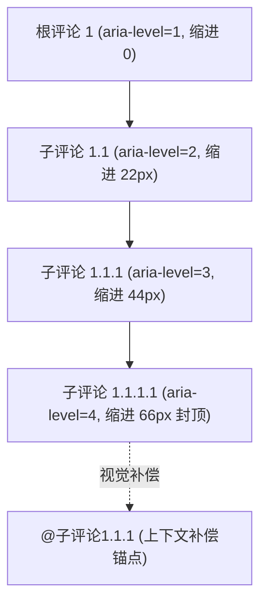
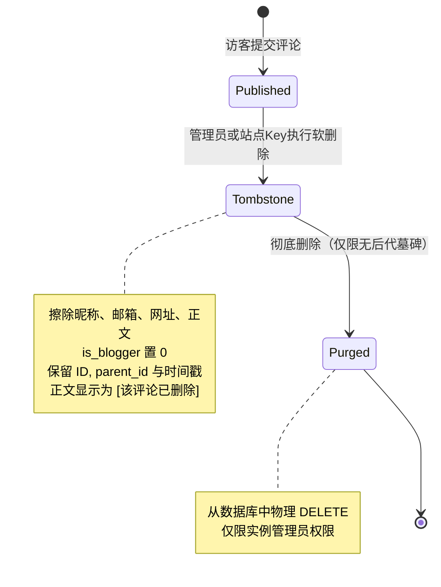
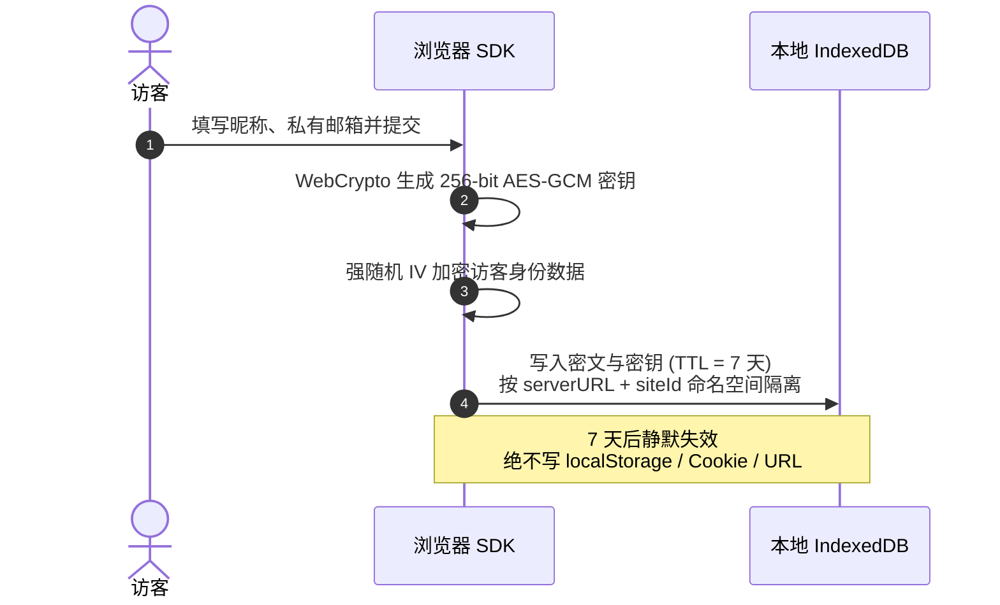
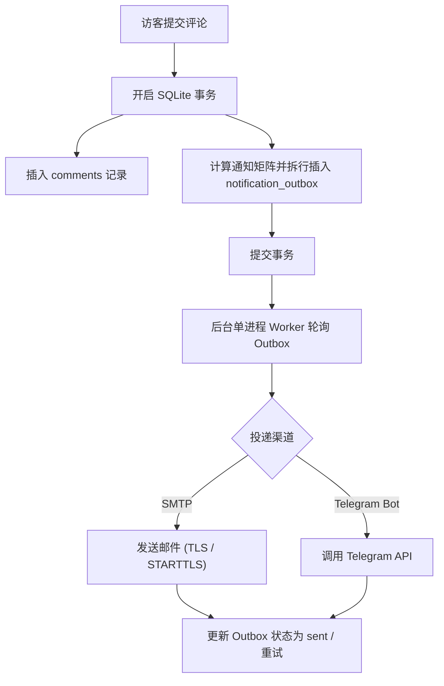

# 核心机制与设计模型

Ecoku 的设计围绕**轻量化**、**纯文本直接发布**、**强隐私边界**与**极简运维**展开。本篇深入介绍 Ecoku 的核心设计哲学与运行机制。

---

## 树状评论与分页模型

传统评论系统往往面临两难选择：扁平化流式评论丢失了对话上下文，而多层嵌套评论在移动端易产生无限缩进排版崩溃。Ecoku 提出了**“无限语义层级 + 最多 3 级视觉缩进”**的设计方案。

### 1. 语义与视觉分层

- **语义层级（Semantic Level）**：DOM 元素的 `aria-level` 与 `data-depth` 真实反映树的物理嵌套深度（1, 2, 3, 4, 5...），确保屏幕阅读器等无障碍设备能准确理解对话层级。
- **视觉缩进（Visual Indent）**：在视觉呈现上，缩进层级通过 CSS 计算公式 `min(depth, 3)` 截断在第 3 级（桌面端每级 22px，最大 66px；移动端每级 14px，最大 42px）。
- **上下文补偿（Context Compensation）**：当嵌套深度达到第 3 级及以上时，评论元信息行中会自动添加可点击的 `@被回复者` 锚点链接，直达父级评论。这既避免了深层回复在窄屏上被挤压成细条，又保证了对话脉络清晰可辨。

### 2. 根线程分页算法

为了防止“加载更多”瀑布流导致回复上下文被割裂，Ecoku 采用**按根线程分页**模型：

- 分页参数 `page` 与 `pageSize` 仅作用于顶层根评论（`parent_id IS NULL`）。
- 预算内的成功响应**完整包含**当前页根评论的公开后代。超过 200 个节点、16 层后代、1 MiB JSON 或 10,000 条统计记录时返回 422，不截断；现有 SDK 显示加载失败。大页面可由自定义接入使用[单层游标 API](../reference/api.md)按需读取。
- 翻页操作切换的是整批讨论树，保证用户阅读任意一条根讨论时，都能看到完整的对话全貌。

---

## 墓碑机制（Soft Delete & Purge）

在公开讨论区中，直接物理删除某条父评论会导致其下所有子回复瞬间成为“孤儿节点”，上下文彻底断裂。Ecoku 采用严密的**墓碑化（Tombstone）**机制：

1. **墓碑化（软删除）**：
   - 擦除昵称、私有邮箱、网址与原始正文，将 `is_blogger` 置为 0，设置 `deleted_at` 时间戳。
   - 保留评论 ID、页面 key、`parent_id` 引用关系。
   - 公开接口返回 `deleted: true`，固定昵称“已删除”，固定正文内容为 `[该评论已删除]`。
   - 墓碑节点**禁止新增回复**。
2. **彻底删除（物理清除）**：
   - 仅当且仅当一个墓碑节点**没有任何子评论**（无论是公开评论还是其他墓碑）时，实例管理员才可执行物理清除。
   - 站点自动化 Management Key 仅有权将本站评论墓碑化，无权执行彻底物理删除。

---

## 访客身份加密存储

Ecoku 绝不使用可能跨站泄漏或被脚本轻易读取的 `localStorage` 或 Cookie 存储访客个人信息。

- **隔离命名空间**：基于 `serverURL + "::" + siteId` 进行独立存储隔离。
- **端到端加密**：使用浏览器原生 Web Crypto API 生成不可导出的 256 位 AES-GCM 密钥，配合强随机 IV 加密身份信息。
- **自动生命周期**：本地数据有效期严格设定为 7 天。过期或数据损坏时静默回退为空身份，不残留任何隐私痕迹。

---

## 博主身份与口令机制

为了避免博主在公开设备上输入私有邮箱，Ecoku 引入了基于 **Passphrase（博主口令）** 的免密证明机制：

- **口令配置**：管理员在后台为站点设置 12～80 字符的博主口令。服务端仅保存其 bcrypt 哈希，管理端永不回显明文。
- **发表流程**：
  1. 博主在评论区发表时，**只需在“昵称”输入框中输入该口令**，无需填写邮箱或网址。
  2. 服务端在提交事务中校验口令哈希，一旦命中，自动将作者昵称重写为站点配置的博主昵称，邮箱重写为博主私有邮箱，网址指向站点规范 URL，并标记 `is_blogger = 1`。
  3. 客户端提交成功后自动清空输入框，防止口令停留在浏览器界面。
- **历史回填**：当在后台保存新的博主口令时，服务端会在事务中自动按博主昵称与邮箱匹配，一键回填历史所有未删除评论的 `is_blogger` 属性。

---

## Outbox 事务一致性通知

Ecoku 将通知事件与评论写入绑定在同一个 SQLite 事务中，杜绝了由于网络波动或外部服务宕机导致的通知丢失。

### 通知判定矩阵

系统依据持久化存储的 `is_blogger` 标记执行通知分发：

| 触发场景 | 博主通知渠道（邮件/Telegram） | 被回复访客邮件通知 |
| :--- | :---: | :---: |
| **访客发表根评论** | ✅ 发送 | — |
| **访客回复访客** | ✅ 发送 | ✅ 发送 |
| **访客回复博主** | ✅ 发送（仅通知一次） | — |
| **博主发表根评论** | ❌ 不发送 | — |
| **博主回复访客** | ❌ 不发送 | ✅ 发送 |
| **博主回复博主** | ❌ 不发送 | ❌ 不发送 |
| **同一邮箱回复自己** | — | ❌ 不发送 |

---

## 会话与动态 CSP 安全模型

1. **管理员内存会话（In-Memory Session）**：
   - 管理端登录后获得的 Bearer Token 仅保存在 Vue 内存中，不写入任何本地持久化存储。
   - 刷新页面或关闭标签页后，会话立即销毁。
   - Token 携带管理员凭据哈希版本（`cv`），一旦修改密码哈希，所有历史已签发 Token 立即全部失效。
2. **严格动态收敛的 Content-Security-Policy**：
   - 当启用自托管 Cap 时，服务端动态放行 Cap HTTPS 实例来源、WASM、Blob Worker 与 `'unsafe-eval'`。
   - 当切换为 Turnstile 或关闭验证时，服务端立即剥离 Cap 域名与所有动态求值权限，CSP 严格降级。
