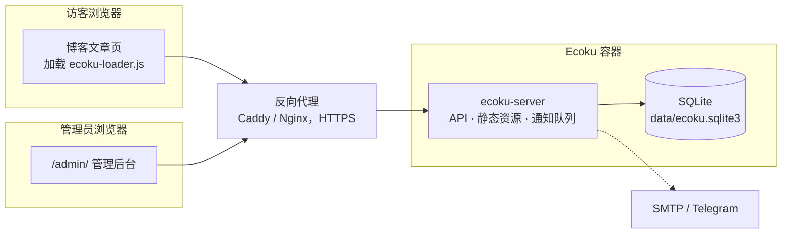

# 简介

Ecoku 是一个自托管的评论系统，适合静态博客和个人网站。你在自己的服务器上用 Docker 运行一个 Ecoku 实例，在文章模板里加一段 HTML，页面上就有了评论区。

它刻意保持简单：

- **评论只有纯文本**。不解析 HTML 和 Markdown，没有富文本编辑器。
- **提交后直接公开**。没有审核队列，不当的评论由管理员事后删除。
- **访客不用注册**。填昵称、邮箱（可设为选填）和可选的网址就能发言。
- **一个实例服务多个网站**。每个网站在后台注册为一个站点，评论和设置互相独立。
- **业务数据存于 SQLite，密钥单独保存**。核心服务不依赖外部数据库或 Redis；备份时一起保存整个 `data/`、Compose 和实例配置。

## 适合谁

- 用 Hugo、Hexo、Astro、VitePress、Jekyll 等生成静态网站，需要一个评论区的人。
- 想把评论数据留在自己服务器上，不想依赖第三方评论服务的人。
- 有几个网站，希望用一套服务统一管理评论的人。

## 不提供什么

以下功能不在 Ecoku 的范围内：

- 富文本、Markdown、图片上传（[Smoji 表情](../integration/smoji)是唯一的图片形式）；
- 访客账号、第三方登录、头像；
- 点赞、反对、表情回应；
- 评论审核队列；
- MySQL、PostgreSQL 等其他数据库。

如果你需要其中某项，Ecoku 可能不适合你。

## 组成 {#components}

一个容器里只有一个 Go 程序 `ecoku-server`，它同时负责：

- 评论接口 `/api/comment/*` 和管理接口 `/api/admin/*`；
- 管理后台页面 `/admin/`；
- 嵌入博客用的脚本和样式 `/client/`；
- 在后台发送邮件和 Telegram 通知。

容器以非 root 用户运行，只在宿主机 `127.0.0.1:12123` 上监听，由同一台机器上的反向代理提供 HTTPS。

## 上线步骤

1. [Docker 部署](../self-hosting/docker)：准备目录和实例配置，启动后自动生成管理员与密钥。
2. [反向代理](../self-hosting/reverse-proxy)：为 Ecoku 配置 HTTPS 域名。
3. [管理后台](../self-hosting/admin)：登录，注册你的网站，按需设置博主身份。
4. [嵌入评论区](../integration/html)：在文章模板中加入接入代码。

之后可以按需配置[通知](../self-hosting/notifications)、[人机验证](../self-hosting/captcha)，或[从 Twikoo 迁移](../self-hosting/twikoo)历史评论。

开始之前，建议先读[工作方式](./concepts)，了解页面 key、删除和隐私的处理方式。
