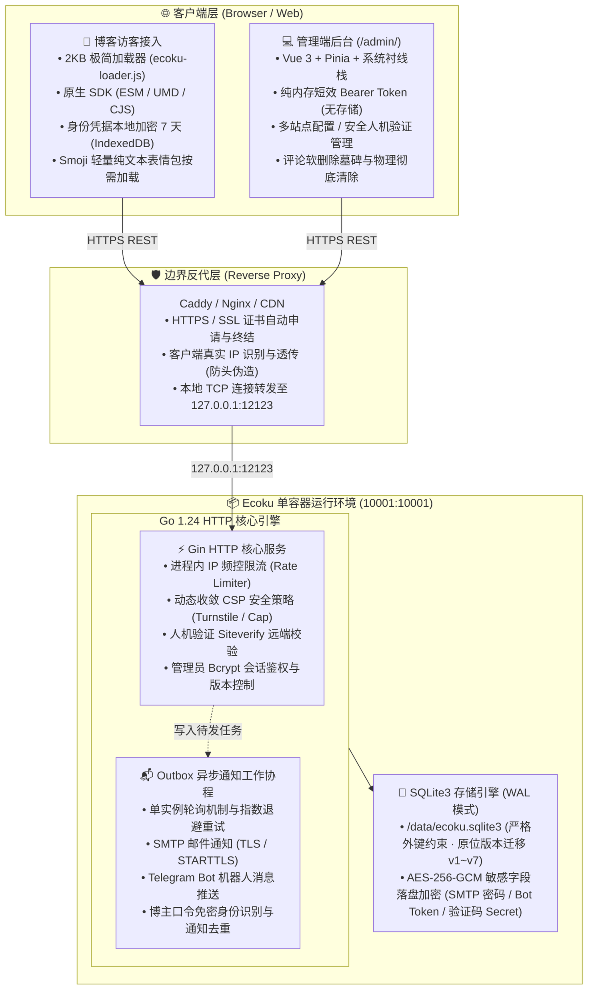

# 简介与系统架构

Ecoku 是一个专为静态博客与内容驱动型站点设计的**自托管、多站点纯文本评论系统**。

它摒弃了繁重的审核队列、复杂的用户中心与外部依赖，以单容器 + SQLite3 的极致轻量化形态交付。评论一旦提交，通过安全检查后立即面向公众呈现。

---

## 核心设计哲学

- **极简拓扑**：单个 Docker 容器同时托管 Go API、静态管理后台（`/admin/`）与浏览器 SDK（`/client/`），数据单文件落盘于 SQLite3，无附加 Redis/MySQL 依赖。
- **纯文本交流**：正文永不解析 HTML 或 Markdown，杜绝 XSS 注入风险，回归评论讨论的本质。
- **提交即公开**：无前置人工审核队列，依靠 IP 频控限流、博主口令与现代化人机验证（Turnstile / Cap）维护讨论秩序。
- **强隐私边界**：公共 API 绝不输出邮箱、IP、User-Agent、地区或数据库内部 ID；访客身份仅在本地 IndexedDB 加密保存 7 天。
- **事务性升级**：Schema 原位版本化演进（v1～v7），单向迁移，杜绝破坏性重构。

---

## 系统架构全景

---

## 适用场景与产品边界

### 适合什么

- **多站点统一托管**：单个 Ecoku 实例可同时为多个独立域名或子站点提供隔离的评论服务。
- **静态博客与文档站**：完美适配 Hugo、Hexo、Astro、VitePress、Next.js、SvelteKit 等现代静态站点生成器。
- **尊重隐私的个人创作者**：将评论数据完全掌握在自己的服务器上，不依赖第三方云端或闭源服务。
- **灵活的人机防护**：支持在纯粹 IP 限流、Cloudflare Turnstile 与完全自托管的 Cap 验证码之间自由切换。

### 不提供什么

为了保持极简与纯粹，Ecoku 明确将以下特性排除在产品范围之外：

- ❌ **富文本与 Markdown 渲染**：评论正文永久按纯文本处理，不渲染图片标签（除规范的 Smoji 表情外）、不解析 HTML。
- ❌ **普通用户注册与登录系统**：访客无需注册账号，仅以昵称、私有邮箱和可选网站发表。
- ❌ **点赞、踩、表态与头像服务**：不请求任何第三方 Gravatar / IP / 分析服务，减少外部网络依赖与追踪。
- ❌ **前置审核队列**：所有合规评论即发即显，管理者通过软删除墓碑进行事后治理。
- ❌ **MySQL / PostgreSQL 适配**：专注 SQLite3 的单机高可靠性，不维护多数据库驱动兼容层。

---

## 部署概览

Ecoku 镜像采用非 root 用户（`10001:10001`）运行，对外仅监听本地回环 `127.0.0.1:12123`。

1. **准备环境**：配置 `compose.yaml`、`app/config.yaml` 与 `ecoku.env`。
2. **反向代理**：通过 Caddy 或 Nginx 配置域名与 HTTPS 证书并反代至本地端口。
3. **管理后台**：访问 `/admin/` 完成站点注册、博主口令与通知配置。
4. **页面接入**：在博客模板中引入 2KB 的 `ecoku-loader.js` 即可完成接入。

详细部署指引请参阅 [Docker 部署](/self-hosting/docker)。
