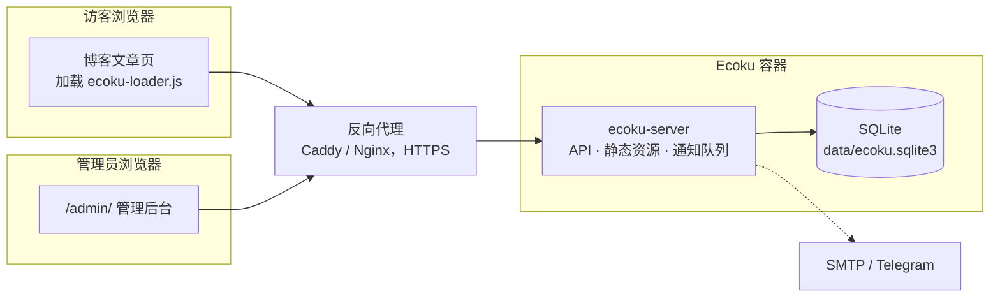

# 简介

Ecoku 是专为静态博客与个人网站设计的自托管评论系统。通过 Docker 部署单个容器，并在页面模板中嵌入一段 HTML，即可完成接入。

设计原则保持克制与精简：

- **纯文本讨论**：不解析 HTML 与 Markdown，无富文本编辑器。
- **提交即公开**：无前置审核队列，违规评论由管理员事后清理。
- **无需注册**：访客无需账号，填写昵称、邮箱（默认必填，可改为选填）与网址（默认选填）即可发言。
- **多站点统一服务**：单实例支持多站点，各站点的评论数据与站点设置相互隔离。
- **单库存储与密钥分离**：业务数据集中于 SQLite，密钥独立持久化；无需外部数据库或 Redis，冷备部署目录即可完整恢复。

## 适用场景

- 使用 Hugo、Hexo、Astro、VitePress、Jekyll 等工具构建静态网站，需要轻量评论区。
- 希望将评论数据完全掌握在自己手中，摆脱第三方商业评论服务依赖。
- 维护多个站点，希望由单套服务统一托管。

## 功能边界

以下特性不属于 Ecoku 的设计范畴：

- 富文本、Markdown 渲染与图片上传（[Smoji 表情](../integration/smoji) 是唯一的图片展示形式）；
- 访客账户体系、第三方社交登录与外部头像；
- 点赞、踩或表情互动计数；
- 评论前置审核队列；
- MySQL、PostgreSQL 等外部数据库。

如果上述功能是你的硬性需求，Ecoku 可能并不适用。

## 系统组成 {#components}

容器内仅运行一个 Go 二进制程序 `ecoku-server`，统一负责：

- 评论接口 `/api/comment/*` 与管理接口 `/api/admin/*`；
- 管理后台 `/admin/` 界面；
- 博客嵌入脚本与样式资源 `/client/`；
- 异步邮件与 Telegram 通知投递队列。

容器以非 root 用户运行，仅监听宿主机回环地址 `127.0.0.1:12123`，由同机反向代理负责 HTTPS 终结。

## 上线步骤

1. [Docker 部署](../self-hosting/docker)：准备运行目录与配置，启动时自动初始化管理员账户与持久密钥。
2. [反向代理](../self-hosting/reverse-proxy)：配置反向代理并绑定 HTTPS 域名。
3. [管理后台](../self-hosting/admin)：登录后台并注册站点，按需设置博主口令与表单规则。
4. [嵌入评论区](../integration/html)：将接入代码加入博客模板。

后续可按需配置 [通知](../self-hosting/notifications)、[人机验证](../self-hosting/captcha)，或 [从 Twikoo 迁移](../self-hosting/twikoo) 历史评论。
开始部署前，建议先阅读 [工作方式](./concepts)，了解页面 Key、删除语义与隐私模型。
