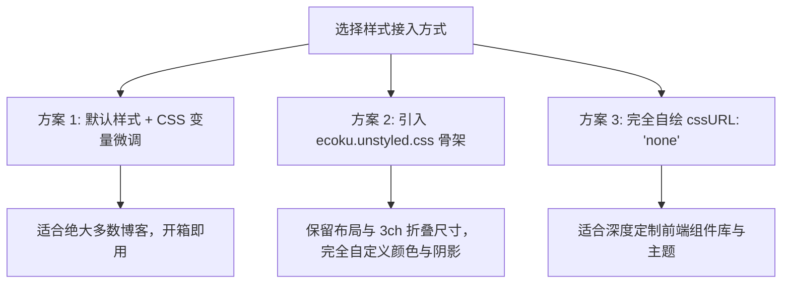

# 自定义 CSS 与 Design Tokens

Ecoku 提供了细致的样式覆盖方案。您可以通过 CSS 变量微调配色，也可以使用纯净骨架样式表打造完全定制的评论区视觉。

---

## 三种样式接入策略



### 1. 方案一：默认样式 + CSS 变量微调（推荐）
保持默认 `data-css-url` 为空，在博客全局 CSS 中声明并覆盖 `--ecoku-*` 变量。

### 2. 方案二：使用骨架样式表 (`ecoku.unstyled.css`)
通过 `<link rel="stylesheet" href=".../client/ecoku.unstyled.css">` 引入，并将 `data-css-url="none"`。
骨架样式仅包含 Flex/Grid 布局、盒模型与 3ch 等宽尺寸，剥离了所有背景、边框和文字颜色。

### 3. 方案三：完全自定义 (`none`)
将 `cssURL` 设为 `'none'`，由您的站点完全定义所有 `.ecoku-*` 类名的视觉规则。

---

## 核心 Design Tokens / CSS 变量全清单

Ecoku 所有的视觉属性均通过标准 CSS 自定义属性驱动：

```css
:root {
  /* 基础背景色体系 */
  --ecoku-theme: rgb(250, 249, 245);          /* 评论区最底层背景色 / 身份输入框底色 */
  --ecoku-entry: rgb(252, 251, 247);          /* 发表卡片背景色 / 按钮默认背景色 */
  --ecoku-code-bg: rgb(243, 239, 231);        /* 按钮 hover 激活底色 / 次级标签背景 */
  --ecoku-surface-muted: rgba(243, 239, 231, 0.72); /* 预览区背景 / 菜单 hover 底色 */

  /* 文字颜色体系 */
  --ecoku-primary: rgb(20, 20, 19);           /* 主文字色 / 标题 / 重点边框 */
  --ecoku-secondary: rgb(96, 91, 82);         /* 次要文字色（时间、字数、折叠提示） */
  --ecoku-content: rgb(58, 54, 44);           /* 评论正文颜色 / 输入框输入文本色 */

  /* 边框体系 */
  --ecoku-border: rgb(150, 143, 132);         /* 强实体边框 / 按钮 hover 边框 */
  --ecoku-border-soft: rgba(20, 20, 19, 0.14);/* 浅色分割线 / 卡片描边 / 输入框边框 */

  /* 交互与焦点 */
  --ecoku-focus: #0d9488;                     /* 输入框与按钮 focus 轮廓色 */
}

/* 暗色模式自适应覆盖 */
@media (prefers-color-scheme: dark) {
  :root {
    --ecoku-theme: rgb(26, 29, 32);
    --ecoku-entry: rgb(34, 38, 42);
    --ecoku-code-bg: rgb(44, 48, 53);
    --ecoku-surface-muted: rgba(48, 53, 58, 0.88);

    --ecoku-primary: rgb(242, 236, 226);
    --ecoku-secondary: rgb(188, 181, 169);
    --ecoku-content: rgb(216, 209, 197);

    --ecoku-border: rgb(109, 114, 120);
    --ecoku-border-soft: rgba(242, 236, 226, 0.14);
    --ecoku-focus: #2dd4bf;
  }
}
```

---

## 视觉排版规范与基线对齐（Baseline）

为保障评论区在任何博客宿主字体环境下均能优雅呈现，Ecoku 严格遵循以下排版基线：

1. **等宽折叠控件（3ch 等宽保障）**：
   - 评论折叠按钮 `.ecoku-collapse-button` 严格固定为 `3ch` 宽度，使用 `font-variant-numeric: tabular-nums`。
   - 切换展开 `[-]` 与折叠 `[+]` 时，元信息行的作者昵称、发布时间与回复动作**绝对不发生水平抖动**。
2. **基线对齐（Baseline Alignment）**：
   - 元信息行 `.ecoku-comment-meta` 采用 `display: flex; align-items: baseline;`，确保 14px 的作者昵称、12px 的时间戳与下划线“回复”文本动作在同一基准水平线上对齐。
3. **等宽时间字体栈**：
   - 时间展示优先采用等宽字体（宿主加载的 Maple Mono，否则回退系统等宽 `ui-monospace, SFMono-Regular, Menlo, monospace`）。
