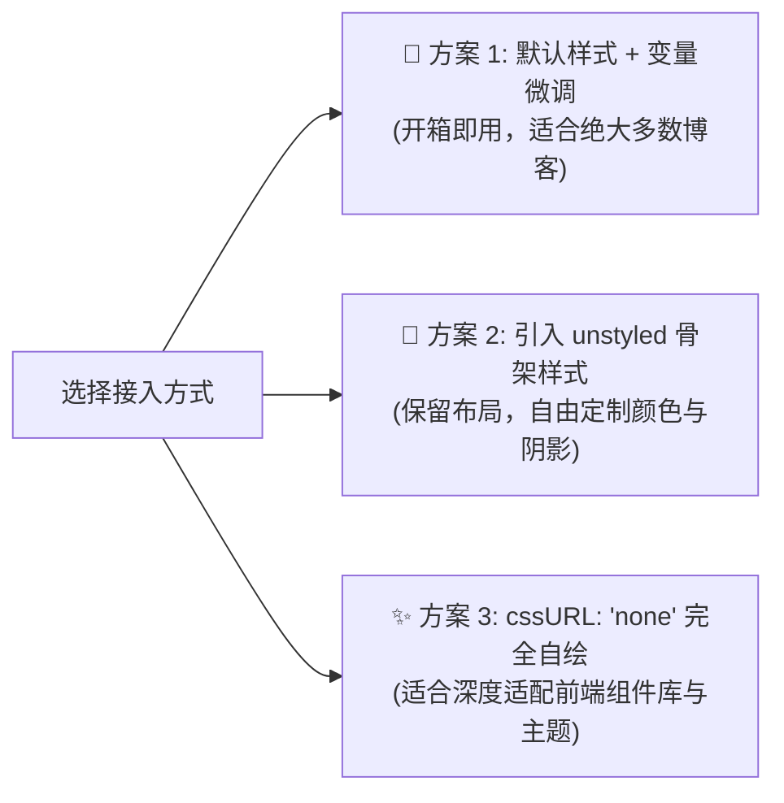

# 自定义 CSS 与 Design Tokens

Ecoku 提供了细致的样式覆盖方案。您可以通过 CSS 变量微调配色，也可以使用纯净骨架样式表打造完全定制的评论区视觉。

---

## 三种样式接入策略



### 1. 方案一：默认样式 + CSS 变量微调（推荐）
保持默认 `data-css-url` 为空，在博客全局 CSS 中声明并覆盖 `--ecoku-*` 变量。

### 2. 方案二：使用骨架样式表 (`ecoku.unstyled.css`)
通过 `<link rel="stylesheet" href=".../client/ecoku.unstyled.css">` 引入，并将 `data-css-url="none"`。
骨架样式仅包含 Flex/Grid 布局、盒模型与 3ch 等宽尺寸，剥离了所有背景、边框和文字颜色。

### 3. 方案三：完全自定义 (`none`)
将 `cssURL` 设为 `'none'`，由您的站点完全定义所有 `.ecoku-*` 类名的视觉规则。

---

## Design Tokens / CSS 变量

默认样式的颜色、强调色、圆角、阴影、等宽字体和字号都由 `--ecoku-*` 变量控制。

### 覆盖方式

- Ecoku 的默认值以零优先级声明。在评论区根节点 `.ecoku-comments` 上写同名变量即可覆盖，不需要提高选择器优先级，也不受样式表加载顺序影响。
- 颜色变量会先读取宿主同名的 PaperMod 变量（`--theme`、`--entry`、`--primary`、`--secondary`、`--content`、`--border`、`--border-soft`、`--code-bg`、`--surface-muted`）。PaperMod 主题通常无需额外配置。
- `data-theme="auto"` 时评论区继承宿主页面的 `color-scheme`，因此宿主用 `light-dark()` 定义的变量会跟随站点自己的明暗切换，而不是只跟随系统设置。宿主没有提供颜色变量时，Ecoku 按系统偏好使用内置的浅色或深色配色。
- `data-theme="light"` 或 `"dark"` 会固定评论区配色，不再读取宿主颜色变量。

```css
/* 在博客样式中覆盖评论区变量 */
.ecoku-comments {
  --ecoku-accent: #a8412c;        /* 博主标志、链接悬停、表单错误 */
  --ecoku-radius: 6px;            /* 发表卡片、菜单、表情面板、Cap 外框 */
  --ecoku-radius-sm: 3px;         /* 菜单项、表情格、Cap 复选框 */
  --ecoku-font-size: 15px;        /* 评论正文与输入 */
  --ecoku-font-size-small: 13px;  /* 元信息、标签、按钮 */
  --ecoku-font-size-title: 22px;  /* “N 条评论”标题 */
}
```

### 变量一览

| 变量 | 默认值 | 用途 |
| --- | --- | --- |
| `--ecoku-theme` | `var(--theme, #f7f4ee)` | 纸面底色；主按钮文字色；Cap 复选框底色 |
| `--ecoku-entry` | `var(--entry, #fbf9f5)` | 发表卡片、服务故障提示、排序菜单、表情面板 |
| `--ecoku-primary` | `var(--primary, #1e1c19)` | 标题、昵称、输入文字、实心主按钮、聚焦底线 |
| `--ecoku-secondary` | `var(--secondary, #6b655b)` | 时间、字数、字段标签、文字按钮 |
| `--ecoku-content` | `var(--content, #35312b)` | 评论正文与正文输入 |
| `--ecoku-border` | `var(--border, #cbc3b5)` | 身份字段底线、次要按钮边框、“回复”下划线 |
| `--ecoku-border-soft` | `var(--border-soft, rgb(30 28 25 / 0.12))` | 卡片描边、线程分隔线、子评论引导线 |
| `--ecoku-surface-muted` | `var(--surface-muted, #efebe3)` | 表情格悬停底色 |
| `--ecoku-code-bg` | `var(--code-bg, #ece7de)` | 保留给自定义样式，默认样式不再使用 |
| `--ecoku-accent` | 朱砂色与 `--ecoku-primary` 混合 | 博主标志、链接悬停；浅色下偏深、深色下偏浅 |
| `--ecoku-danger` | `var(--ecoku-accent)` | 表单错误与无效字段 |
| `--ecoku-focus` | `--ecoku-primary` 的 40% | 键盘焦点框（1px）；设为 `transparent` 可隐藏 |
| `--ecoku-radius` | `6px` | 卡片、菜单、面板和按钮圆角 |
| `--ecoku-radius-sm` | `3px` | 菜单项、表情格和复选框圆角 |
| `--ecoku-shadow` | 浅色双层阴影 | 排序菜单与表情面板 |
| `--ecoku-font-mono` | Maple Mono 与系统等宽字体 | 时间、`[+]`/`[-]`、字数、分页页码 |
| `--ecoku-font-size` | `15px` | 正文与输入 |
| `--ecoku-font-size-small` | `13px` | 元信息、标签、按钮 |
| `--ecoku-font-size-title` | `22px`（窄屏 `20px`） | 评论数标题 |

评论区字体继承宿主页面；触屏设备上的输入框不小于 16px，避免 iOS 聚焦时放大页面。

---

## 视觉排版规范与基线对齐（Baseline）

为保障评论区在任何博客宿主字体环境下均能优雅呈现，Ecoku 遵循以下排版基线：

1. **等宽折叠控件（3ch 等宽保障）**：
   - 评论折叠按钮 `.ecoku-collapse-button` 固定为 `3ch` 宽度，使用 `font-variant-numeric: tabular-nums`。
   - 切换展开 `[-]` 与折叠 `[+]` 时，元信息行的作者昵称、发布时间与回复动作不发生水平抖动。
2. **基线对齐（Baseline Alignment）**：
   - 元信息行 `.ecoku-comment-meta` 采用 `display: flex; align-items: baseline;`，15px 的作者昵称、12px 的时间戳与 13px 的下划线“回复”在同一基线上对齐。
3. **等宽字体栈**：
   - 时间、折叠控件、字数和分页页码使用 `--ecoku-font-mono`（宿主已加载的 Maple Mono，否则回退系统等宽 `ui-monospace, SFMono-Regular, Menlo, monospace`）。
