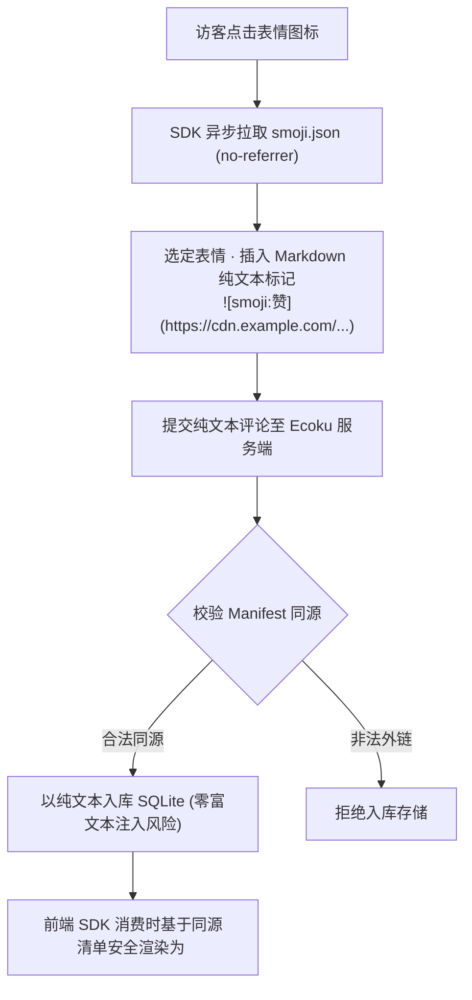

# Smoji 表情包协议与自建源

Smoji 是 Ecoku 采用的**纯文本轻量级表情包协议**。

它兼顾了丰富的表情交流体验与纯文本安全边界：表情在数据库与服务端中仅以纯文本格式存储，客户端在保证同源安全的前提下按需渲染。

---

## 协议工作流程



---

## `smoji.json` 清单 Schema 规范 (v1)

自建表情源需在可访问的 URL 提供一个符合 JSON Schema 规范的 `smoji.json` 文件：

```json
{
  "version": 1,
  "packs": [
    {
      "id": "paopao",
      "label": "泡泡表情",
      "items": [
        {
          "id": "smile",
          "label": "微笑",
          "src": "https://stickers.example.com/paopao/smile.png"
        },
        {
          "id": "thumbsup",
          "label": "赞",
          "src": "https://stickers.example.com/paopao/thumbsup.png"
        }
      ]
    }
  ]
}
```

### 字段约束与技术规范

- `version`：必须为整数 `1`。
- `packs`：表情包分组数组（1～64 组）。
- `packs[].id`：分组唯一标识（匹配正则 `/^[A-Za-z0-9][A-Za-z0-9._-]{0,63}$/`）。
- `packs[].label`：分组显示名称（去除首尾空白后最多 40 个字符）。
- `packs[].items`：表情项列表（每组 1～600 项，全清单总表情数不超过 6000 个）。
- `items[].id`：表情项唯一标识（匹配正则 `/^[A-Za-z0-9][A-Za-z0-9._-]{0,63}$/`）。
- `items[].label`：表情显示文字（去除首尾空白后 1～40 个字符，禁止 `]` 与换行，用于 Markdown alt 与插入标记）。
- `items[].src`：表情图片地址（支持同源绝对直链，或基于 `smoji.json` 的相对路径，不得带用户名、密码、查询参数或片段）。
- **严格白名单（Exact Keys）**：JSON 结构严格匹配上述键集合，出现任何未定义冗余字段将直接拒绝解析。
- **体积与拉取约束**：清单文件大小上限为 **1 MiB**，网络拉取超时为 8 秒。
- **严格同源约束**：图片 `src` 的 Origin **必须与 `smoji.json` 自身的 Origin 严格保持一致**，生产环境必须使用 `https://` 协议。

---

## 纯文本标记格式

- **标记语法**：``
- **示例**：``

### 安全降级规则
若评论正文中包含了与当前站点已配置清单不同源的图片标记，或者站点关闭了 Smoji 功能，客户端在渲染时会自动将其原样作为纯文本显示，绝对不会解释为 HTML 图片标签，杜绝跨站 IP 追踪与钓鱼攻击。


## 配置与素材更新

在评论或回复框中点击“表情”即可打开选择器。面板在表单底栏上方向右对齐，窄屏时会随表单收窄；默认样式和无主题样式均采用这一布局。

在后台站点设置中启用 Smoji，填写清单 URL。清单与图片地址不得带用户名、密码、查询参数或片段；HTTP 仅用于回环开发地址。跨域托管清单时，资源服务器需允许评论页面来源的 CORS 请求。

Smoji 工作台导出的“Ecoku 响应示例”展示公共接口的 `formConfig.smoji`，不是后台可导入的配置文件。后台表单内部使用 `smojiEnabled` / `smojiManifestUrl`；管理 API 请求字段为 `smoji_enabled` / `smoji_manifest_url`。

评论保存完整图片 URL。更新素材时保留原有域名和旧图片路径；使用 Smoji 工作台构建发布时部署包含旧路径兼容副本的完整 `demo/dist`。单独替换清单不会修复历史评论中的失效地址。若改用其他 Origin，旧标记会按文本显示。

## 精简清单（v0.2.1）

```json
{"version":1,"base":"https://s3-cdn.zsh.moe/smoji/{pack}/{id}.webp","packs":[{"id":"douyin-current","label":"抖音","items":[{"id":"fehpikklicec","label":"微笑"}]}]}
```

`base` 是可选 URL 模板，必须包含 `{pack}` 与 `{id}`，分别替换为分组和条目的 ID。省略 `src` 的条目使用该模板；自选分组或不同扩展名可保留 `src` 覆盖。解析后仍得到完整 URL，评论存储格式不变。旧版逐项 `src` 清单继续受支持，未知字段仍被拒绝。

清单与展开后的图片仍须同源，禁止凭据、query 和 fragment。生产清单不要包含 `localhost` 图片地址；Smoji 工作台本地导出会使用配置的 CDN `https://s3-cdn.zsh.moe/smoji/`。JSON 响应需使用 `application/json` 或 `+json` 类型，体积按 UTF-8 字节计算，8 秒超时覆盖正文读取。

v0.2.0 不支持 `base`，且仍限制为 32 包、每包 300 项、总计 2000 项、256 KiB。使用该版本时需保留逐项 `src` 并导出容量内的子集；升级后再切换精简清单。清单和图片均需要发布到 CDN，更换 JSON 不会自动发布代码或修复历史评论 URL。
