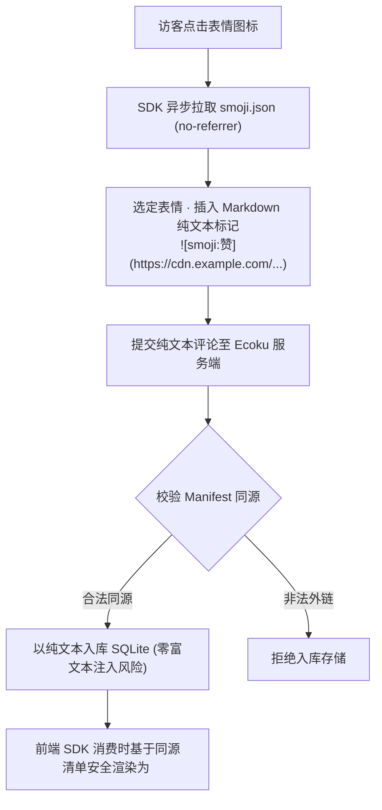

# Smoji 表情包协议与自建源

Smoji 是 Ecoku 采用的**纯文本轻量级表情包协议**。

它兼顾了丰富的表情交流体验与纯文本安全边界：表情在数据库与服务端中仅以纯文本格式存储，客户端在保证同源安全的前提下按需渲染。

---

## 协议工作流程



---

## `smoji.json` 清单 Schema 规范 (v1)

自建表情源需在 Web 服务器根目录下提供一个符合 JSON Schema 规范的 `smoji.json` 文件：

```json
{
  "version": 1,
  "packs": [
    {
      "id": "paopao",
      "label": "泡泡表情",
      "items": [
        {
          "id": "smile",
          "label": "微笑",
          "src": "https://stickers.example.com/paopao/smile.png"
        },
        {
          "id": "thumbsup",
          "label": "赞",
          "src": "https://stickers.example.com/paopao/thumbsup.png"
        }
      ]
    }
  ]
}
```

### 字段约束与技术规范

- `version`：必须为整数 `1`。
- `packs`：表情包分组数组（1～32 组）。
- `packs[].id`：分组唯一标识（匹配正则 `/^[A-Za-z0-9][A-Za-z0-9._-]{0,63}$/`）。
- `packs[].label`：分组显示名称（最多 40 字符）。
- `packs[].items`：表情项列表（每组 1～300 项，全清单总表情数不超过 2000 个）。
- `items[].id`：表情项唯一标识（匹配正则 `/^[A-Za-z0-9][A-Za-z0-9._-]{0,63}$/`）。
- `items[].label`：表情显示文字（1～40 字符，用于 Markdown alt 与插入标记）。
- `items[].src`：表情图片地址（支持同源绝对直链，或基于 `smoji.json` 的相对路径）。
- **严格白名单（Exact Keys）**：JSON 结构严格匹配上述键集合，出现任何未定义冗余字段将直接拒绝解析。
- **体积与拉取约束**：清单文件大小上限为 **256 KiB**，网络拉取超时为 8 秒。
- **严格同源约束**：图片 `src` 的 Origin **必须与 `smoji.json` 自身的 Origin 严格保持一致**，生产环境必须使用 `https://` 协议。

---

## 纯文本标记格式

- **标记语法**：``
- **示例**：``

### 安全降级规则
若评论正文中包含了与当前站点已配置清单不同源的图片标记，或者站点关闭了 Smoji 功能，客户端在渲染时会自动将其原样作为纯文本显示，绝对不会解释为 HTML 图片标签，杜绝跨站 IP 追踪与钓鱼攻击。
