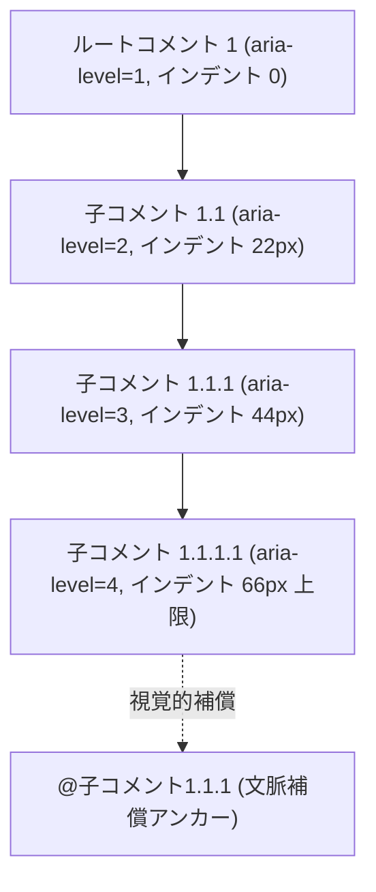
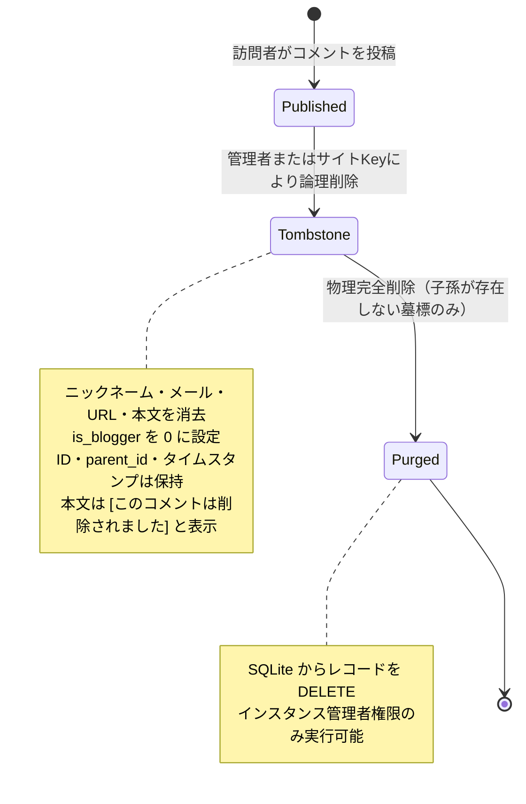
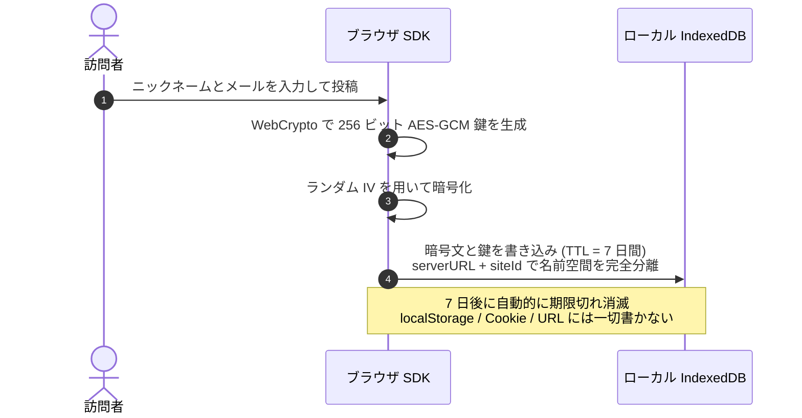
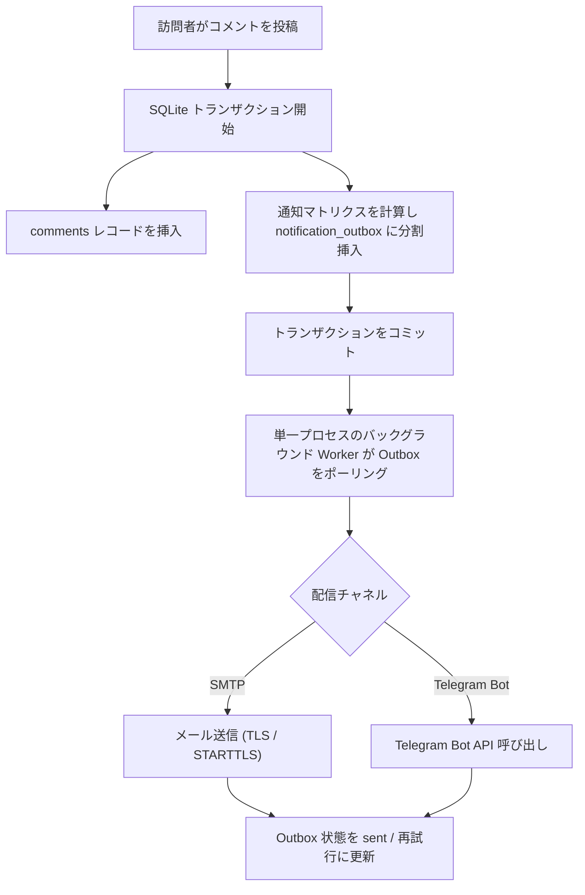

# コアコンセプトと動作原理

Ecoku の設計は**軽量性**、**純テキストの即時公開**、**厳格なプライバシー保護**、**極小の運用コスト**を軸に展開されています。本ページでは、Ecoku の内部モデルとアルゴリズムについて詳しく解説します。

---

## スレッドコメントとページネーションモデル

従来のコメントシステムは「文脈が失われるフラットなタイムライン」か「狭い画面で無限インデントが発生して崩れる階層表示」の二者択一に直面しがちでした。Ecoku は**「無制限のセマンティクス階層 + 最大3段階の視覚的インデント」**という設計を採用しています。

### 1. セマンティクスと表示の分離

- **セマンティクス階層（Semantic Level）**：DOM の `aria-level` と `data-depth` はデータベース上の物理的な階層深さ（1, 2, 3, 4, 5...）を忠実に反映し、スクリーンリーダー等の支援技術に正確な構造を伝えます。
- **視覚的インデント（Visual Indent）**：画面上のインデントは CSS の `min(depth, 3)` で最大3段階（PC 画面では各 22px / 最大 66px、モバイルでは各 14px / 最大 42px）に制限されます。
- **文脈アンカー（Context Compensation）**：階層が3段階以上に達した深層コメントには、メタヘッダーに親コメントへの直接リンク（`@返信先`）が自動表示され、狭い画面でも議論の流れを見失いません。

### 2. ルートスレッドページネーション

「もっと読み込む」による会話の分断を防ぐため、Ecoku は**ルートスレッド単位のページネーション**を採用しています：

- パラメーター `page` と `pageSize` はルートコメント（`parent_id IS NULL`）にのみ適用されます。
- 処理上限内の成功レスポンスには、該当ページのルートコメントに属する**すべての公開子孫コメント**が含まれます。200 ノード、子孫 16 階層、1 MiB JSON、集計対象 10,000 件のいずれかを超過した場合は切り捨てず 422 エラーを返します。大規模ページでは[単一階層カーソル API](../reference/api.md)を用いて必要な分だけ取得できます。
- ページ切り替えはスレッド全体を一括して切り替えるため、どのルートコメントを読んでも完全な対話ツリーを閲覧できます。

---

## 墓標メカニズム（Soft Delete & Hard Purge）

公開掲示板で親コメントを物理削除すると、その配下の返信がすべて文脈を失って孤立します。Ecoku は厳格な**墓標化（Tombstone）**メカニズムを実装しています：

1. **論理削除（墓標化）**：
   - ニックネーム、非公開メール、ウェブサイト、本文を消去し、`is_blogger` を 0、`deleted_at` タイムスタンプを設定。
   - コメント ID、ページ key、`parent_id` の関連性を保持。
   - 公開 API では `deleted: true`、ニックネーム「削除済み」、本文 `[このコメントは削除されました]` を返却。
   - 墓標化されたコメントへの新規返信は禁止されます。
2. **完全削除（物理パージ）**：
   - **子孫コメント（通常コメントおよび他の墓標）が一切存在しない墓標**に限り、インスタンス管理者が物理削除（DELETE）できます。
   - サイト自動化用の Management Key は墓標化のみ可能で、物理完全削除の権限はありません。

---

## 訪問者情報の暗号化保存

Ecoku は、クロスサイト漏洩やスクリプトからの不正アクセスリスクがある `localStorage` や Cookie に訪問者情報を保存しません。

- **分離された名前空間**：`serverURL + "::" + siteId` に基づいて完全に独立したスコープで保存。
- **エンドツーエンド暗号化**：Web Crypto API によりエクスポート不可能な 256 ビット AES-GCM 鍵を生成し、ローカルで暗号化。
- **自動ライフサイクル**：有効期間は厳格に 7 日間です。期限切れまたはデータ破損時は静かに空の初期状態へフォールバックします。

---

## ブロガー合言葉（Passphrase）認証

公共端末等でプライベートなメールアドレスを入力するリスクを防ぐため、Ecoku は**合言葉（Passphrase）**によるパスワードレス認証を提供します：

- **合言葉設定**：管理画面でサイトごとに 12〜80 文字の合言葉を設定。サーバーは bcrypt ハッシュのみを保存し、平文は保持しません。
- **投稿手順**：
  1. ブロガーはコメント投稿時、**ニックネーム欄に秘密の合言葉を入力**します（メールやサイトの入力は不要）。
  2. サーバーは合言葉ハッシュを検証し、一致した場合は投稿者を設定済みのブロガー名、非公開メール、サイト URL へ自動的に書き換え、`is_blogger = 1` を付与します。
  3. 投稿完了後、入力欄は即座にクリアされます。
- **過去コメント（v0.2.3）**：元の schema v5 移行と空サイトへの Twikoo インポート内の補完のみ維持します。設定保存、初回設定、合言葉変更で過去コメントに管理者フラグを再付与せず、既存フラグは保持します。

---

## Outbox トランザクショナル通知 {#トランザクショナル-outbox-通知}

Ecoku はコメントの保存と通知タスクの登録を単一の SQLite トランザクション内で実行し、通知の欠落を完全に防止します。

### 通知判定マトリクス

データベースに永続化された `is_blogger` フラグに基づいて配信を判定します：

| シナリオ | ブロガー通知（メール/Telegram） | 返信先訪問者へのメール通知 |
| :--- | :---: | :---: |
| **訪問者がルートコメントを投稿** | ✅ 送信 | — |
| **訪問者が訪問者に返信** | ✅ 送信 | ✅ 送信 |
| **訪問者がブロガーに返信** | ✅ 送信（1回のみ） | — |
| **ブロガーがルートコメントを投稿** | ❌ 送信なし | — |
| **ブロガーが訪問者に返信** | ❌ 送信なし | ✅ 送信 |
| **ブロガーがブロガーに返信** | ❌ 送信なし | ❌ 送信なし |
| **同一メールアドレスで自己返信** | — | ❌ 送信なし |

---

## セッションと動的 CSP セキュリティモデル

1. **インメモリ管理者セッション（In-Memory Session）**：
   - ログイン後に発行される Bearer Token は Vue のメモリ内変数にのみ保持されます。
   - ページのリロードやタブの終了によって即座に破棄されます。
   - Token にはパスワードハッシュのバージョン（`cv`）が含まれており、パスワードハッシュが更新されると過去の全セッションが無効化されます。
2. **動的 CSP（Content-Security-Policy）の自動収束**：
   - 自ホスト型 Cap 認証が有効な場合、Cap の HTTPS ドメイン、WASM、Blob Worker、評価権限（`'unsafe-eval'`）のみを動的に許可。
   - Turnstile への切り替えや認証無効化時には Cap 関連の許可を即座に完全剥奪し、厳格なベースラインへ自動回帰。

UTF-8 で 72 バイト以下にしてください。切り詰めは行わず、既存 bcrypt ハッシュは引き続き有効です。
