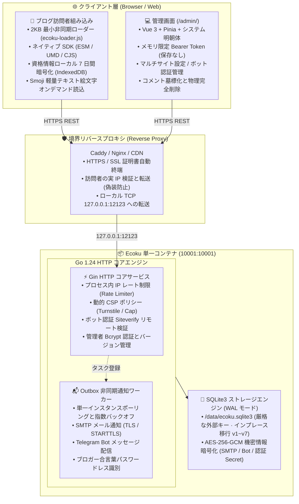

# 概要とシステム構成

Ecoku は、静的ブログやドキュメントサイトのために設計された**セルフホスト対応のマルチサイト純テキストコメントシステム**です。

肥大化した審査キューや複雑なユーザー管理、外部トラッキングサービスを排除し、シングルコンテナ + SQLite3 の極小構成で提供されます。コメントは投稿後、セキュリティ検証を経てその場で公開されます。

---

## 設計思想

- **極小シングルコンテナ**：単一の Go バイナリが REST API、静的管理画面（`/admin/`）、ブラウザ SDK（`/client/`）を同時に提供。データは単一の SQLite3 ファイルで管理。
- **純テキストコミュニケーション**：コメント本文は HTML や Markdown として解釈されず、XSS 攻撃を根本から防止。
- **投稿後即時公開**：手動審査による遅延をなくし、IP レート制限、ブロガー合言葉、最新 CAPTCHA（Turnstile / Cap）で安全性を維持。
- **プライバシー保護**：公開 API はメールアドレス、IP、User-Agent、地域情報を返しません。訪問者情報は IndexedDB に AES-GCM 暗号化で 7 日間のみ保持。
- **トランザクショナルなスキーマ移行**：バージョン管理された SQLite マイグレーション（v1〜v7）により、単一トランザクションで安全にアップグレード。

---

## システム構成概要

