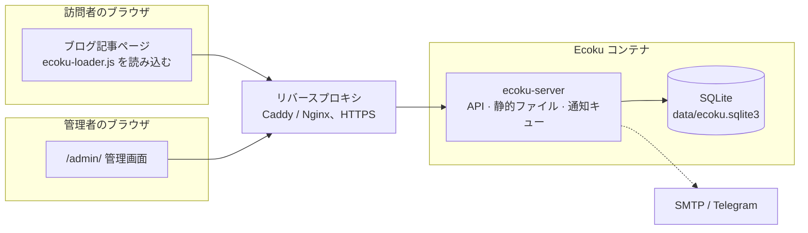

# はじめに

Ecoku は、静的ブログや個人サイト向けのセルフホスト型コメントシステムです。自分のサーバーで Docker を使って Ecoku インスタンスを 1 つ動かし、記事テンプレートに HTML を少し加えるだけで、ページにコメント欄が付きます。

意図的にシンプルに作られています。

- **コメントは純テキストのみ**。HTML や Markdown は解釈せず、リッチテキストエディターもありません。
- **投稿するとすぐに公開**。審査キューはなく、不適切なコメントは管理者が後から削除します。
- **訪問者の登録は不要**。ニックネーム、メールアドレス（任意入力にもできます）、任意の URL を入力すれば投稿できます。
- **1 つのインスタンスで複数のサイトを扱える**。各サイトは管理画面でサイトとして登録し、コメントと設定はサイトごとに独立します。
- **すべてのデータは 1 つの SQLite ファイルに入る**。MySQL、Redis などの外部サービスは不要で、バックアップはディレクトリを 1 つコピーするだけです。

## 向いている人

- Hugo、Hexo、Astro、VitePress、Jekyll などで静的サイトを作っていて、コメント欄が欲しい人。
- コメントデータを自分のサーバーに置き、サードパーティーのコメントサービスに頼りたくない人。
- 複数のサイトを持っていて、コメントを 1 つのサービスでまとめて管理したい人。

## 提供しないもの

次の機能は Ecoku の対象外です。

- リッチテキスト、Markdown、画像アップロード（[Smoji スタンプ](../integration/smoji)が唯一の画像表示手段です）
- 訪問者アカウント、外部サービスでのログイン、アバター
- いいね、よくないね、リアクション
- コメントの審査キュー
- MySQL、PostgreSQL などほかのデータベース

これらのいずれかが必要な場合、Ecoku は合わないかもしれません。

## 構成 {#components}

コンテナの中には Go プログラム `ecoku-server` が 1 つだけあり、次のすべてを担当します。

- コメント API `/api/comment/*` と管理 API `/api/admin/*`
- 管理画面 `/admin/`
- ブログに埋め込むスクリプトとスタイル `/client/`
- バックグラウンドでのメールと Telegram の通知送信

コンテナは非 root ユーザーで動作し、ホストの `127.0.0.1:12123` だけで待ち受けます。HTTPS は同じマシン上のリバースプロキシが提供します。

## 公開までの手順

1. [Docker デプロイ](../self-hosting/docker)：ディレクトリ、設定ファイル、シークレットを用意してコンテナを起動します。
2. [リバースプロキシ](../self-hosting/reverse-proxy)：Ecoku 用の HTTPS ドメインを設定します。
3. [管理画面](../self-hosting/admin)：ログインしてサイトを登録し、必要に応じてブロガー情報を設定します。
4. [コメント欄の埋め込み](../integration/html)：記事テンプレートに埋め込みコードを追加します。

その後、必要に応じて[通知](../self-hosting/notifications)や[CAPTCHA](../self-hosting/captcha)を設定したり、[Twikoo から移行](../self-hosting/twikoo)して過去のコメントを取り込んだりできます。

始める前に[動作の仕組み](./concepts)を読んで、ページキー、削除、プライバシーの扱いを把握しておくことをおすすめします。
