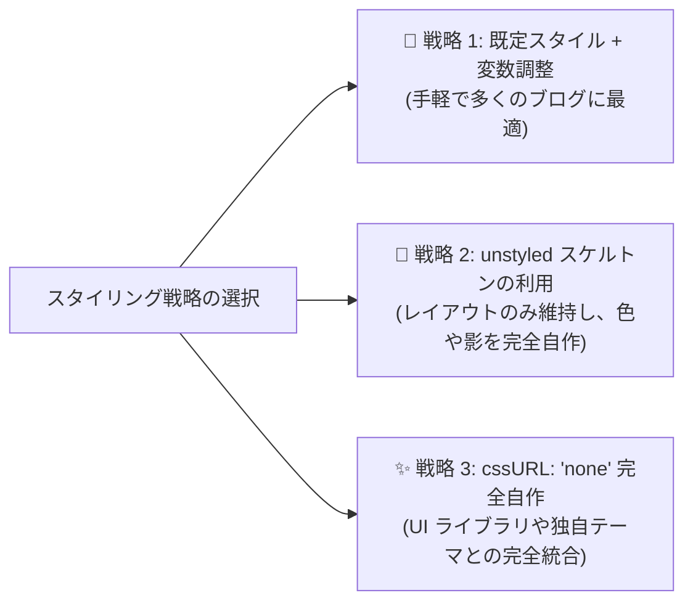

# カスタム CSS と Design Tokens

Ecoku は柔軟なスタイルカスタマイズ戦略を提供しています。CSS 変数によるカラーパレットの微調整、構造のみを残したスケルトンスタイルシートの利用、または独自の完全カスタムスタイル作成に対応しています。

---

## 3 つのスタイリング戦略



### 1. 戦略 1：既定スタイル + CSS 変数の微調整（推奨）
`data-css-url` を空（未指定）のままにし、ブログ全体の CSS 内で `--ecoku-*` 変数を上書き定義します。

### 2. 戦略 2：スケルトンスタイルシート (`ecoku.unstyled.css`) の利用
`<link rel="stylesheet" href=".../client/ecoku.unstyled.css">` を読み込み、`data-css-url="none"` を指定します。
スケルトンスタイルには Flex/Grid レイアウト、ボックスモデル、3ch 等幅制御のみが含まれ、背景色・ボーダー・文字色はすべて削ぎ落とされています。

### 3. 戦略 3：完全カスタマイズ (`none`)
`cssURL` に `'none'` を指定し、サイト側ですべての `.ecoku-*` クラスの装飾をゼロから定義します。

---

## Design Tokens / CSS 変数一覧

Ecoku のすべての視覚要素は標準の CSS カスタムプロパティによって制御されます。

> [!TIP]
> **スコープの推奨事項**：
> - Hugo PaperMod などのテーマをご利用の場合、`:root` に `--theme`、`--primary`、`--border` などのテーマ変数を宣言すると、Ecoku が自動的に継承します。
> - コメント欄専用に上書きを行う場合は、`.ecoku-comments` コンテナセレクター配下で `--ecoku-*` 変数を上書きすることを推奨します。

```css
/* コメント欄コンテナに限定したスタイルカスタマイズ */
.ecoku-comments {
  /* 背景色体系 */
  --ecoku-theme: rgb(250, 249, 245);          /* コメント欄最背面背景 / 投稿者情報入力欄背景 */
  --ecoku-entry: rgb(252, 251, 247);          /* 投稿カード背景 / ボタン標準背景 */
  --ecoku-code-bg: rgb(243, 239, 231);        /* ボタン hover 背景 / サブバッジ背景 */
  --ecoku-surface-muted: rgba(243, 239, 231, 0.72); /* プレビュー背景 / メニュー hover 背景 */

  /* 文字色体系 */
  --ecoku-primary: rgb(20, 20, 19);           /* メイン文字色 / タイトル / 強調ボーダー */
  --ecoku-secondary: rgb(96, 91, 82);         /* 補助文字色（日時、文字数カウント、折りたたみヒント） */
  --ecoku-content: rgb(58, 54, 44);           /* コメント本文色 / 入力フィールド文字色 */

  /* ボーダー体系 */
  --ecoku-border: rgb(150, 143, 132);         /* ソリッドボーダー / ボタン hover 外枠 */
  --ecoku-border-soft: rgba(20, 20, 19, 0.14);/* 薄い区切り線 / カード境界線 / 入力欄枠線 */

  /* フォーカスリング（既定では primary と動的ブレンド: color-mix(in srgb, var(--ecoku-primary) 72%, #2f73ff)） */
  --ecoku-focus: #2f73ff;                     /* 入力欄およびボタンのフォーカスリング色 */
}

/* ダークモード自動追従上書き */
@media (prefers-color-scheme: dark) {
  .ecoku-comments {
    --ecoku-theme: rgb(26, 29, 32);
    --ecoku-entry: rgb(34, 38, 42);
    --ecoku-code-bg: rgb(44, 48, 53);
    --ecoku-surface-muted: rgba(48, 53, 58, 0.88);

    --ecoku-primary: rgb(242, 236, 226);
    --ecoku-secondary: rgb(188, 181, 169);
    --ecoku-content: rgb(216, 209, 197);

    --ecoku-border: rgb(109, 114, 120);
    --ecoku-border-soft: rgba(242, 236, 226, 0.14);
    --ecoku-focus: #3b82f6;
  }
}
```

---

## タイポグラフィ規範とベースライン配置

あらゆるブログのフォント環境下でも美しく整列するよう、Ecoku は厳格なタイポグラフィ基準に従っています：

1. **等幅折りたたみボタン（3ch 等幅保証）**：
   - 折りたたみボタン `.ecoku-collapse-button` は幅 `3ch` かつ `font-variant-numeric: tabular-nums` に厳格固定。
   - 展開 `[-]` と折りたたみ `[+]` を切り替えても、メタ情報行のニックネームや投稿日時の**横揺れ（レイアウトシフト）が一切発生しません**。
2. **ベースライン揃え（Baseline Alignment）**：
   - メタ情報行 `.ecoku-comment-meta` は `display: flex; align-items: baseline;` を採用し、14px のニックネーム、12px の日時、下線付きの「返信」リンクが同一の基準ベースライン上に美しく揃います。
3. **等幅時刻フォントスタック**：
   - 日時表示には等幅フォントを優先適用（ホスト側の Maple Mono、またはシステム等幅 `ui-monospace, SFMono-Regular, Menlo, monospace`）。
