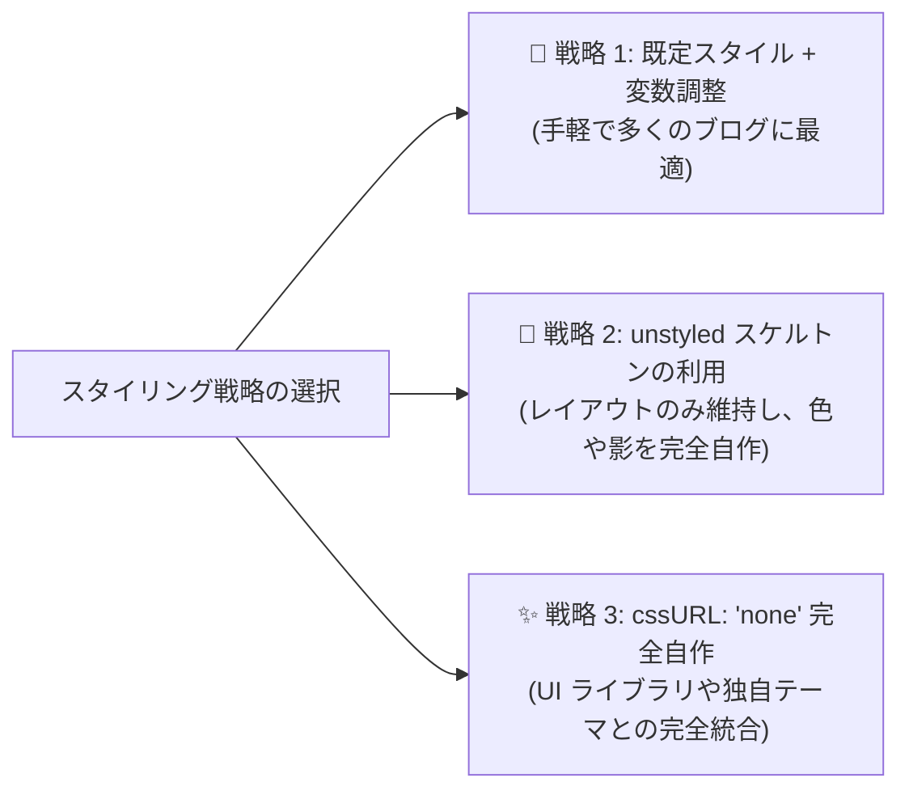

# カスタム CSS と Design Tokens

Ecoku は柔軟なスタイルカスタマイズ戦略を提供しています。CSS 変数によるカラーパレットの微調整、構造のみを残したスケルトンスタイルシートの利用、または独自の完全カスタムスタイル作成に対応しています。

---

## 3 つのスタイリング戦略



### 1. 戦略 1：既定スタイル + CSS 変数の微調整（推奨）
`data-css-url` を空（未指定）のままにし、ブログ全体の CSS 内で `--ecoku-*` 変数を上書き定義します。

### 2. 戦略 2：スケルトンスタイルシート (`ecoku.unstyled.css`) の利用
`<link rel="stylesheet" href=".../client/ecoku.unstyled.css">` を読み込み、`data-css-url="none"` を指定します。
スケルトンスタイルには Flex/Grid レイアウト、ボックスモデル、3ch 等幅制御のみが含まれ、背景色・ボーダー・文字色はすべて削ぎ落とされています。

### 3. 戦略 3：完全カスタマイズ (`none`)
`cssURL` に `'none'` を指定し、サイト側ですべての `.ecoku-*` クラスの装飾をゼロから定義します。

---

## Design Tokens / CSS 変数

既定スタイルの色、アクセントカラー、角丸、影、等幅フォント、文字サイズは `--ecoku-*` 変数で制御します。

### 上書きの仕組み

- Ecoku の既定値は詳細度ゼロで宣言されています。コメント欄のルート `.ecoku-comments` に同名の変数を書くだけで上書きでき、セレクタの詳細度を上げる必要も、スタイルシートの読み込み順を気にする必要もありません。
- 色の変数はまずホスト側の PaperMod 同名変数（`--theme`、`--entry`、`--primary`、`--secondary`、`--content`、`--border`、`--border-soft`、`--code-bg`、`--surface-muted`）を読み取ります。PaperMod テーマでは通常、追加設定は不要です。
- `data-theme="auto"` ではコメント欄がホストページの `color-scheme` を継承するため、ホストが `light-dark()` で定義した変数は OS の設定だけでなくサイト独自のライト／ダーク切り替えにも追従します。ホストが色の変数を提供しない場合、Ecoku はシステム設定に応じて内蔵のライトまたはダーク配色を使います。
- `data-theme="light"` または `"dark"` はコメント欄の配色を固定し、ホストの色変数を読み取りません。

```css
/* サイトのスタイルシートでコメント欄の変数を上書き */
.ecoku-comments {
  --ecoku-accent: #a8412c;        /* ブロガーバッジ、リンクホバー、フォームエラー */
  --ecoku-radius: 6px;            /* 投稿カード、メニュー、スタンプパネル、Cap の枠 */
  --ecoku-radius-sm: 3px;         /* メニュー項目、スタンプのセル、Cap のチェックボックス */
  --ecoku-font-size: 15px;        /* コメント本文と入力欄 */
  --ecoku-font-size-small: 13px;  /* メタ情報、ラベル、ボタン */
  --ecoku-font-size-title: 22px;  /* 「N 条评论」見出し */
}
```

### 変数一覧

| 変数 | 既定値 | 用途 |
| --- | --- | --- |
| `--ecoku-theme` | `var(--theme, #f7f4ee)` | 紙面の地色、主ボタンの文字色、Cap チェックボックスの地色 |
| `--ecoku-entry` | `var(--entry, #fbf9f5)` | 投稿カード、サービス障害の表示、並べ替えメニュー、スタンプパネル |
| `--ecoku-primary` | `var(--primary, #1e1c19)` | 見出し、ニックネーム、入力文字、塗りの主ボタン、フォーカス時の下線 |
| `--ecoku-secondary` | `var(--secondary, #6b655b)` | 日時、文字数、フィールドラベル、テキストボタン |
| `--ecoku-content` | `var(--content, #35312b)` | コメント本文と本文入力 |
| `--ecoku-border` | `var(--border, #cbc3b5)` | 身元フィールドの下線、副ボタンの枠線、「回复」の下線 |
| `--ecoku-border-soft` | `var(--border-soft, rgb(30 28 25 / 0.12))` | カードの枠線、スレッドの区切り線、返信のガイド線 |
| `--ecoku-surface-muted` | `var(--surface-muted, #efebe3)` | スタンプのセルのホバー時の地色 |
| `--ecoku-code-bg` | `var(--code-bg, #ece7de)` | カスタムスタイル用に予約（既定スタイルでは未使用） |
| `--ecoku-accent` | 朱色と `--ecoku-primary` の混色 | ブロガーバッジ、リンクホバー。ライトでは濃く、ダークでは明るく |
| `--ecoku-danger` | `var(--ecoku-accent)` | フォームエラーと無効なフィールド |
| `--ecoku-focus` | `--ecoku-primary` の 40% | 1px のキーボードフォーカス枠。`transparent` で非表示 |
| `--ecoku-radius` | `6px` | カード、メニュー、パネル、ボタンの角丸 |
| `--ecoku-radius-sm` | `3px` | メニュー項目、スタンプのセル、チェックボックスの角丸 |
| `--ecoku-shadow` | 淡い 2 層の影 | 並べ替えメニューとスタンプパネル |
| `--ecoku-font-mono` | Maple Mono とシステム等幅フォント | 日時、`[+]`/`[-]`、文字数、ページ番号 |
| `--ecoku-font-size` | `15px` | 本文と入力欄 |
| `--ecoku-font-size-small` | `13px` | メタ情報、ラベル、ボタン |
| `--ecoku-font-size-title` | `22px`（狭い画面では `20px`） | コメント数の見出し |

コメント欄のフォントはホストページを継承します。タッチ端末では入力欄を 16px 以上に保ち、iOS がフォーカス時にページを拡大しないようにしています。

---

## タイポグラフィ規範とベースライン配置

あらゆるブログのフォント環境下でも整って見えるよう、Ecoku は次のタイポグラフィ基準に従っています：

1. **等幅折りたたみボタン（3ch 等幅保証）**：
   - 折りたたみボタン `.ecoku-collapse-button` は幅 `3ch` かつ `font-variant-numeric: tabular-nums` に固定。
   - 展開 `[-]` と折りたたみ `[+]` を切り替えても、メタ情報行のニックネーム、投稿日時、返信操作が横にずれません。
2. **ベースライン揃え（Baseline Alignment）**：
   - メタ情報行 `.ecoku-comment-meta` は `display: flex; align-items: baseline;` を採用し、15px のニックネーム、12px の日時、13px の下線付き「回复」が同じベースラインに揃います。
3. **等幅フォントスタック**：
   - 日時、折りたたみボタン、文字数、ページ番号には `--ecoku-font-mono`（ホスト側の Maple Mono、なければシステム等幅 `ui-monospace, SFMono-Regular, Menlo, monospace`）を使います。
