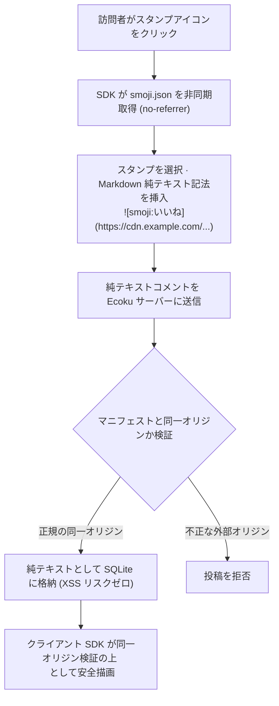

# Smoji スタンププロトコルと自作ソース

Smoji は、Ecoku が採用する**純テキストベースの軽量スタンププロトコル**です。

スタンプによる豊かな表現力と、純テキストの厳格なセキュリティ境界を両立しています。スタンプは SQLite データベースおよびサーバー内部では純テキストのマークダウントークンとしてのみ保存され、クライアント側が同一オリジンの安全性を検証した上で必要に応じて `` として描画します。

---

## プロトコルの処理フロー



---

## `smoji.json` マニフェスト Schema 仕様 (v1)

自作スタンプソースを公開するには、アクセス可能な HTTPS URL で以下の JSON Schema に準拠した `smoji.json` を配信します：

```json
{
  "version": 1,
  "packs": [
    {
      "id": "paopao",
      "label": "泡泡スタンプ",
      "items": [
        {
          "id": "smile",
          "label": "笑顔",
          "src": "https://stickers.example.com/paopao/smile.png"
        },
        {
          "id": "thumbsup",
          "label": "いいね",
          "src": "https://stickers.example.com/paopao/thumbsup.png"
        }
      ]
    }
  ]
}
```

### フィールド制約と技術仕様

- `version`：整数 `1` 必須。
- `packs`：スタンプパックスグループ配列（1〜32 パック）。
- `packs[].id`：パック一意の識別子（正規表現 `/^[A-Za-z0-9][A-Za-z0-9._-]{0,63}$/` に一致）。
- `packs[].label`：パック表示名（前後の空白除去後、最大 40 文字）。
- `packs[].items`：スタンプアイテム一覧（1 パックあたり 1〜300 個、マニフェスト全体で合計 2,000 個まで）。
- `items[].id`：アイテム一意の識別子（正規表現 `/^[A-Za-z0-9][A-Za-z0-9._-]{0,63}$/` に一致）。
- `items[].label`：スタンプ表示文字（前後の空白除去後 1〜40 文字、`]` および改行は禁止）。
- `items[].src`：スタンプ画像アドレス（同一オリジンの絶対 URL、または `smoji.json` からの相対パス。ユーザー名、パスワード、クエリ、ハッシュは禁止）。
- **厳格なキー定義（Exact Keys）**：JSON 構造は上記キーのみを許可し、未定義の余剰フィールドが含まれる場合は解析を拒否します。
- **データサイズと通信制約**：マニフェストファイルサイズ上限は **256 KiB**。リクエスト開始から読み込み完了までのタイムアウトは 8 秒。
- **厳格な同一オリジン制約**：スタンプ画像の `src` の Origin は、**`smoji.json` 自身の Origin と完全に一致**していなければなりません。本番環境では必ず `https://` を使用してください。

---

## 純テキスト記法フォーマット

- **記法**：``
- **例**：``

### 安全なフォールバック規則
コメント本文内に、現在のサイトに設定されたマニフェストと異なるオリジンのスタンプ記法が含まれている場合、またはサイト側で Smoji 機能が無効化されている場合、クライアント SDK は HTML 画像タグとして展開せず、**そのまま純テキストとして安全に表示**します。これにより外部サーバーによる IP トラッキングやフィッシング攻撃を遮断します。

---

## 設定とアセット更新

管理画面のサイト設定で Smoji を有効化し、マニフェスト URL を入力します。マニフェストおよび画像のアドレスにはユーザー名、パスワード、クエリ、ハッシュフラグメントを含めてはなりません。HTTP はローカル開発環境（`localhost`）のみ許可されます。別オリジンでマニフェストを配信する場合は、コメントページのドメインからの CORS 要求を許可してください。

Smoji ワークベンチから出力される「Ecoku レスポンス例」は公開 API の `formConfig.smoji` 構造を示すものであり、管理画面に直接インポートするファイルではありません。管理画面フォームは内部で `smojiEnabled` / `smojiManifestUrl` を使用し、管理 API のリクエストフィールドは `smoji_enabled` / `smoji_manifest_url` です。

コメントには画像の完全な絶対 URL が保存されます。アセットを更新する際も、元のドメイン名と過去の画像パスを維持してください。Smoji ワークベンチでビルドする際は、旧パスの互換ファイルを含む `demo/dist` 全体を配置してください。マニフェストファイルのみを差し替えても、過去のコメント内のリンク切れは修復されません。別 Origin に変更した場合、過去のスタンプはテキストとして表示されます。
