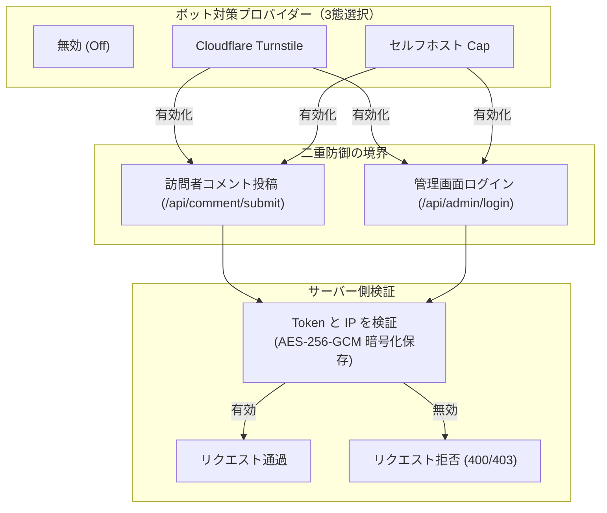

# 管理画面の設定

管理画面は `/admin/` で提供されます。

---

## 1. 認証とインメモリセッション
- **インメモリ Bearer Token**：ログイン時に発行されるトークンはメモリ内のみに保持され、`localStorage` や Cookie には書き込まれません。リロードやタブの閉鎖で即座にログアウトされます。
- **有効期限**：デフォルト 8 時間（480 分）。

---

## 2. サイト管理
- **サイト ID**：SDK で使用する不変の一意の識別子。
- **サイト URL**：通知メール内のリンク生成に使用されるベース URL。
- **許可オリジン (Allowed Origins)**：厳格な CORS ホワイトリスト。
- **必須項目制御**：メールアドレスやウェブサイトの必須/任意設定。
- **Smoji スタンプ**：リモートの HTTPS `smoji.json` マニフェストを設定可能。

---

## 3. ブロガー認証と合言葉
- ニックネーム、メール、12〜80 文字の秘密の合言葉を設定。
- 公開フォームでニックネーム欄に合言葉を入力することで、メールアドレスを入力せずに認証可能。

---

## 4. コメント管理
- **墓標ソフトデリート**：投稿者情報を消去し、`[このコメントは削除されました]` としてスレッド構造を維持。
- **完全削除**：子孫返信が一切存在しない墓標コメントのみ物理削除可能。

---

## 5. ボット対策・認証 (CAPTCHA) {#ボット対策-captcha}

「セキュリティ」画面では、インスタンス全体に適用されるボット対策（3つの状態から選択）を設定でき、**訪問者のコメント投稿**と**管理画面ログイン**の両方を保護します：



> [!NOTE]
> Turnstile および Cap の Secret Key は、マスターキーを使用して AES-256-GCM で暗号化されて保存され、管理画面に平文で表示されることはありません。プロバイダーを切り替えても保存済みの認証情報は保持されます。

### 1. Cloudflare Turnstile

[Cloudflare Turnstile 公式ドキュメント](https://developers.cloudflare.com/turnstile/)

- Cloudflare ダッシュボードで Turnstile Widget を作成します（Managed または Non-interactive モード推奨）。
- **Domains** 許可リストに、ブログのドメイン（例：`blog.example.com`）と Ecoku のドメイン（例：`ecoku.example.com`）を追加します。
- 生成された `Site Key` と `Secret Key` をコピーし、Ecoku 管理画面の「セキュリティ」で Turnstile を選択して入力・保存します。
- コメント欄およびログイン画面に 300px のコンパクトな認証スロットが自動的に表示されます。

### 2. オープンソース・セルフホスト Cap (Capjs)

[Cap (Capjs) 公式サイト](https://capjs.org/) · [GitHub リポジトリ](https://github.com/tiago2/cap)

Cap はモダンで軽量、プライバシー重視の完全オープンソースなセルフホスト型 CAPTCHA サービスです。Ecoku は Cap に完全対応しており、有効化時は管理画面の CSP ポリシーを動的に最適化します（Cap Origin、WASM、Blob Worker、および必要な eval 権限を正確に許可）。

#### Cap セルフホスト構成例

ホストの `~/capjs` ディレクトリに配置し、Valkey をキャッシュバックエンドとして使用する例：

```bash
# 1. データディレクトリの作成
mkdir -p ~/capjs/data/cap ~/capjs/data/valkey && cd ~/capjs

# 2. Valkey 実行権限の設定（UID/GID 999:1000）
sudo chown -R 999:1000 data/valkey
chmod 750 data/cap data/valkey
```

`cat <<'EOF'` を使用して `~/capjs/compose.yml` を作成します：

```bash
cd ~/capjs

cat <<'EOF' > compose.yml
services:
  cap:
    image: tiago2/cap:3.1.8
    restart: unless-stopped
    init: true
    stop_grace_period: 30s
    depends_on:
      valkey:
        condition: service_healthy
    ports:
      - "127.0.0.1:3000:3000"
    environment:
      ADMIN_KEY: ${ADMIN_KEY:?ADMIN_KEY is required}
      REDIS_URL: redis://valkey:6379
      SERVER_PORT: "3000"
      CORS_ORIGIN: ${CORS_ORIGIN:?CORS_ORIGIN is required}
      ENABLE_ASSETS_SERVER: "true"
      WIDGET_VERSION: ${WIDGET_VERSION:?WIDGET_VERSION is required}
      WASM_VERSION: ${WASM_VERSION:?WASM_VERSION is required}
    volumes:
      - ./data/cap:/usr/src/app/data
    networks:
      - public
      - data
    read_only: true
    cap_drop:
      - ALL
    security_opt:
      - no-new-privileges:true
    tmpfs:
      - /tmp:rw,noexec,nosuid,nodev,size=64m
    healthcheck:
      test:
        - CMD
        - bun
        - -e
        - "fetch('http://127.0.0.1:3000/').then(r=>process.exit(r.ok?0:1)).catch(()=>process.exit(1))"
      interval: 30s
      timeout: 5s
      retries: 5
      start_period: 20s

  valkey:
    image: valkey/valkey:9.1.1-alpine
    restart: unless-stopped
    stop_grace_period: 30s
    user: "${VALKEY_UID:?VALKEY_UID is required}:${VALKEY_GID:?VALKEY_GID is required}"
    command:
      - valkey-server
      - --save
      - "60"
      - "1"
      - --appendonly
      - "yes"
      - --appendfsync
      - everysec
      - --loglevel
      - warning
      - --maxmemory-policy
      - noeviction
    volumes:
      - ./data/valkey:/data
    networks:
      - data
    read_only: true
    cap_drop:
      - ALL
    security_opt:
      - no-new-privileges:true
    tmpfs:
      - /tmp:rw,noexec,nosuid,nodev,size=32m
    healthcheck:
      test:
        - CMD
        - valkey-cli
        - ping
      interval: 5s
      timeout: 3s
      retries: 10
      start_period: 5s

networks:
  public:
  data:
    internal: true
EOF
```

`cat <<'EOF'` を使用して `~/capjs/.env` を作成します：

```bash
cd ~/capjs

cat <<'EOF' > .env
CAP_IMAGE=tiago2/cap:3.1.8
VALKEY_IMAGE=valkey/valkey:9.1.1-alpine

# Cap 管理画面アクセスキー（openssl rand -hex 32 での生成を推奨）
ADMIN_KEY=your_secure_admin_key_here

# 許可する CORS オリジン（ブログおよび Ecoku インスタンス）
CORS_ORIGIN=https://blog.example.com,https://ecoku.example.com

# ウィジェットおよび WASM バージョン固定
WIDGET_VERSION=0.1.56
WASM_VERSION=0.0.7

# Valkey コンテナ実行ユーザー権限
VALKEY_UID=999
VALKEY_GID=1000
EOF

chmod 600 .env
```

#### Cap リバースプロキシ設定例 (Caddy)

Cap コンテナはローカル `127.0.0.1:3000` で待ち受けます。Caddy で HTTPS を公開します：

```caddyfile
cap.example.com {
    reverse_proxy 127.0.0.1:3000
}
```

#### Ecoku への連携設定

1. Cap を起動：`cd ~/capjs && sudo docker compose pull && sudo docker compose up -d`
2. ブラウザで `https://cap.example.com` にアクセスし、`.env` の `ADMIN_KEY` でログインします。
3. 新しい Key を作成し、ブログドメイン（例：`blog.example.com`）と Ecoku ドメイン（例：`ecoku.example.com`）を許可ホストに追加します。
4. 生成された `Site Key` と `Secret Key` を取得します。
5. Ecoku 管理画面 `/admin/` ->「セキュリティ」を開きます：
   - **セルフホスト Cap** を選択
   - **インスタンス URL**：`https://cap.example.com`（HTTPS 正規 URL、末尾スラッシュなし）
   - **Site Key**：Cap で生成された Site Key
   - **Secret Key**：Cap で生成された Secret Key
6. 「保存」をクリックすると、Cap による保護が有効化されます。

---

## 6. CLI 救済コマンド

```bash
sudo docker compose down
sudo docker compose run --rm --no-deps ecoku captcha disable
sudo docker compose up -d
```


UTF-8 で 72 バイト以下にしてください。切り詰めは行わず、既存 bcrypt ハッシュは引き続き有効です。
