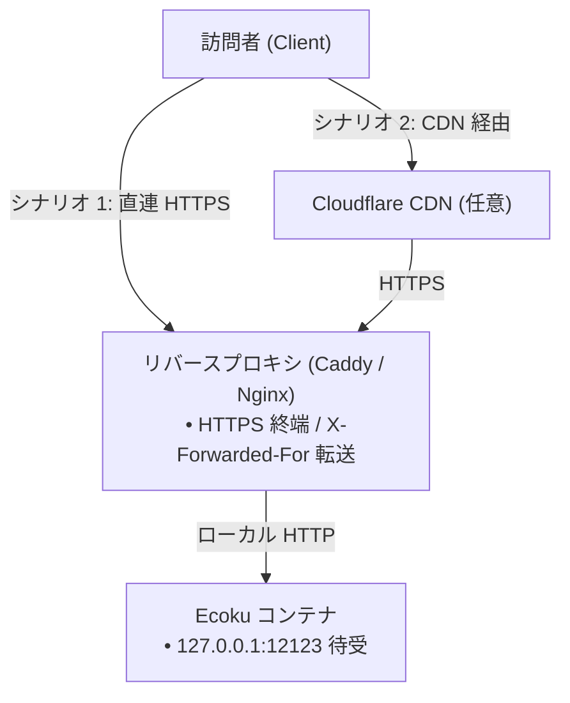

# リバースプロキシとレート制限

Ecoku コンテナはデフォルトでホストのローカルループバック `127.0.0.1:12123` でのみ HTTP リクエストを待ち受けます。本番環境では、フロントエンド Web サーバー（Caddy または Nginx）で HTTPS を終端し、トラフィックをコンテナポートへリバースプロキシする必要があります。

---

## ネットワークトポロジモデル



---

## シナリオ 1：オリジン直接リバースプロキシ

### Caddy 設定（推奨）

Caddy は証明書の自動取得と更新を備えており、最も簡潔に設定できます：

```caddyfile
ecoku.example.com {
    encode zstd gzip

    reverse_proxy 127.0.0.1:12123 {
        # クライアントヘッダーの偽造によるレート制限バイパスを防ぐため、X-Forwarded-For を直接接続 IP で上書き
        header_up X-Forwarded-For {remote_host}
        header_up X-Forwarded-Proto {scheme}
    }
}
```

### Nginx 設定

```nginx
server {
    listen 443 ssl http2;
    server_name ecoku.example.com;

    ssl_certificate /etc/letsencrypt/live/ecoku.example.com/fullchain.pem;
    ssl_certificate_key /etc/letsencrypt/live/ecoku.example.com/privkey.pem;

    # Gzip 圧縮の有効化
    gzip on;
    gzip_types text/plain text/css application/json application/javascript;

    location / {
        proxy_pass http://127.0.0.1:12123;
        proxy_set_header Host $host;
        # X-Forwarded-For を直接の TCP ピア IP で上書き
        proxy_set_header X-Forwarded-For $remote_addr;
        proxy_set_header X-Forwarded-Proto $scheme;
    }
}
```

---

## シナリオ 2：CDN（Cloudflare など）経由のリバースプロキシ

ドメインが Cloudflare CDN を経由している場合、直接のピアは CDN ノードになります。CDN が検証・注入した正規の訪問者 IP を `X-Forwarded-For` に書き込むよう設定します。

### Cloudflare + Caddy 設定

```caddyfile
ecoku.example.com {
    encode zstd gzip

    reverse_proxy 127.0.0.1:12123 {
        # Cloudflare が検証した訪問者の実 IP を X-Forwarded-For に転送
        header_up X-Forwarded-For {http.request.header.CF-Connecting-IP}
        header_up X-Forwarded-Proto {scheme}
    }
}
```

> [!WARNING]
> - CDN を使用する場合、オリジンのファイアウォールは Cloudflare 公式の IP 範囲のみを許可し、パブリック IP による CDN バイパスを遮断してください。
> - Ecoku の `trusted_proxies` 設定には、**常にローカルの Docker ゲートウェイ IP のみを指定**してください。広大な CDN IP レンジを直接登録してはなりません。

---

## クライアント IP の判定と `trusted_proxies`

Ecoku は IP 偽造防止メカニズムを内蔵しています：

1. **デフォルトのゼロトラスト**：`trusted_proxies` が空（`[]`）の場合、Ecoku は `X-Forwarded-For` ヘッダーを一切解析しません。すべてのリクエストは直接の TCP ソケットピア IP（通常はリバースプロキシの IP）として処理され、全訪問者が 1 つのレート制限バケットを共有します。
2. **完全一致トラスト**：直接の TCP 接続ピアが `trusted_proxies` に宣言された IP または CIDR と**完全に一致**した場合にのみ、Ecoku は `X-Forwarded-For` から正規のクライアント IP を読み取り、訪問者ごとの個別レート制限を適用します。

### Docker ゲートウェイ IP の確認

ホスト側で以下のコマンドを実行し、コンテナが属する Docker ブリッジネットワークのゲートウェイを確認します：

```bash
sudo docker inspect ecoku --format '{{range .NetworkSettings.Networks}}{{.Gateway}}{{"\n"}}{{end}}'
```

出力が `172.18.0.1` の場合、`app/config.yaml` を以下のように設定します：

```yaml
site:
  trusted_proxies:
    - "172.18.0.1/32"
```

> [!CAUTION]
> `trusted_proxies` に `0.0.0.0/0` や `::/0` を指定することは厳禁です。偽造された `X-Forwarded-For` によって誰でもレート制限を回避できてしまいます。

---

## 疎通確認テスト

```bash
# ヘルスチェックエンドポイントの確認
curl -i https://ecoku.example.com/api/health

# フロントエンド SDK ローダーの取得確認
curl -i https://ecoku.example.com/client/ecoku-loader.js

# 管理画面エントリポイントの確認
curl -i https://ecoku.example.com/admin/
```
