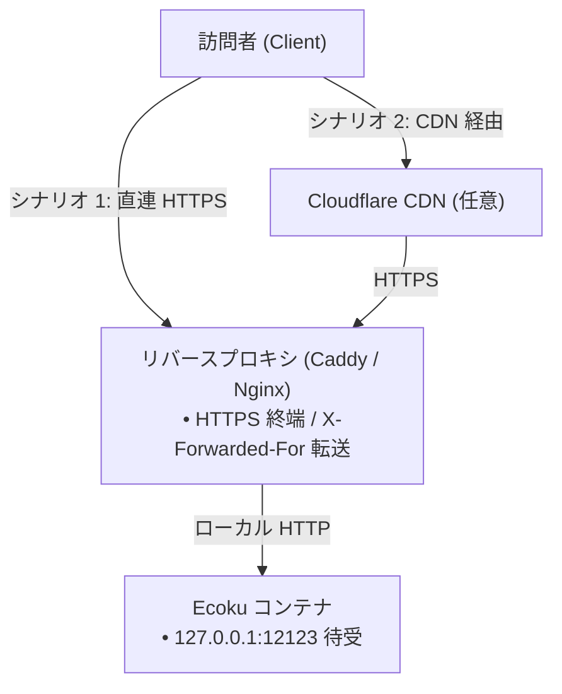

# リバースプロキシとレート制限

Ecoku は `127.0.0.1:12123` でのみ待ち受けるため、フロントエンドの Web サーバーで HTTPS を終端します。

---

## ネットワークトポロジモデル



---

## Caddy 設定（推奨）

```caddyfile
ecoku.example.com {
    encode zstd gzip

    reverse_proxy 127.0.0.1:12123 {
        header_up X-Forwarded-For {remote_host}
        header_up X-Forwarded-Proto {scheme}
    }
}
```

---

## Nginx 設定

```nginx
server {
    listen 443 ssl http2;
    server_name ecoku.example.com;

    ssl_certificate /etc/letsencrypt/live/ecoku.example.com/fullchain.pem;
    ssl_certificate_key /etc/letsencrypt/live/ecoku.example.com/privkey.pem;

    location / {
        proxy_pass http://127.0.0.1:12123;
        proxy_set_header Host $host;
        proxy_set_header X-Forwarded-For $remote_addr;
        proxy_set_header X-Forwarded-Proto $scheme;
    }
}
```

---

## `trusted_proxies` の設定

`app/config.yaml` の `trusted_proxies` に Docker ネットワークゲートウェイ（例: `172.18.0.1/32`）を指定することで、`X-Forwarded-For` の安全な解析を有効化します。
