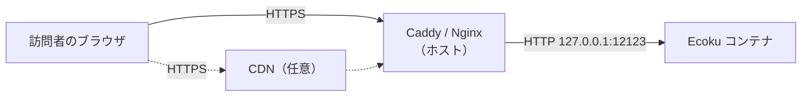

# リバースプロキシ

Ecoku コンテナは、ホストの `127.0.0.1:12123` でのみ HTTP を提供します。インターネットからアクセスするには、同じホスト上の Caddy または Nginx で HTTPS を終端し、このポートに転送する必要があります。

このページで行うことは 2 つです。

1. HTTPS の転送を設定し、`https://ecoku.example.com` にアクセスできるようにする
2. Ecoku が訪問者の実 IP を識別できるようにし、すべての訪問者で 1 つの枠を共有するのではなく、訪問者ごとにレート制限がかかるようにする

## リクエストの経路



リバースプロキシが `127.0.0.1:12123` に接続すると、Docker がその接続をコンテナに引き渡します。コンテナから見える接続元アドレスは訪問者ではなく、Docker ブリッジのゲートウェイ（通常は `172.18.0.1` のような形）です。そのため、訪問者の実 IP はリバースプロキシが `X-Forwarded-For` リクエストヘッダーに書き込んで渡すしかなく、Ecoku はリクエストが確かにこのゲートウェイから来たと確認できた場合にだけそれを読み取ります。

## オリジンに直接転送する場合

### Caddy

Caddy は証明書を自動で取得・更新します。

```caddyfile
ecoku.example.com {
    encode zstd gzip

    reverse_proxy 127.0.0.1:12123 {
        # 直接の接続元アドレスで上書きし、ブラウザが付けた X-Forwarded-For は破棄します
        header_up X-Forwarded-For {remote_host}
        header_up X-Forwarded-Proto {scheme}
    }
}
```

### Nginx

証明書のパスは Certbot のデフォルトの場所を例にしています。

```nginx
server {
    listen 443 ssl;
    listen [::]:443 ssl;
    http2 on;
    server_name ecoku.example.com;

    ssl_certificate     /etc/letsencrypt/live/ecoku.example.com/fullchain.pem;
    ssl_certificate_key /etc/letsencrypt/live/ecoku.example.com/privkey.pem;

    gzip on;
    gzip_types text/plain text/css application/json application/javascript;

    location / {
        proxy_pass http://127.0.0.1:12123;
        proxy_set_header Host $host;
        # 追加ではなく上書きします。$remote_addr は現在の TCP 接続元です
        proxy_set_header X-Forwarded-For $remote_addr;
        proxy_set_header X-Forwarded-Proto $scheme;
    }
}
```

どちらの設定も、要点は `X-Forwarded-For` を**上書き**することです。追加する方式（Nginx の `$proxy_add_x_forwarded_for` など）にすると、ブラウザが偽の値を自分で付けられるため、レート制限を回避されてしまいます。

## CDN を経由する場合

ドメインを Cloudflare などの CDN に載せると、リバースプロキシの直接の接続元は CDN のノードになります。この場合は、CDN が付けるリクエストヘッダーから訪問者の IP を取り出します。Cloudflare と Caddy の例：

```caddyfile
ecoku.example.com {
    encode zstd gzip

    reverse_proxy 127.0.0.1:12123 {
        header_up X-Forwarded-For {http.request.header.CF-Connecting-IP}
        header_up X-Forwarded-Proto {scheme}
    }
}
```

`CF-Connecting-IP` が信頼できるのは、リクエストが実際に Cloudflare を経由している場合だけです。ファイアウォールまたは Caddy で Cloudflare の IP レンジだけを許可し、誰かがオリジンに直接接続してこのヘッダーを自分で付けられないようにしてください。

Ecoku 側の設定は変わりません。`trusted_proxies` には引き続き Docker ゲートウェイだけを指定し、CDN のネットワークレンジは入れないでください。

## trusted_proxies を設定する {#trusted-proxies}

`app/config.yaml` の `site.trusted_proxies` は、Ecoku がどこから転送された `X-Forwarded-For` を信頼するかを決めます。

- **空（デフォルト）**：転送ヘッダーを一切読まず、コンテナから見える接続元アドレスでレート制限します。リバースプロキシの背後に置くと、このアドレスは Docker ゲートウェイになるため、すべての訪問者が同じレート制限枠を共有します。デフォルトではコメント投稿は 1 分あたり 5 回までなので、アクセスが少し増えるだけで `429` を受け取る人が出ます。
- **Docker ゲートウェイを指定**：直接の接続元がちょうどゲートウェイである場合にだけ、`X-Forwarded-For` から訪問者の IP を取り出します。

Ecoku が属するネットワークのゲートウェイを調べます。

```bash
sudo docker inspect ecoku --format '{{range .NetworkSettings.Networks}}{{.Gateway}}{{"\n"}}{{end}}'
```

出力が `172.18.0.1` だったとすると、次のように設定に書きます。

```yaml
site:
  trusted_proxies:
    - "172.18.0.1/32"
```

その後、コンテナを再起動します。

```bash
cd ~/Ecoku && sudo docker compose up -d --force-recreate ecoku
```

::: danger
`0.0.0.0/0` や `::/0` は指定しないでください。Ecoku は起動を拒否します。すべての接続元を信頼することは、誰にでも IP の偽装を許すことと同じです。
:::

## 確認

インターネットに接続できる任意のマシンで次を実行します。

```bash
for path in /api/health /client/ecoku-loader.js /admin/; do
  curl -sS -o /dev/null -w "%{http_code} $path\n" "https://ecoku.example.com$path"
done
```

3 行とも `200` で始まるはずです。ヘルスチェック API はインターネットに公開してかまいません。返すのは状態とタイムスタンプだけです。

問題がなければ、`https://ecoku.example.com/admin/` を開いて[管理画面の設定](./admin)に進みます。
