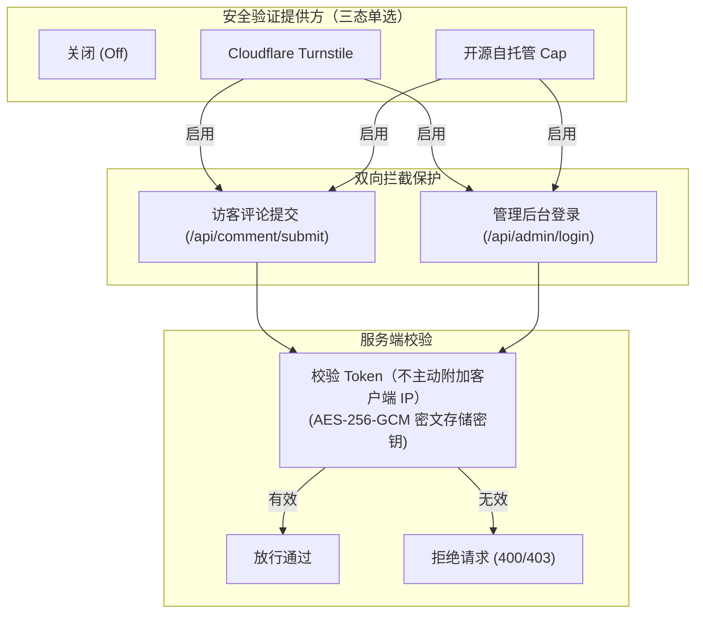

# 管理后台配置

Ecoku 的管理后台位于实例的 `/admin/` 路径。

---

## 1. 可撤销管理员会话

管理员会话通过 HttpOnly Cookie 保存，服务端在 SQLite 中仅保存凭据摘要与到期时间。登录后固定 8 小时，刷新或关闭重开会恢复有效会话，不延长到期时间。主动退出由服务端撤销当前会话；退出失败会保留当前页面并提示重试。凭据不进入 JavaScript、localStorage、sessionStorage 或 URL。

生产环境使用 HTTPS、Secure、HttpOnly、SameSite=Strict、host-only Cookie，路径为 `/api/admin`。仅明确允许的回环 HTTP 开发来源可不带 Secure。轮换管理员密码哈希或签名密钥并重启会使旧会话失效。

---

## 2. 站点管理（Site Management）

在「站点」视图中，您可以创建和管理多个站点的独立配置：

| 配置项 | 说明与规范 |
| :--- | :--- |
| **站点 ID** | 客户端接入所用的唯一标识符（如 `blog`、`docs`）。创建后**永久只读不可修改**。 |
| **规范站点 URL** | 站点的公共主域名规范地址（如 `https://blog.example.com`），用于生成评论原文链接。 |
| **站点名称** | 站点的可读名称（如 `我的个人博客`），留空时自动回退为站点域名。 |
| **允许来源 (Allowed Origins)** | 允许调用评论 API 的精确 Origin 白名单（例如 `https://blog.example.com`）。严格禁止通配符或子路径。 |
| **默认评论排序** | `最新评论`（newest）或 `最早评论`（oldest）。 |
| **必填字段控制** | 独立控制访客的 `邮箱`（默认必填）与 `网站`（默认可选）是否必须填写。 |
| **评论框占位符** | 评论输入框内的提示文案（最多 80 字符，默认：`写下评论（仅支持纯文本）`）。 |
| **正文长度上限** | 根评论与回复允许的最大字符数（1～10,000，按 Unicode 字符计数，默认：`1000`）。 |
| **空评论区文案** | 暂无评论时的展示文本（最多 240 字符，支持保留换行，默认：`还没有评论\n成为第一个留下评论的人。`）。 |

### 表情包 Smoji 配置

站点可勾选启用 Smoji 表情包，并填入一个远程 `smoji.json` 清单地址：

- **清单地址**：生产环境必须为 HTTPS 规范 URL。
- **同源约束**：清单内定义的所有表情图片，其 Origin 必须与清单 URL 完全同源。
- **隐私警示**：表情包由外部清单站点直接向访客浏览器分发，加载表情图片时可能向该清单服务器暴露访客 IP。

---

## 3. 博主身份与口令（Passphrase）

每个站点可配置专属的博主身份认证：

- **博主昵称与邮箱**：必须同时填写或同时留空。
- **博主口令**：启用博主身份时，需设置 12～80 字符的博主口令。
  - 口令经 bcrypt 哈希存储，管理端只显示“已设置”，永不回显明文。
  - **公开评论区免密发表**：博主在博客前台发评时，**仅需在昵称框填入口令**，无需输入邮箱或网站，服务端即可自动识别博主身份并点亮博主徽章。
  - 保存、首次设置或轮换口令不会回填历史博主标记；回填仅存在于原 schema v5 迁移和首次 Twikoo 导入。
- **博主徽章**：可自定义在博主昵称后显示的文本徽章（默认 `[博主]`）。

---

## 4. 评论管理与治理

在「评论」视图中，支持对所有站点的评论进行检索与治理：

### 状态筛选与原文跳转
- 支持按 `已发布`（Published）与 `已删除`（Deleted/墓碑）双态筛选。
- 点击详情抽屉中的“查看原评论”按钮，将通过 `site_url + pageKey + #ecoku-comment-{id}` 精确定位并高亮前台页面的对应评论。

### 墓碑软删除（Soft-Delete）
- 对违规或需删除的评论执行软删除。
- 软删除将立即清空该评论的昵称、私有邮箱、网址与原始正文，`is_blogger` 置为 0，设置 `deleted_at` 时间戳。
- 前台保留该评论节点，正文显示为 `[该评论已删除]`，防止其下的子回复出现上下文断裂。墓碑禁止再被回复。

### 彻底物理清除（Hard Purge）
- 仅当且仅当一个墓碑评论**没有任何子评论**时，实例管理员才可执行“彻底删除”将其从数据库彻底移除。若该墓碑下仍存在讨论子树，系统将禁止物理删除。

---

## 5. 安全与人机验证（Captcha） {#人机验证}

在「安全」视图中，可为整个实例配置统一生效的机器人验证（三态单选切换），同时保护**访客评论提交**与**管理后台登录**：



> [!NOTE]
> Turnstile 与 Cap 的 Secret Key 均使用实例主密钥以 AES-256-GCM 密文存储，管理端界面永不回显明文。切换或关闭提供方时，已保存的密钥配置不会丢失。

### 1. Cloudflare Turnstile

[Cloudflare Turnstile 官方文档](https://developers.cloudflare.com/turnstile/)

- 前往 Cloudflare 仪表盘创建 Turnstile Widget（推荐托管模式 Managed 或非交互式 Non-interactive）。
- 在 **Domains** 域名允许列表中，添加博客前端域名（如 `blog.example.com`）与 Ecoku 服务端域名（如 `ecoku.example.com`）。
- 复制生成的 `Site Key` 与 `Secret Key`，在 Ecoku 管理后台「安全」页面中选择 Turnstile 并填入保存。
- 评论区与后台登录页将自动渲染 300px 紧凑无感验证槽位。

### 2. 开源自托管 Cap (Capjs)

[Cap (Capjs) 官方网站](https://capjs.org/) · [GitHub 仓库](https://github.com/tiago2/cap)

Cap 是一款现代、轻量、注重隐私且完全开源的自托管验证码服务。Ecoku 深度支持 Cap，并根据安全模式动态收敛管理端 CSP 策略（精确放行 Cap Origin、WASM、Blob Worker 与必要的 eval 权限）。

#### Cap 自托管部署参考

假设部署在宿主机 `~/capjs` 目录下，使用 Valkey 作为高速缓存后端：

```bash
# 1. 创建 Cap 与 Valkey 数据目录
mkdir -p ~/capjs/data/cap ~/capjs/data/valkey && cd ~/capjs

# 2. 配置 Valkey 运行权限（UID/GID 999:1000）
sudo chown -R 999:1000 data/valkey
chmod 750 data/cap data/valkey
```

使用 `cat <<'EOF'` 写入 `~/capjs/compose.yml`（固定安全稳定版本）：

```bash
cd ~/capjs

cat <<'EOF' > compose.yml
services:
  cap:
    image: tiago2/cap:3.1.8
    restart: unless-stopped
    init: true
    stop_grace_period: 30s
    depends_on:
      valkey:
        condition: service_healthy
    ports:
      - "127.0.0.1:3000:3000"
    environment:
      ADMIN_KEY: ${ADMIN_KEY:?ADMIN_KEY is required}
      REDIS_URL: redis://valkey:6379
      SERVER_PORT: "3000"
      CORS_ORIGIN: ${CORS_ORIGIN:?CORS_ORIGIN is required}
      ENABLE_ASSETS_SERVER: "true"
      WIDGET_VERSION: ${WIDGET_VERSION:?WIDGET_VERSION is required}
      WASM_VERSION: ${WASM_VERSION:?WASM_VERSION is required}
    volumes:
      - ./data/cap:/usr/src/app/data
    networks:
      - public
      - data
    read_only: true
    cap_drop:
      - ALL
    security_opt:
      - no-new-privileges:true
    tmpfs:
      - /tmp:rw,noexec,nosuid,nodev,size=64m
    healthcheck:
      test:
        - CMD
        - bun
        - -e
        - "fetch('http://127.0.0.1:3000/').then(r=>process.exit(r.ok?0:1)).catch(()=>process.exit(1))"
      interval: 30s
      timeout: 5s
      retries: 5
      start_period: 20s

  valkey:
    image: valkey/valkey:9.1.1-alpine
    restart: unless-stopped
    stop_grace_period: 30s
    user: "${VALKEY_UID:?VALKEY_UID is required}:${VALKEY_GID:?VALKEY_GID is required}"
    command:
      - valkey-server
      - --save
      - "60"
      - "1"
      - --appendonly
      - "yes"
      - --appendfsync
      - everysec
      - --loglevel
      - warning
      - --maxmemory-policy
      - noeviction
    volumes:
      - ./data/valkey:/data
    networks:
      - data
    read_only: true
    cap_drop:
      - ALL
    security_opt:
      - no-new-privileges:true
    tmpfs:
      - /tmp:rw,noexec,nosuid,nodev,size=32m
    healthcheck:
      test:
        - CMD
        - valkey-cli
        - ping
      interval: 5s
      timeout: 3s
      retries: 10
      start_period: 5s

networks:
  public:
  data:
    internal: true
EOF
```

使用 `cat <<'EOF'` 写入 `~/capjs/.env` 环境变量：

```bash
cd ~/capjs

cat <<'EOF' > .env
CAP_IMAGE=tiago2/cap:3.1.8
VALKEY_IMAGE=valkey/valkey:9.1.1-alpine

# Cap 管理控制台访问密钥（建议使用 openssl rand -hex 32 生成）
ADMIN_KEY=your_secure_admin_key_here

# 允许跨域调用的 Origin（包含博客前台与 Ecoku 评论服务域名）
CORS_ORIGIN=https://blog.example.com,https://ecoku.example.com

# 静态 Widget 与 WASM 资源版本锁定
WIDGET_VERSION=0.1.56
WASM_VERSION=0.0.7

# Valkey 容器用户权限
VALKEY_UID=999
VALKEY_GID=1000
EOF

chmod 600 .env
```

#### Cap 反向代理示例 (Caddy)

Cap 容器监听在本地 `127.0.0.1:3000`，通过 Caddy 暴露 HTTPS（例如域名 `cap.example.com`）：

```caddyfile
cap.example.com {
    reverse_proxy 127.0.0.1:3000
}
```

#### 对接到 Ecoku 后台

1. 启动 Cap 服务：`cd ~/capjs && sudo docker compose pull && sudo docker compose up -d`。
2. 浏览器打开 `https://cap.example.com`，输入 `.env` 中的 `ADMIN_KEY` 登录 Cap 控制台。
3. 创建新 Key，将前台博客域名（如 `blog.example.com`）与 Ecoku 域名（如 `ecoku.example.com`）加入允许 Host 列表。
4. 获取该 Key 的 `Site Key` 与 `Secret Key`。
5. 打开 Ecoku 管理后台 `/admin/` ->「安全」：
   - 选择 **开源自托管 Cap**
   - **实例地址**：`https://cap.example.com`（必须为 HTTPS 规范 URL，末尾不带斜杠）
   - **Site Key**：填入 Cap 生成的 Site Key
   - **Secret Key**：填入 Cap 生成的 Secret Key
6. 点击「保存设置」，系统即可无缝切换为 Cap 验证码防护。

---

## 6. 通知设置（Notifications）

通知配置为实例级全局设置：

### 邮件（SMTP）通知
- 支持 `tls` 或 `starttls` 加密连接，端口按邮件服务商要求填写（常见为 465 / 587）；不支持明文 SMTP。
- 支持配置博主通知收件邮箱列表（支持批量输入多个收件人）。
- 提供“发送测试邮件”按钮，通过独立限流器安全探测邮件连通性。

### Telegram 机器人通知
- 填入 Telegram Bot Token 与接收消息的 Chat ID（支持个人 ID、群组 ID 或频道 ID）。
- 提供“发送测试消息”按钮验证推送功能。

---

## 7. 应急故障恢复（CLI 救砖）

若因人机验证提供方配置错误或网络故障导致管理员无法通过后台登录，可通过服务器命令行直接重置人机验证状态：

```bash
# 1. 停止运行中的服务
sudo docker compose down

# 2. 查询当前验证码配置状态
sudo docker compose run --rm --no-deps ecoku captcha status

# 3. 强制关闭人机验证
sudo docker compose run --rm --no-deps ecoku captcha disable

# 4. 重新启动服务
sudo docker compose up -d
```

恢复登录后，即可在管理后台修正验证码参数并重新启用。


UTF-8 编码同时不得超过 72 字节；不截断口令，已有 bcrypt 哈希继续有效。
