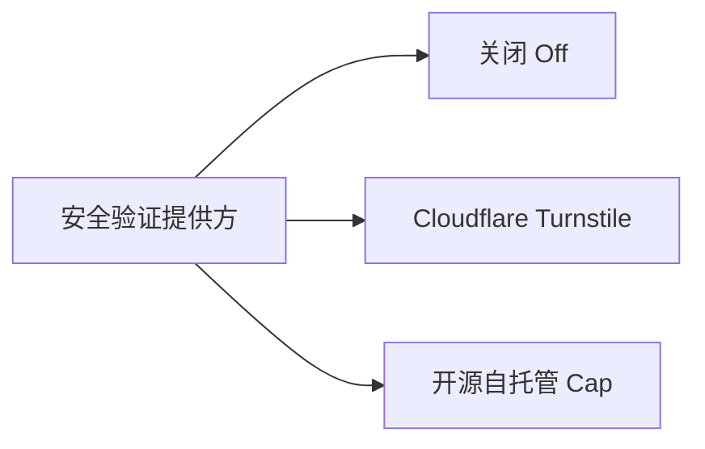

# 管理后台配置

Ecoku 的管理后台位于实例的 `/admin/` 路径。

---

## 1. 登录与会话特性

- **访问地址**：`https://comments.example.com/admin/`
- **身份凭据**：输入在 `ecoku.env` 中配置的 `ECOKU_ADMIN_USERNAME` 与对应密码。
- **内存 Bearer Token**：
  - 登录成功后签发的 Bearer Token 仅保存在浏览器当前运行时的 Vue 内存中。
  - **绝不写入** `localStorage`、`sessionStorage`、`cookie` 或 URL 参数。
  - 刷新页面或关闭浏览器标签页后，会话立即注销，保障公共或多设备使用时的绝对安全。
- **有效时间**：默认会话生命周期为 8 小时（480 分钟），支持倒计时即时退出。

---

## 2. 站点管理（Site Management）

在「站点」视图中，您可以创建和管理多个站点的独立配置：

| 配置项 | 说明与规范 |
| :--- | :--- |
| **站点 ID** | 客户端接入所用的唯一标识符（如 `blog`、`docs`）。创建后**永久只读不可修改**。 |
| **规范站点 URL** | 站点的公共主域名规范地址（如 `https://blog.example.com`），用于生成评论原文链接。 |
| **站点名称** | 站点的可读名称（如 `我的个人博客`），留空时自动回退为站点域名。 |
| **允许来源 (Allowed Origins)** | 允许调用评论 API 的精确 Origin 白名单（例如 `https://blog.example.com`）。严格禁止通配符或子路径。 |
| **默认评论排序** | `最新评论`（newest）或 `最早评论`（oldest）。 |
| **必填字段控制** | 独立控制访客的 `邮箱`（默认必填）与 `网站`（默认可选）是否必须填写。 |
| **评论框占位符** | 评论输入框内的提示文案（最多 80 字符，默认：`写下评论（仅支持纯文本）`）。 |
| **正文长度上限** | 根评论与回复允许的最大字符数（1～10,000，按 Unicode 字符计数，默认：`1000`）。 |
| **空评论区文案** | 暂无评论时的展示文本（最多 240 字符，支持保留换行，默认：`还没有评论\n成为第一个留下评论的人。`）。 |

### 表情包 Smoji 配置

站点可勾选启用 Smoji 表情包，并填入一个远程 `smoji.json` 清单地址：

- **清单地址**：生产环境必须为 HTTPS 规范 URL。
- **同源约束**：清单内定义的所有表情图片，其 Origin 必须与清单 URL 完全同源。
- **隐私警示**：表情包由外部清单站点直接向访客浏览器分发，加载表情图片时可能向该清单服务器暴露访客 IP。

---

## 3. 博主身份与口令（Passphrase）

每个站点可配置专属的博主身份认证：

- **博主昵称与邮箱**：必须同时填写或同时留空。
- **博主口令**：启用博主身份时，需设置 12～80 字符的博主口令。
  - 口令经 bcrypt 哈希存储，管理端只显示“已设置”，永不回显明文。
  - **公开评论区免密发表**：博主在博客前台发评时，**仅需在昵称框填入口令**，无需输入邮箱或网站，服务端即可自动识别博主身份并点亮博主徽章。
  - **历史评论自动回填**：保存口令时，服务端在事务内按博主昵称与私有邮箱精确匹配历史所有未删除的评论，自动批量回填 `is_blogger` 标记。
- **博主徽章**：可自定义在博主昵称后显示的文本徽章（默认 `[博主]`）。

---

## 4. 评论管理与治理

在「评论」视图中，支持对所有站点的评论进行检索与治理：

### 状态筛选与原文跳转
- 支持按 `已发布`（Published）与 `已删除`（Deleted/墓碑）双态筛选。
- 点击详情抽屉中的“查看原评论”按钮，将通过 `site_url + pageKey + #ecoku-comment-{id}` 精确定位并高亮前台页面的对应评论。

### 墓碑软删除（Soft-Delete）
- 对违规或需删除的评论执行软删除。
- 软删除将立即清空该评论的昵称、私有邮箱、网址与原始正文，`is_blogger` 置为 0，设置 `deleted_at` 时间戳。
- 前台保留该评论节点，正文显示为 `[该评论已删除]`，防止其下的子回复出现上下文断裂。墓碑禁止再被回复。

### 彻底物理清除（Hard Purge）
- 仅当且仅当一个墓碑评论**没有任何子评论**时，实例管理员才可执行“彻底删除”将其从数据库彻底移除。若该墓碑下仍存在讨论子树，系统将禁止物理删除。

---

## 5. 安全与人机验证（Captcha）

在「安全」视图中，可为整个实例配置统一生效的机器人验证（单选三选一），同时保护**访客评论提交**与**管理后台登录**：



### 1. Cloudflare Turnstile
- 访问 Cloudflare 控制台创建 Turnstile Widget，填入 `Site Key` 与 `Secret Key`。
- 适配 300px 紧凑槽位，无感验证。

### 2. 开源自托管 Cap
- 支持完全自托管的 Cap 验证码实例。
- 填入 Cap 的 `实例地址`（必须 HTTPS）、`Site Key` 与 `Secret Key`。
- 服务端自动生成精确的 CSP 规则，放行 Cap 的 Origin、WASM、Blob Worker 与必要的 eval 权限。

> [!NOTE]
> Turnstile 与 Cap 的 Secret Key 均使用实例主密钥以 AES-256-GCM 密文存储，管理端界面永不回显明文。切换或关闭提供方时，已保存的密钥配置不会丢失。

---

## 6. 通知设置（Notifications）

通知配置为实例级全局设置：

### 邮件（SMTP）通知
- 支持标准的 SMTP 服务器、端口（如 465 SSL/TLS 或 587 STARTTLS，禁止未加密的 25 端口）。
- 支持配置博主通知收件邮箱列表（支持批量输入多个收件人）。
- 提供“发送测试邮件”按钮，通过独立限流器安全探测邮件连通性。

### Telegram 机器人通知
- 填入 Telegram Bot Token 与接收消息的 Chat ID（支持个人 ID、群组 ID 或频道 ID）。
- 提供“发送测试消息”按钮验证推送功能。

---

## 7. 应急故障恢复（CLI 救砖）

若因人机验证提供方配置错误或网络故障导致管理员无法通过后台登录，可通过服务器命令行直接重置人机验证状态：

```bash
# 1. 停止运行中的服务
sudo docker compose down

# 2. 查询当前验证码配置状态
sudo docker compose run --rm --no-deps ecoku captcha status

# 3. 强制关闭人机验证
sudo docker compose run --rm --no-deps ecoku captcha disable

# 4. 重新启动服务
sudo docker compose up -d
```

恢复登录后，即可在管理后台修正验证码参数并重新启用。
