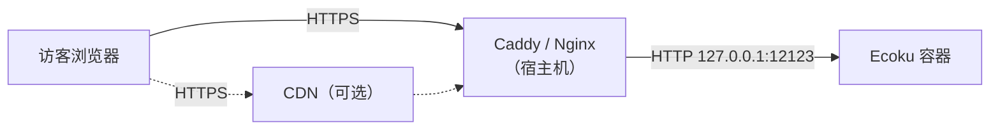

# 反向代理

Ecoku 容器只在宿主机 `127.0.0.1:12123` 上提供 HTTP。公网访问需要由同一台主机上的 Caddy 或 Nginx 终止 HTTPS，再转发给这个端口。

本页有两件事要完成：

1. 配置 HTTPS 转发，让 `https://ecoku.example.com` 可以访问；
2. 让 Ecoku 识别访客的真实 IP，使限流按人计算，而不是所有访客共用一个额度。

## 请求经过的路径



反向代理连到 `127.0.0.1:12123` 时，Docker 会把连接转交给容器。容器看到的对端地址不是访客，而是 Docker 网桥的网关（通常形如 `172.18.0.1`）。所以访客的真实 IP 只能由反向代理写进 `X-Forwarded-For` 请求头传过去，而 Ecoku 只在确认请求确实来自这个网关时才读取它。

## 直接回源

### Caddy

Caddy 会自动申请和续期证书。

```caddyfile
ecoku.example.com {
    encode zstd gzip

    reverse_proxy 127.0.0.1:12123 {
        # 用直连对端地址覆盖，丢弃浏览器自带的 X-Forwarded-For
        header_up X-Forwarded-For {remote_host}
        header_up X-Forwarded-Proto {scheme}
    }
}
```

### Nginx

证书路径以 Certbot 默认位置为例。

```nginx
server {
    listen 443 ssl;
    listen [::]:443 ssl;
    http2 on;
    server_name ecoku.example.com;

    ssl_certificate     /etc/letsencrypt/live/ecoku.example.com/fullchain.pem;
    ssl_certificate_key /etc/letsencrypt/live/ecoku.example.com/privkey.pem;

    gzip on;
    gzip_types text/plain text/css application/json application/javascript;

    location / {
        proxy_pass http://127.0.0.1:12123;
        proxy_set_header Host $host;
        # 覆盖而不是追加：$remote_addr 是当前 TCP 对端
        proxy_set_header X-Forwarded-For $remote_addr;
        proxy_set_header X-Forwarded-Proto $scheme;
    }
}
```

两份配置的关键都是**覆盖** `X-Forwarded-For`。如果改成追加（如 Nginx 的 `$proxy_add_x_forwarded_for`），浏览器可以自己带一个伪造的值，限流就能被绕过。

## 经过 CDN 回源

域名接入 Cloudflare 等 CDN 后，反向代理的直连对端变成了 CDN 节点。这时要从 CDN 提供的请求头里取访客 IP。以 Cloudflare 和 Caddy 为例：

```caddyfile
ecoku.example.com {
    encode zstd gzip

    reverse_proxy 127.0.0.1:12123 {
        header_up X-Forwarded-For {http.request.header.CF-Connecting-IP}
        header_up X-Forwarded-Proto {scheme}
    }
}
```

`CF-Connecting-IP` 只有在请求确实经过 Cloudflare 时才可信。请在防火墙或 Caddy 中只放行 Cloudflare 的 IP 段，避免有人直连源站并自己填这个请求头。

Ecoku 这一侧的配置不变：`trusted_proxies` 仍然只填 Docker 网关，不要把 CDN 的网段填进去。

## 配置 trusted_proxies {#trusted-proxies}

`app/config.yaml` 里的 `site.trusted_proxies` 决定 Ecoku 信任谁转发的 `X-Forwarded-For`：

- **留空（默认）**：不读取任何转发头，一律按容器看到的对端地址限流。放在反向代理后面时，这个地址就是 Docker 网关，于是所有访客共享同一个限流额度。默认每分钟只允许 5 次评论提交，访问量稍大就会有人收到 `429`。
- **填 Docker 网关**：只有直连对端正好是网关时，才从 `X-Forwarded-For` 取访客 IP。

查出 Ecoku 所在网络的网关：

```bash
sudo docker inspect ecoku --format '{{range .NetworkSettings.Networks}}{{.Gateway}}{{"\n"}}{{end}}'
```

假设输出 `172.18.0.1`，在 `app/config.yaml` 中加上：

```yaml
site:
  trusted_proxies:
    - "172.18.0.1/32"
```

然后重启容器：

```bash
cd ~/Ecoku && sudo docker compose up -d --force-recreate ecoku
```

::: danger
不要填 `0.0.0.0/0` 或 `::/0`，Ecoku 会拒绝启动。信任任意来源等于允许任何人伪造 IP。
:::

## 检查

在任意一台能上网的机器上执行：

```bash
for path in /api/health /client/ecoku-loader.js /admin/; do
  curl -sS -o /dev/null -w "%{http_code} $path\n" "https://ecoku.example.com$path"
done
```

三行都应以 `200` 开头。健康接口可以对公网开放，它只返回状态和时间戳。

确认无误后，打开 `https://ecoku.example.com/admin/` 继续[配置管理后台](./admin)。
