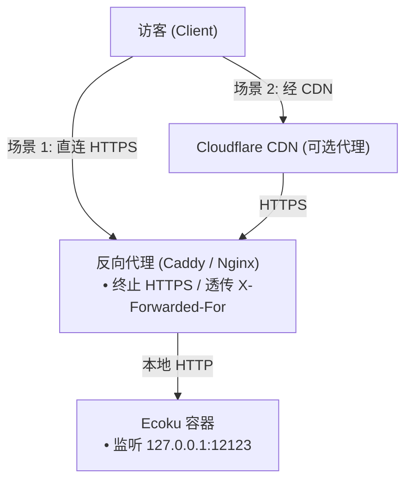

# 反向代理与网络限流

Ecoku 容器默认仅在宿主机本地回环 `127.0.0.1:12123` 监听 HTTP 请求。在生产环境中，必须通过前端 Web 服务器（如 Caddy 或 Nginx）终止 HTTPS，并将流量反向代理到容器端口。

---

## 网络拓扑模型



---

## 场景 1：直连源站反向代理

### Caddy 配置（推荐）

Caddy 具备自动证书申请与维护能力，配置最为精炼：

```caddyfile
ecoku.example.com {
    encode zstd gzip

    reverse_proxy 127.0.0.1:12123 {
        # 强制覆盖 X-Forwarded-For 为对端直连 IP，防止客户端伪造 Header 欺骗限流
        header_up X-Forwarded-For {remote_host}
        header_up X-Forwarded-Proto {scheme}
    }
}
```

### Nginx 配置

```nginx
server {
    listen 443 ssl http2;
    server_name ecoku.example.com;

    ssl_certificate /etc/letsencrypt/live/ecoku.example.com/fullchain.pem;
    ssl_certificate_key /etc/letsencrypt/live/ecoku.example.com/privkey.pem;

    # 启用 Gzip 压缩
    gzip on;
    gzip_types text/plain text/css application/json application/javascript;

    location / {
        proxy_pass http://127.0.0.1:12123;
        proxy_set_header Host $host;
        # 覆盖 X-Forwarded-For 为当前直接 TCP 对端 IP
        proxy_set_header X-Forwarded-For $remote_addr;
        proxy_set_header X-Forwarded-Proto $scheme;
    }
}
```

---

## 场景 2：经 CDN（如 Cloudflare）反向代理

当域名通过 Cloudflare CDN 代理时，直接对端是 CDN 节点。必须配置反向代理将 CDN 注入的真实客户端 IP 写入 `X-Forwarded-For`。

### Cloudflare + Caddy 配置

```caddyfile
ecoku.example.com {
    encode zstd gzip

    reverse_proxy 127.0.0.1:12123 {
        # 将 Cloudflare 鉴权后的访客真实 IP 覆盖写入 X-Forwarded-For
        header_up X-Forwarded-For {http.request.header.CF-Connecting-IP}
        header_up X-Forwarded-Proto {scheme}
    }
}
```

> [!WARNING]
> - 开启 CDN 时，源站防火墙应严格限制仅放行 Cloudflare 官方 IP 段，禁止通过公网 IP 绕过 CDN 直接回源。
> - 在 Ecoku 的 `trusted_proxies` 配置中，**仍旧只填写 Docker 网关 IP**，绝不能将整个 CDN 庞大的网段填入 `trusted_proxies`。

---

## 客户端 IP 判定与 `trusted_proxies`

Ecoku 内置严格的防伪造保护机制：

1. **默认不信任**：若 `trusted_proxies` 为空（`[]`），Ecoku 默认不解析任何 `X-Forwarded-For` 请求头，所有请求均按 TCP Socket 对端 IP（通常为反向代理网关 IP）处理。此时所有访客共用一个限流桶。
2. **精确信任**：只有当 TCP 直接连接对端**精确匹配** `trusted_proxies` 中声明的单个 IP 或 CIDR 时，Ecoku 才会从 `X-Forwarded-For` 读取真实客户端 IP 进行独立限流。

### 查询 Docker 网关 IP

执行以下命令获取当前容器所在的 Docker 桥接网络网关：

```bash
sudo docker inspect ecoku --format '{{range .NetworkSettings.Networks}}{{.Gateway}}{{"\n"}}{{end}}'
```

例如输出为 `172.18.0.1`，则在 `app/config.yaml` 中配置：

```yaml
site:
  trusted_proxies:
    - "172.18.0.1/32"
```

> [!CAUTION]
> 绝对禁止在 `trusted_proxies` 中配置 `0.0.0.0/0` 或 `::/0`，否则任何外部请求均可通过伪造 `X-Forwarded-For` 绕过限流。

---

## 连通性测试

```bash
# 验证反向代理健康检查端点
curl -i https://ecoku.example.com/api/health

# 验证前端静态加载器脚本可访问
curl -i https://ecoku.example.com/client/ecoku-loader.js

# 验证管理后台入口
curl -i https://ecoku.example.com/admin/
```
