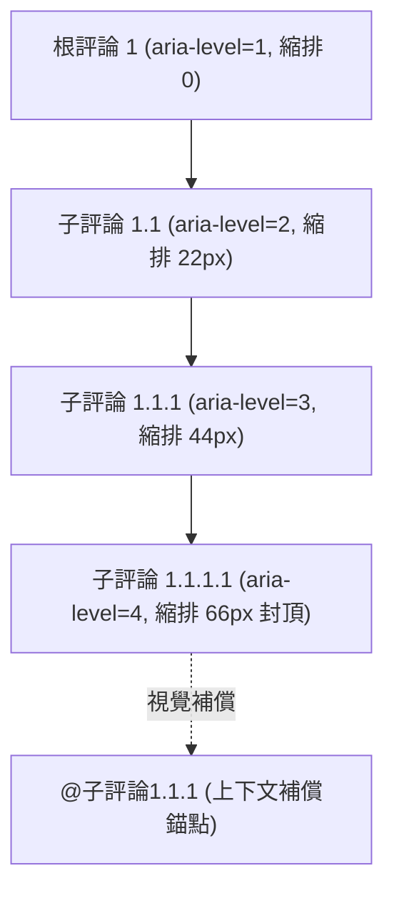
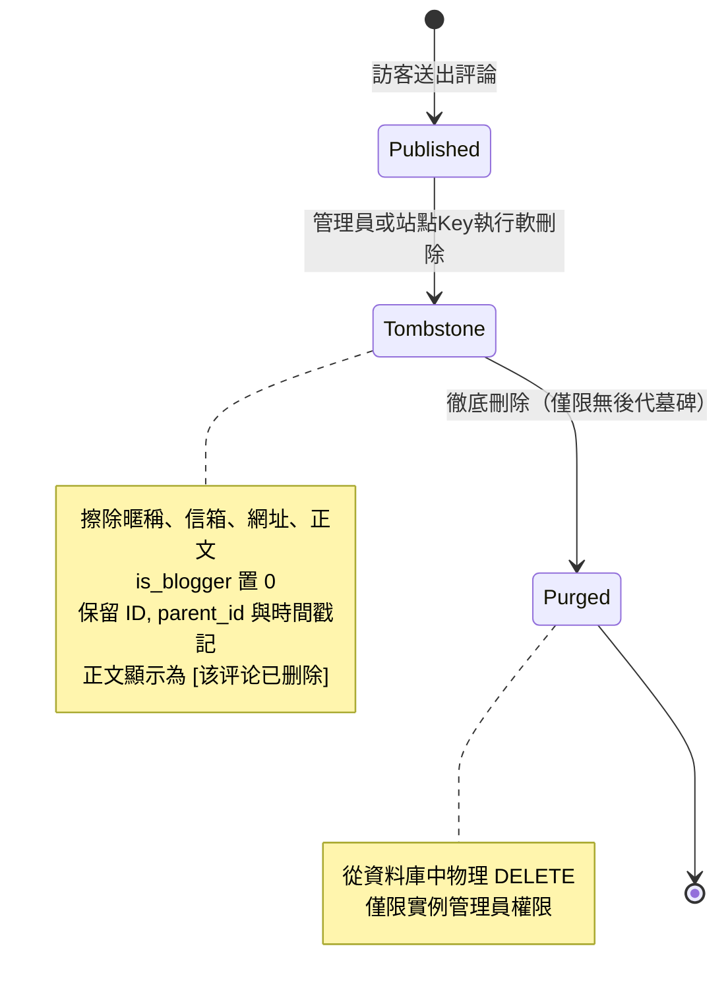
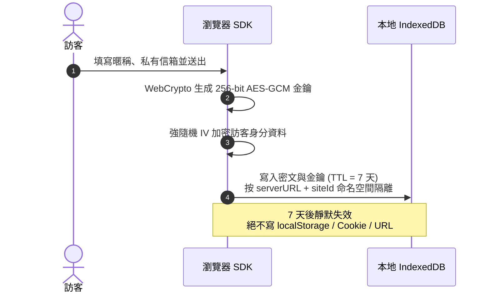
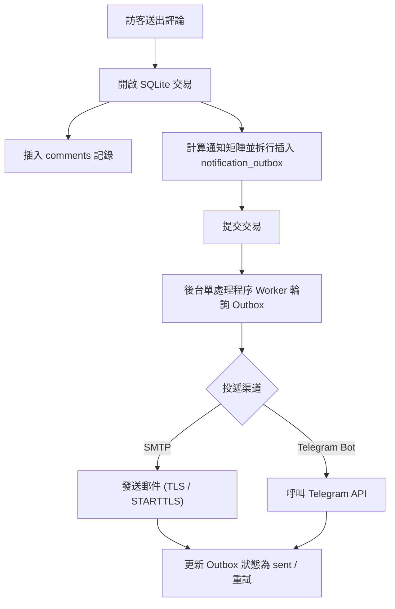

# 核心機制與設計模型

Ecoku 的設計圍繞**輕量化**、**純文字直接發布**、**強隱私邊界**與**極簡維運**展開。本篇深入介紹 Ecoku 的核心設計哲學與運行機制。

---

## 樹狀評論與分頁模型

傳統評論系統往往面臨兩難選擇：扁平化串流評論遺失了對話上下文，而多層巢狀評論在行動端易產生無限縮排版面崩潰。Ecoku 提出了**「最多 16 層回覆 + 最多 3 級視覺縮排」**的設計方案。

### 1. 語意與視覺分層

- **語意層級（Semantic Level）**：DOM 元素的 `aria-level` 與 `data-depth` 真實反映樹的物理巢狀深度（1, 2, 3, 4, 5...），確保螢幕報讀器等無障礙設備能準確理解對話層級。
- **視覺縮排（Visual Indent）**：在視覺呈現上，縮排層級透過 CSS 計算公式 `min(depth, 3)` 截斷在第 3 級（桌面端每級 22px，最大 66px；行動端每級 14px，最大 42px）。
- **上下文補償（Context Compensation）**：當巢狀深度達到第 3 級及以上時，評論元資訊行中會自動加入可點選的 `@被回覆者` 錨點連結，直達父級評論。這既避免了深層回覆在窄螢幕上被擠壓成細條，又保證了對話脈絡清晰可辨。

### 2. 根討論串分頁演算法

為了防止「載入更多」瀑布流導致回覆上下文被割裂，Ecoku 採用**按根討論串分頁**模型：

- 分頁參數 `page` 與 `pageSize` 僅作用於頂層根評論（`parent_id IS NULL`）。
- 預算內的成功回應**完整包含**當前頁根評論的公開後代。超過 200 個節點、16 層後代、1 MiB JSON 或 10,000 條統計記錄時回傳 422，不截斷；現有 SDK 顯示載入失敗。大頁面可由自訂接入使用[單層游標 API](../reference/api.md)按需讀取。
- 翻頁操作切換的是整批討論樹，保證使用者閱讀任意一條根討論時，都能看到完整的對話全貌。

---

## 墓碑機制（Soft Delete & Purge）

在公開討論區中，直接物理刪除某條父評論會導致其下所有子回覆瞬間成為「孤兒節點」，上下文徹底斷裂。Ecoku 採用嚴密的**墓碑化（Tombstone）**機制：

1. **墓碑化（軟刪除）**：
   - 擦除暱稱、私有信箱、網址與原始正文，將 `is_blogger` 置為 0，設定 `deleted_at` 時間戳記。
   - 保留評論 ID、頁面 key、`parent_id` 引用關係。
   - 公開介面回傳 `deleted: true`，固定暱稱「已删除」，固定正文內容為 `[该评论已删除]`。
   - 墓碑節點**禁止新增回覆**。
2. **徹底刪除（物理清除）**：
   - 僅當且僅當一個墓碑節點**沒有任何子評論**（無論是公開評論還是其他墓碑）時，實例管理員才可執行物理清除。
   - 站點自動化 Management Key 僅有權將本站評論墓碑化，無權執行徹底物理刪除。

---

## 訪客身分加密儲存

Ecoku 絕不使用可能跨站洩漏或被腳本輕易讀取的 `localStorage` 或 Cookie 儲存訪客個人資訊。

- **隔離命名空間**：基於 `serverURL + "::" + siteId` 進行獨立儲存隔離。
- **本地加密儲存**：使用瀏覽器原生 Web Crypto API 生成不可導出的 256 位元 AES-GCM 金鑰，配合強隨機 IV 加密身分資訊。
- **自動生命週期**：本地資料有效期嚴格設定為 7 天。過期或資料損壞時靜默回退為空身分；不會自動刪除已儲存的密文與金鑰，清理需使用瀏覽器的網站資料管理。

---

## 站長身分與口令機制

為了避免站長在公開設備上輸入私有信箱，Ecoku 引入了基於 **Passphrase（站長口令）** 的免密證明機制：

- **口令配置**：管理員在後台為站點設定 12～80 字元的站長口令。伺服端僅儲存其 bcrypt 哈希，管理端永不回顯明文。
- **發表流程**：
  1. 站長在評論區發表時，**只需在「暱稱」輸入框中輸入該口令**，無需填寫信箱或網址。
  2. 伺服端在送出交易中校驗口令哈希，一旦命中，自動將作者暱稱重寫為站點配置的站長暱稱，信箱重寫為站長私有信箱，網址指向站點規範 URL，並標記 `is_blogger = 1`。
  3. 客戶端送出成功後自動清空輸入框，防止口令停留在瀏覽器介面。
- **歷史回填（v0.2.3）**：僅保留原 schema v5 遷移與空站點 Twikoo 匯入交易內的回填；儲存設定、首次設定或更換口令均不重新授予歷史留言站長身分，既有標記保留。

---

## Outbox 交易一致性通知

Ecoku 將通知事件與評論寫入綁定在同一個 SQLite 交易中，杜絕了由於網路波動或外部服務當機導致的通知遺失。

### 通知判定矩陣

系統依據持久化儲存的 `is_blogger` 標記執行通知分發：

| 觸發場景 | 站長通知渠道（郵件/Telegram） | 被回覆訪客郵件通知 |
| :--- | :---: | :---: |
| **訪客發表根評論** | ✅ 發送 | — |
| **訪客回覆訪客** | ✅ 發送 | ✅ 發送 |
| **訪客回覆站長** | ✅ 發送（僅通知一次） | — |
| **站長發表根評論** | ❌ 不發送 | — |
| **站長回覆訪客** | ❌ 不發送 | ✅ 發送 |
| **站長回覆站長** | ❌ 不發送 | ❌ 不發送 |
| **同一信箱回覆自己** | — | ❌ 不發送 |

---

## 會話與動態 CSP 安全模型

1. **可撤銷管理員會話**：
   - 管理員會話使用 HttpOnly Cookie；SQLite 僅保存憑證摘要與到期時間。登入後固定 8 小時，重新整理或關閉重開可恢復有效會話，不延長期限。主動登出由服務端撤銷目前會話；登出失敗保留目前畫面並提示重試。憑證不進入 JavaScript、localStorage、sessionStorage 或 URL。
   - 正式環境使用 HTTPS、Secure、HttpOnly、SameSite=Strict、host-only Cookie，路徑為 `/api/admin`。只有明確允許的回環 HTTP 開發來源可省略 Secure。輪換管理員密碼雜湊或簽名金鑰並重啟後，舊會話失效。
2. **嚴格動態收斂的 Content-Security-Policy**：
   - 當啟用自託管 Cap 時，伺服端動態放行 Cap HTTPS 實例來源、WASM、Blob Worker 與 `'unsafe-eval'`。
   - 當切換為 Turnstile 或關閉驗證時，伺服端立即剝離 Cap 網域與所有動態求值權限，CSP 嚴格降級。

UTF-8 編碼同時不得超過 72 位元組，不截斷口令，既有 bcrypt 雜湊仍有效。
