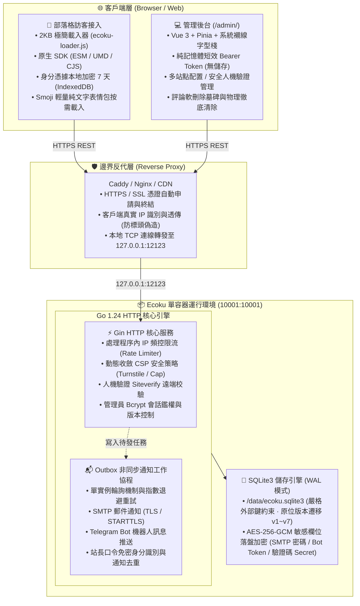

# 簡介與系統架構

Ecoku 是一個專為靜態部落格與內容驅動型站點設計的**自託管、多站點純文字評論系統**。

它摒棄了繁重的審核隊列、複雜的使用者中心與外部依賴，以單容器 + SQLite3 的極致輕量化形態交付。評論一旦送出，通過安全檢查後立即面向公眾呈現。

---

## 核心設計哲學

- **極簡拓撲**：單個 Docker 容器同時託管 Go API、靜態管理後台（`/admin/`）與瀏覽器 SDK（`/client/`），資料單檔案落盤於 SQLite3，無附加 Redis/MySQL 依賴。
- **純文字交流**：正文永不解析 HTML 或 Markdown，杜絕 XSS 注入風險，回歸評論討論的本質。
- **送出即公開**：無前置人工審核隊列，依靠 IP 頻控限流、站長口令與現代化人機驗證（Turnstile / Cap）維護討論秩序。
- **強隱私邊界**：公共 API 絕不輸出信箱、IP、User-Agent、地區或資料庫內部 ID；訪客身分僅在本地 IndexedDB 加密保存 7 天。
- **交易性升級**：Schema 原位版本化演進（v1～v7），單向遷移，杜絕破壞性重構。

---

## 系統架構全景

