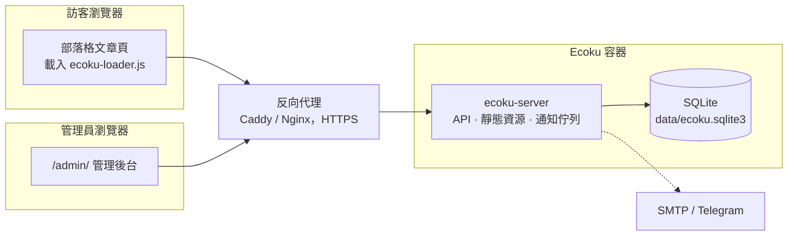

# 簡介

Ecoku 是專為靜態部落格與個人網站設計的自託管評論系統。透過 Docker 部署單一容器，並在頁面範本中嵌入一段 HTML，即可完成接入。

設計原則保持克制與精簡：

- **純文字討論**：不解析 HTML 與 Markdown，無富文字編輯器。
- **送出即公開**：無前置審核佇列，違規評論由管理員事後清理。
- **無需註冊**：訪客無需帳號，填寫暱稱、信箱（預設必填，可改為選填）與網址（預設選填）即可發言。
- **多站點統一服務**：單一實例支援多站點，各站點的評論資料與站點設定相互隔離。
- **單庫儲存與金鑰分離**：業務資料集中於 SQLite，金鑰獨立持久化；無需外部資料庫或 Redis，冷備部署目錄即可完整還原。

## 適用情境

- 使用 Hugo、Hexo、Astro、VitePress、Jekyll 等工具建置靜態網站，需要輕量評論區。
- 希望將評論資料完全掌握在自己手中，擺脫第三方商業評論服務依賴。
- 維護多個站點，希望由單套服務統一託管。

## 功能邊界

以下特性不屬於 Ecoku 的設計範疇：

- 富文字、Markdown 轉譯與圖片上傳（[Smoji 貼圖](../integration/smoji) 是唯一的圖片展示形式）；
- 訪客帳號體系、第三方社群登入與外部大頭貼；
- 按讚、倒讚或表情互動計數；
- 評論前置審核佇列；
- MySQL、PostgreSQL 等外部資料庫。

如果上述功能是你的硬性需求，Ecoku 可能並不適用。

## 系統組成 {#components}

容器內僅執行一個 Go 二進位程式 `ecoku-server`，統一負責：

- 評論 API `/api/comment/*` 與管理 API `/api/admin/*`；
- 管理後台 `/admin/` 介面；
- 部落格嵌入腳本與樣式資源 `/client/`；
- 非同步電子郵件與 Telegram 通知遞送佇列。

容器以非 root 使用者執行，僅監聽主機回環位址 `127.0.0.1:12123`，由同機反向代理負責 HTTPS 終結。

## 上線步驟

1. [Docker 部署](../self-hosting/docker)：準備執行目錄與設定，啟動時自動初始化管理員帳號與持久金鑰。
2. [反向代理](../self-hosting/reverse-proxy)：設定反向代理並綁定 HTTPS 網域。
3. [管理後台](../self-hosting/admin)：登入後台並註冊站點，視需要設定部落客口令與表單規則。
4. [嵌入評論區](../integration/html)：將接入程式碼加入部落格範本。

後續可視需要設定 [通知](../self-hosting/notifications)、[人機驗證](../self-hosting/captcha)，或 [從 Twikoo 遷移](../self-hosting/twikoo) 歷史評論。
開始部署前，建議先閱讀 [運作方式](./concepts)，了解頁面 Key、刪除語意與隱私模型。
