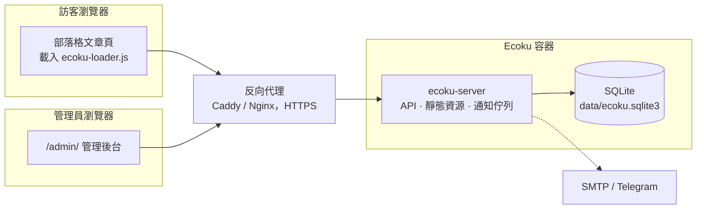

# 簡介

Ecoku 是一套自託管的評論系統，適合靜態部落格和個人網站。你在自己的伺服器上用 Docker 執行一個 Ecoku 實例，在文章範本裡加入一段 HTML，頁面上就有了評論區。

它刻意保持簡單：

- **評論只有純文字**。不解析 HTML 和 Markdown，沒有富文字編輯器。
- **送出後直接公開**。沒有審核佇列，不當的評論由管理員事後刪除。
- **訪客不用註冊**。填寫暱稱、信箱（可設為選填）和選填的網址就能發言。
- **一個實例服務多個網站**。每個網站在後台註冊為一個站點，評論和設定彼此獨立。
- **所有資料都在一個 SQLite 檔案裡**。不需要 MySQL、Redis 或其他外部服務，備份就是複製一個目錄。

## 適合誰

- 用 Hugo、Hexo、Astro、VitePress、Jekyll 等產生靜態網站，需要評論區的人。
- 想把評論資料留在自己的伺服器上，不想依賴第三方評論服務的人。
- 有好幾個網站，希望用一套服務統一管理評論的人。

## 不提供什麼

以下功能不在 Ecoku 的範圍內：

- 富文字、Markdown、圖片上傳（[Smoji 貼圖](../integration/smoji)是唯一的圖片形式）；
- 訪客帳號、第三方登入、大頭貼；
- 按讚、倒讚、表情回應；
- 評論審核佇列；
- MySQL、PostgreSQL 等其他資料庫。

如果你需要其中某一項，Ecoku 可能不適合你。

## 組成 {#components}

一個容器裡只有一個 Go 程式 `ecoku-server`，它同時負責：

- 評論 API `/api/comment/*` 和管理 API `/api/admin/*`；
- 管理後台頁面 `/admin/`；
- 嵌入部落格用的腳本和樣式 `/client/`；
- 在背景寄送電子郵件和 Telegram 通知。

容器以非 root 使用者執行，只在主機的 `127.0.0.1:12123` 上監聽，由同一台機器上的反向代理提供 HTTPS。

## 上線步驟

1. [Docker 部署](../self-hosting/docker)：準備目錄、設定檔和金鑰，啟動容器。
2. [反向代理](../self-hosting/reverse-proxy)：為 Ecoku 設定 HTTPS 網域。
3. [管理後台](../self-hosting/admin)：登入，註冊你的網站，視需要設定部落客身分。
4. [嵌入評論區](../integration/html)：在文章範本中加入接入程式碼。

之後可以視需要設定[通知](../self-hosting/notifications)、[人機驗證](../self-hosting/captcha)，或[從 Twikoo 遷移](../self-hosting/twikoo)歷史評論。

開始之前，建議先讀[運作方式](./concepts)，了解頁面 key、刪除和隱私的處理方式。
