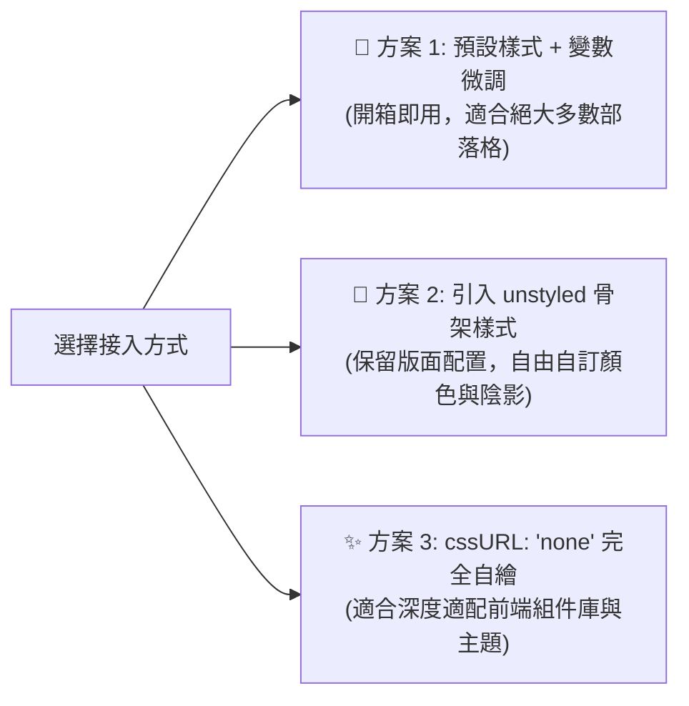

# 自訂 CSS 與 Design Tokens

Ecoku 提供了細緻的樣式覆蓋方案。您可以透過 CSS 變數微調配色，也可以使用純淨骨架樣式表打造完全自訂的評論區視覺。

---

## 三種樣式接入策略



### 1. 方案一：預設樣式 + CSS 變數微調（推薦）
保持預設 `data-css-url` 為空，在部落格全域 CSS 中宣告並覆蓋 `--ecoku-*` 變數。

### 2. 方案二：使用骨架樣式表 (`ecoku.unstyled.css`)
透過 `<link rel="stylesheet" href=".../client/ecoku.unstyled.css">` 引入，並將 `data-css-url="none"`。
骨架樣式僅包含 Flex/Grid 版面配置、盒模型與 3ch 等寬尺寸，剝離了所有背景、邊框和文字顏色。

### 3. 方案三：完全自訂 (`none`)
將 `cssURL` 設為 `'none'`，由您的站點完全定義所有 `.ecoku-*` 類別名稱的視覺規則。

---

## Design Tokens / CSS 變數

預設樣式的顏色、強調色、圓角、陰影、等寬字型和字級都由 `--ecoku-*` 變數控制。

### 覆蓋方式

- Ecoku 的預設值以零優先級宣告。在評論區根節點 `.ecoku-comments` 上寫同名變數即可覆蓋，不需要提高選擇器優先級，也不受樣式表載入順序影響。
- 顏色變數會先讀取宿主同名的 PaperMod 變數（`--theme`、`--entry`、`--primary`、`--secondary`、`--content`、`--border`、`--border-soft`、`--code-bg`、`--surface-muted`）。PaperMod 主題通常無需額外設定。
- `data-theme="auto"` 時評論區繼承宿主頁面的 `color-scheme`，因此宿主用 `light-dark()` 定義的變數會跟隨站點自己的明暗切換，而不是只跟隨系統設定。宿主沒有提供顏色變數時，Ecoku 依系統偏好使用內建的淺色或深色配色。
- `data-theme="light"` 或 `"dark"` 會固定評論區配色，不再讀取宿主顏色變數。

```css
/* 在部落格樣式中覆蓋評論區變數 */
.ecoku-comments {
  --ecoku-accent: #a8412c;        /* 部落客標誌、連結懸停、表單錯誤 */
  --ecoku-radius: 6px;            /* 發表卡片、選單、表情面板、Cap 外框 */
  --ecoku-radius-sm: 3px;         /* 選單項、表情格、Cap 核取方塊 */
  --ecoku-font-size: 15px;        /* 評論正文與輸入 */
  --ecoku-font-size-small: 13px;  /* 中繼資訊、標籤、按鈕 */
  --ecoku-font-size-title: 22px;  /* 「N 條評論」標題 */
}
```

### 變數一覽

| 變數 | 預設值 | 用途 |
| --- | --- | --- |
| `--ecoku-theme` | `var(--theme, #f7f4ee)` | 紙面底色；主按鈕文字色；Cap 核取方塊底色 |
| `--ecoku-entry` | `var(--entry, #fbf9f5)` | 發表卡片、服務故障提示、排序選單、表情面板 |
| `--ecoku-primary` | `var(--primary, #1e1c19)` | 標題、暱稱、輸入文字、實心主按鈕、聚焦底線 |
| `--ecoku-secondary` | `var(--secondary, #6b655b)` | 時間、字數、欄位標籤、文字按鈕 |
| `--ecoku-content` | `var(--content, #35312b)` | 評論正文與正文輸入 |
| `--ecoku-border` | `var(--border, #cbc3b5)` | 身分欄位底線、次要按鈕邊框、「回覆」底線 |
| `--ecoku-border-soft` | `var(--border-soft, rgb(30 28 25 / 0.12))` | 卡片描邊、討論串分隔線、子評論引導線 |
| `--ecoku-surface-muted` | `var(--surface-muted, #efebe3)` | 表情格懸停底色 |
| `--ecoku-code-bg` | `var(--code-bg, #ece7de)` | 保留給自訂樣式，預設樣式不再使用 |
| `--ecoku-accent` | 朱砂色與 `--ecoku-primary` 混合 | 部落客標誌、連結懸停；淺色下偏深、深色下偏淺 |
| `--ecoku-danger` | `var(--ecoku-accent)` | 表單錯誤與無效欄位 |
| `--ecoku-focus` | `--ecoku-primary` 的 40% | 鍵盤焦點框（1px）；設為 `transparent` 可隱藏 |
| `--ecoku-radius` | `6px` | 卡片、選單、面板和按鈕圓角 |
| `--ecoku-radius-sm` | `3px` | 選單項、表情格和核取方塊圓角 |
| `--ecoku-shadow` | 淺色雙層陰影 | 排序選單與表情面板 |
| `--ecoku-font-mono` | Maple Mono 與系統等寬字型 | 時間、`[+]`/`[-]`、字數、分頁頁碼 |
| `--ecoku-font-size` | `15px` | 正文與輸入 |
| `--ecoku-font-size-small` | `13px` | 中繼資訊、標籤、按鈕 |
| `--ecoku-font-size-title` | `22px`（窄螢幕 `20px`） | 評論數標題 |

評論區字型繼承宿主頁面；觸控裝置上的輸入框不小於 16px，避免 iOS 聚焦時放大頁面。

---

## 視覺排版規範與基準線對齊（Baseline）

為確保評論區在任何部落格宿主字型環境下都能優雅呈現，Ecoku 遵循以下排版基準：

1. **等寬折疊控制項（3ch 等寬保障）**：
   - 評論折疊按鈕 `.ecoku-collapse-button` 固定為 `3ch` 寬度，使用 `font-variant-numeric: tabular-nums`。
   - 切換展開 `[-]` 與折疊 `[+]` 時，中繼資訊列的作者暱稱、發布時間與回覆動作不發生水平抖動。
2. **基準線對齊（Baseline Alignment）**：
   - 中繼資訊列 `.ecoku-comment-meta` 採用 `display: flex; align-items: baseline;`，15px 的作者暱稱、12px 的時間戳與 13px 的底線「回覆」在同一基準線上對齊。
3. **等寬字型堆疊**：
   - 時間、折疊控制項、字數和分頁頁碼使用 `--ecoku-font-mono`（宿主已載入的 Maple Mono，否則回退系統等寬 `ui-monospace, SFMono-Regular, Menlo, monospace`）。
