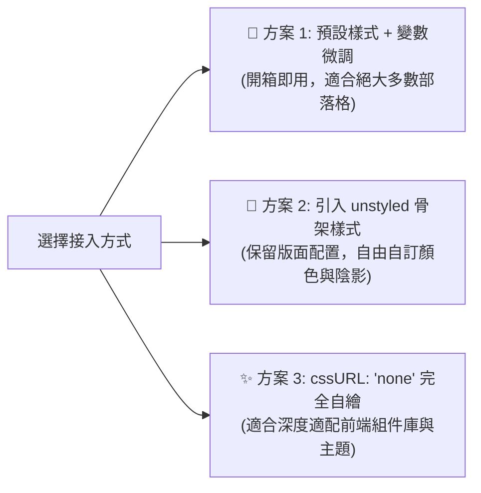

# 自訂 CSS 與 Design Tokens

Ecoku 提供了細緻的樣式覆蓋方案。您可以透過 CSS 變數微調配色，也可以使用純淨骨架樣式表打造完全自訂的評論區視覺。

---

## 三種樣式接入策略



### 1. 方案一：預設樣式 + CSS 變數微調（推薦）
保持預設 `data-css-url` 為空，在部落格全域 CSS 中宣告並覆蓋 `--ecoku-*` 變數。

### 2. 方案二：使用骨架樣式表 (`ecoku.unstyled.css`)
透過 `<link rel="stylesheet" href=".../client/ecoku.unstyled.css">` 引入，並將 `data-css-url="none"`。
骨架樣式僅包含 Flex/Grid 版面配置、盒模型與 3ch 等寬尺寸，剝離了所有背景、邊框和文字顏色。

### 3. 方案三：完全自訂 (`none`)
將 `cssURL` 設為 `'none'`，由您的站點完全定義所有 `.ecoku-*` 類別名稱的視覺規則。

---

## 核心 Design Tokens / CSS 變數全清單

Ecoku 所有的視覺屬性均透過標準 CSS 自訂屬性驅動。

> [!TIP]
> **覆蓋作用域建議**：
> - 若使用 Hugo PaperMod 等主題，可在 `:root` 直接宣告 `--theme`、`--primary`、`--border` 等主題通用變數，Ecoku 會自動繼承回退。
> - 若需針對評論區單獨自訂，建議在 `.ecoku-comments` 作用域上覆蓋專屬的 `--ecoku-*` 變數。

```css
/* 精確針對評論區容器進行視覺自訂 */
.ecoku-comments {
  /* 基礎背景色體系 */
  --ecoku-theme: rgb(250, 249, 245);          /* 評論區最底層背景色 / 身分輸入框底色 */
  --ecoku-entry: rgb(252, 251, 247);          /* 發表卡片背景色 / 按鈕預設背景色 */
  --ecoku-code-bg: rgb(243, 239, 231);        /* 按鈕 hover 啟用底色 / 次級標籤背景 */
  --ecoku-surface-muted: rgba(243, 239, 231, 0.72); /* 預覽區背景 / 選單 hover 底色 */

  /* 文字顏色體系 */
  --ecoku-primary: rgb(20, 20, 19);           /* 主文字色 / 標題 / 重點邊框 */
  --ecoku-secondary: rgb(96, 91, 82);         /* 次要文字色（時間、字數、折疊提示） */
  --ecoku-content: rgb(58, 54, 44);           /* 評論內文顏色 / 輸入框輸入文字色 */

  /* 邊框體系 */
  --ecoku-border: rgb(150, 143, 132);         /* 強實體邊框 / 按鈕 hover 邊框 */
  --ecoku-border-soft: rgba(20, 20, 19, 0.14);/* 淺色分割線 / 卡片描邊 / 輸入框邊框 */

  /* 互動焦點（預設基於 primary 動態混合: color-mix(in srgb, var(--ecoku-primary) 72%, #2f73ff)） */
  --ecoku-focus: #2f73ff;                     /* 輸入框與按鈕 focus 輪廓高亮色 */
}

/* 暗色模式自適應覆蓋 */
@media (prefers-color-scheme: dark) {
  .ecoku-comments {
    --ecoku-theme: rgb(26, 29, 32);
    --ecoku-entry: rgb(34, 38, 42);
    --ecoku-code-bg: rgb(44, 48, 53);
    --ecoku-surface-muted: rgba(48, 53, 58, 0.88);

    --ecoku-primary: rgb(242, 236, 226);
    --ecoku-secondary: rgb(188, 181, 169);
    --ecoku-content: rgb(216, 209, 197);

    --ecoku-border: rgb(109, 114, 120);
    --ecoku-border-soft: rgba(242, 236, 226, 0.14);
    --ecoku-focus: #3b82f6;
  }
}
```

---

## 視覺排版規範與基準線對齊（Baseline）

為保障評論區在任何部落格宿主字型環境下均能優雅呈現，Ecoku 嚴格遵循以下排版基準線：

1. **等寬折疊控制項（3ch 等寬保障）**：
   - 評論折疊按鈕 `.ecoku-collapse-button` 嚴格固定為 `3ch` 寬度，使用 `font-variant-numeric: tabular-nums`。
   - 切換展開 `[-]` 與折疊 `[+]` 時，元資訊行的作者暱稱、發布時間與回覆動作**絕對不發生水平抖動**。
2. **基準線對齊（Baseline Alignment）**：
   - 元資訊行 `.ecoku-comment-meta` 採用 `display: flex; align-items: baseline;`，確保 14px 的作者暱稱、12px 的時間戳記與底線「回覆」文字動作在同一基準水平線上對齊。
3. **等寬時間字型棧**：
   - 時間展示優先採用等寬字型（宿主載入的 Maple Mono，否則回退系統等寬 `ui-monospace, SFMono-Regular, Menlo, monospace`）。
