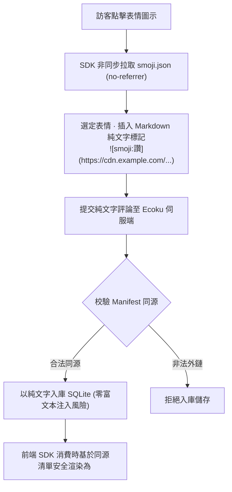

# Smoji 貼圖包協議與自建源

Smoji 是 Ecoku 採用的**純文字輕量級貼圖包協議**。

它兼顧了豐富的表情交流體驗與純文字安全邊界：表情在資料庫與伺服端中僅以純文字格式儲存，客戶端在保證同源安全的前提下按需渲染。

---

## 協議工作流程



---

## `smoji.json` 清單 Schema 規範 (v1)

自建表情源需在可存取的 URL 提供一個符合 JSON Schema 規範的 `smoji.json` 檔案：

```json
{
  "version": 1,
  "packs": [
    {
      "id": "paopao",
      "label": "泡泡貼圖",
      "items": [
        {
          "id": "smile",
          "label": "微笑",
          "src": "https://stickers.example.com/paopao/smile.png"
        },
        {
          "id": "thumbsup",
          "label": "讚",
          "src": "https://stickers.example.com/paopao/thumbsup.png"
        }
      ]
    }
  ]
}
```

### 欄位約束與技術規範

- `version`：必須為整數 `1`。
- `packs`：表情包分組陣列（1～64 組）。
- `packs[].id`：分組唯一識別碼（匹配正規表示式 `/^[A-Za-z0-9][A-Za-z0-9._-]{0,63}$/`）。
- `packs[].label`：分組顯示名稱（去除首尾空白後最多 40 個字元）。
- `packs[].items`：表情項列表（每組 1～600 項，全清單總表情數不超過 6000 個）。
- `items[].id`：表情項唯一識別碼（匹配正規表示式 `/^[A-Za-z0-9][A-Za-z0-9._-]{0,63}$/`）。
- `items[].label`：表情顯示文字（去除首尾空白後 1～40 個字元，禁止 `]` 與換行，用於 Markdown alt 與插入標記）。
- `items[].src`：表情圖片位址（支援同源絕對直鏈，或基於 `smoji.json` 的相對路徑，不得帶使用者名稱、密碼、查詢參數或片段）。
- **嚴格白名單（Exact Keys）**：JSON 結構嚴格匹配上述鍵集合，出現任何未定義冗餘欄位將直接拒絕解析。
- **體積與拉取約束**：清單檔案大小上限為 **1 MiB**，網路拉取逾時為 8 秒。
- **嚴格同源約束**：圖片 `src` 的 Origin **必須與 `smoji.json` 自身的 Origin 嚴格保持一致**，生產環境必須使用 `https://` 協定。

---

## 純文字標記格式

- **標記語法**：``
- **範例**：``

### 安全降級規則
若評論本文中包含了與目前站點已配置清單不同源的圖片標記，或者站點關閉了 Smoji 功能，客戶端在渲染時會自動將其原樣作為純文字顯示，絕對不會解釋為 HTML 圖片標籤，杜絕跨站 IP 追蹤與釣魚攻擊。

---

## 配置與素材更新

在評論或回覆框中點擊「表情」即可開啟選擇器。面板在表單底欄上方向右對齊，窄螢幕時會隨表單縮窄；預設樣式和無主題樣式均採用這個版面配置。

在後台站點設定中啟用 Smoji，填寫清單 URL。清單與圖片位址不得帶使用者名稱、密碼、查詢參數或片段；HTTP 僅用於回環開發位址。跨來源託管清單時，資源伺服器需允許評論頁面來源的 CORS 請求。

Smoji 工作台匯出的「Ecoku 回應範例」呈現公開介面的 `formConfig.smoji`，不是後台可匯入的設定檔。後台表單內部使用 `smojiEnabled` / `smojiManifestUrl`；管理 API 請求欄位為 `smoji_enabled` / `smoji_manifest_url`。

評論儲存完整圖片 URL。更新素材時保留原有網域名稱和舊圖片路徑；使用 Smoji 工作台建置發布時部署包含舊路徑相容副本的完整 `demo/dist`。單獨替換清單不會修復歷史評論中的失效位址。若改用其他 Origin，舊標記會按純文字顯示。

## 精簡清單（v0.2.1）

```json
{"version":1,"base":"https://s3-cdn.zsh.moe/smoji/{pack}/{id}.webp","packs":[{"id":"douyin-current","label":"抖音","items":[{"id":"fehpikklicec","label":"微笑"}]}]}
```

可選的 `base` URL 模板須包含 `{pack}` 與 `{id}`，分別替換為分組與項目 ID。省略 `src` 時使用模板；自選分組或其他副檔名可保留 `src` 覆蓋。解析結果仍是完整 URL，評論儲存格式不變。舊版逐項 `src` 清單仍受支援，未知欄位仍會被拒絕。

圖片展開後仍須與清單同源，禁止憑據、query 與 fragment。正式清單不要包含 localhost 圖片 URL；Smoji 工作台本地匯出使用設定的 CDN `https://s3-cdn.zsh.moe/smoji/`。Content-Type 須為 `application/json` 或 `+json` 類型，容量按 UTF-8 位元組計算，8 秒逾時包含本文讀取。

v0.2.0 不支援 `base`，上限仍為 32 包、每包 300 項、共 2000 項與 256 KiB。舊版請匯出容量內的逐項 `src` 子集，升級後再改用精簡清單。清單與圖片都須發布到 CDN；替換 JSON 不會部署程式或修復歷史評論 URL。
