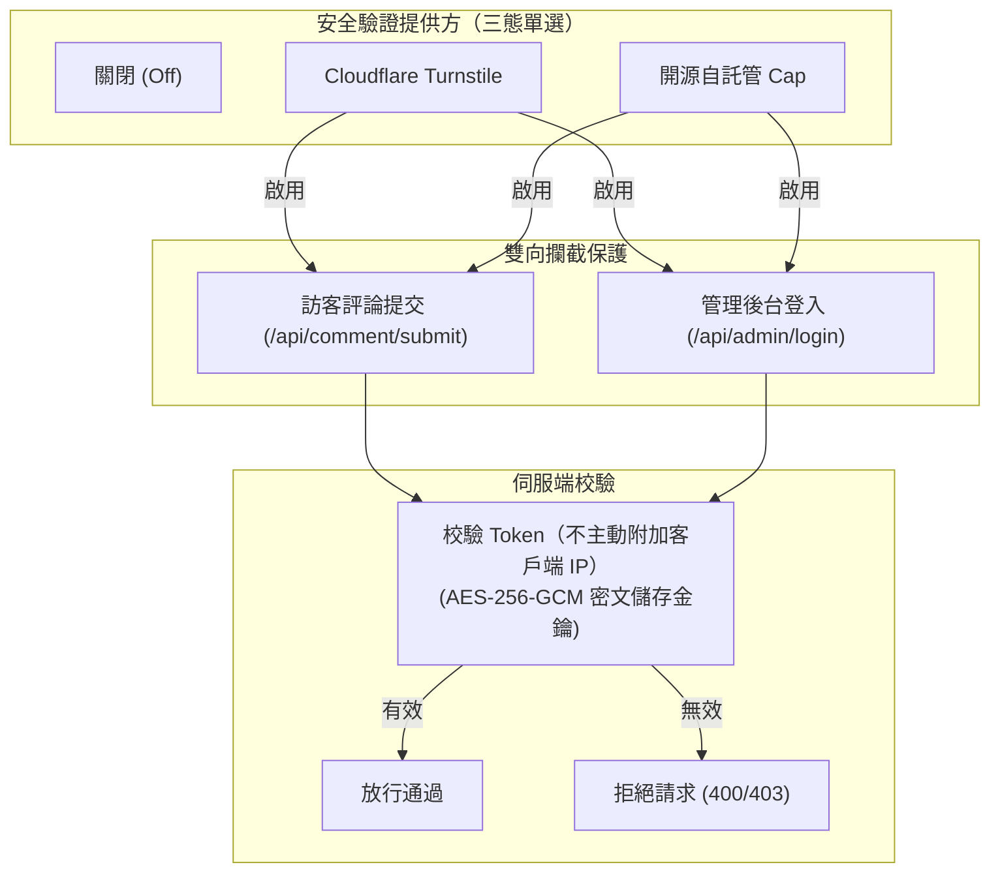

# 後台管理配置

管理後台位於實例的 `/admin/` 路徑。

---

## 1. 可撤銷管理員會話

管理員會話使用 HttpOnly Cookie；SQLite 僅保存憑證摘要與到期時間。登入後固定 8 小時，重新整理或關閉重開可恢復有效會話，不延長期限。主動登出由服務端撤銷目前會話；登出失敗保留目前畫面並提示重試。憑證不進入 JavaScript、localStorage、sessionStorage 或 URL。

正式環境使用 HTTPS、Secure、HttpOnly、SameSite=Strict、host-only Cookie，路徑為 `/api/admin`。只有明確允許的回環 HTTP 開發來源可省略 Secure。輪換管理員密碼雜湊或簽名金鑰並重啟後，舊會話失效。

---

## 2. 站點管理
- **站點 ID**：唯一識別碼，建立後永久唯讀。
- **規範站點 URL**：產生原文連結的基礎 URL。
- **允許來源 (Allowed Origins)**：精確的 CORS 白名單。
- **表單必填項**：獨立設定信箱與網站是否必填。
- **Smoji 貼圖**：支援配置遠端 HTTPS `smoji.json` 清單。

---

## 3. 站長身分與口令（Passphrase）
- 設定站長暱稱、私有信箱與 12～80 字元的站長口令。
- 前台評論時，站長只需在暱稱框輸入口令，即可免密完成身分認證。

儲存、首次設定或輪換口令不回填歷史博主標記；僅原 schema v5 遷移與首次 Twikoo 匯入保留回填。

---

## 4. 評論治理
- **墓碑軟刪除**：抹除個人資訊並保留結構，顯示 `[该评论已删除]`。
- **徹底清除**：僅在墓碑沒有任何子回覆時允許物理刪除。

---

## 5. 安全與人機驗證（Captcha） {#人機驗證}

在「安全」視圖中，可為整個實例配置統一生效的機器人驗證（三態單選切換），同時保護**訪客評論提交**與**管理後台登入**：



> [!NOTE]
> Turnstile 與 Cap 的 Secret Key 均使用實例主金鑰以 AES-256-GCM 密文儲存，管理後台介面永不回顯明文。切換或關閉提供方時，已儲存的金鑰配置不會遺失。

### 1. Cloudflare Turnstile

[Cloudflare Turnstile 官方文件](https://developers.cloudflare.com/turnstile/)

- 前往 Cloudflare 儀表板建立 Turnstile Widget（推薦託管模式 Managed 或非互動式 Non-interactive）。
- 在 **Domains** 網域允許清單中，新增部落格前端網域（如 `blog.example.com`）與 Ecoku 服務端網域（如 `ecoku.example.com`）。
- 複製產生的 `Site Key` 與 `Secret Key`，在 Ecoku 管理後台「安全」頁面中選擇 Turnstile 並填入儲存。
- 評論區與後台登入頁將自動渲染 300px 緊湊無感驗證槽位。

### 2. 開源自託管 Cap (Capjs)

[Cap (Capjs) 官方網站](https://capjs.org/) · [GitHub 倉庫](https://github.com/tiago2/cap)

Cap 是一款現代、輕量、注重隱私且完全開源的自託管驗證碼服務。Ecoku 深度支援 Cap，並根據安全模式動態收斂管理端 CSP 策略（精確放行 Cap Origin、WASM、Blob Worker 與必要的 eval 權限）。

#### Cap 自託管部署參考

假設部署在宿主機 `~/capjs` 目錄下，使用 Valkey 作為高速快取後端：

```bash
# 1. 建立 Cap 與 Valkey 資料目錄
mkdir -p ~/capjs/data/cap ~/capjs/data/valkey && cd ~/capjs

# 2. 配置 Valkey 運行權限（UID/GID 999:1000）
sudo chown -R 999:1000 data/valkey
chmod 750 data/cap data/valkey
```

使用 `cat <<'EOF'` 寫入 `~/capjs/compose.yml`（固定安全穩定版本）：

```bash
cd ~/capjs

cat <<'EOF' > compose.yml
services:
  cap:
    image: tiago2/cap:3.1.8
    restart: unless-stopped
    init: true
    stop_grace_period: 30s
    depends_on:
      valkey:
        condition: service_healthy
    ports:
      - "127.0.0.1:3000:3000"
    environment:
      ADMIN_KEY: ${ADMIN_KEY:?ADMIN_KEY is required}
      REDIS_URL: redis://valkey:6379
      SERVER_PORT: "3000"
      CORS_ORIGIN: ${CORS_ORIGIN:?CORS_ORIGIN is required}
      ENABLE_ASSETS_SERVER: "true"
      WIDGET_VERSION: ${WIDGET_VERSION:?WIDGET_VERSION is required}
      WASM_VERSION: ${WASM_VERSION:?WASM_VERSION is required}
    volumes:
      - ./data/cap:/usr/src/app/data
    networks:
      - public
      - data
    read_only: true
    cap_drop:
      - ALL
    security_opt:
      - no-new-privileges:true
    tmpfs:
      - /tmp:rw,noexec,nosuid,nodev,size=64m
    healthcheck:
      test:
        - CMD
        - bun
        - -e
        - "fetch('http://127.0.0.1:3000/').then(r=>process.exit(r.ok?0:1)).catch(()=>process.exit(1))"
      interval: 30s
      timeout: 5s
      retries: 5
      start_period: 20s

  valkey:
    image: valkey/valkey:9.1.1-alpine
    restart: unless-stopped
    stop_grace_period: 30s
    user: "${VALKEY_UID:?VALKEY_UID is required}:${VALKEY_GID:?VALKEY_GID is required}"
    command:
      - valkey-server
      - --save
      - "60"
      - "1"
      - --appendonly
      - "yes"
      - --appendfsync
      - everysec
      - --loglevel
      - warning
      - --maxmemory-policy
      - noeviction
    volumes:
      - ./data/valkey:/data
    networks:
      - data
    read_only: true
    cap_drop:
      - ALL
    security_opt:
      - no-new-privileges:true
    tmpfs:
      - /tmp:rw,noexec,nosuid,nodev,size=32m
    healthcheck:
      test:
        - CMD
        - valkey-cli
        - ping
      interval: 5s
      timeout: 3s
      retries: 10
      start_period: 5s

networks:
  public:
  data:
    internal: true
EOF
```

使用 `cat <<'EOF'` 寫入 `~/capjs/.env` 環境變數：

```bash
cd ~/capjs

cat <<'EOF' > .env
CAP_IMAGE=tiago2/cap:3.1.8
VALKEY_IMAGE=valkey/valkey:9.1.1-alpine

# Cap 管理控制台存取金鑰（建議使用 openssl rand -hex 32 產生）
ADMIN_KEY=your_secure_admin_key_here

# 允許跨域呼叫的 Origin（包含部落格前台與 Ecoku 評論服務網域）
CORS_ORIGIN=https://blog.example.com,https://ecoku.example.com

# 靜態 Widget 與 WASM 資源版本鎖定
WIDGET_VERSION=0.1.56
WASM_VERSION=0.0.7

# Valkey 容器使用者權限
VALKEY_UID=999
VALKEY_GID=1000
EOF

chmod 600 .env
```

#### Cap 反向代理範例 (Caddy)

Cap 容器監聽在本地 `127.0.0.1:3000`，透過 Caddy 暴露 HTTPS（例如網域 `cap.example.com`）：

```caddyfile
cap.example.com {
    reverse_proxy 127.0.0.1:3000
}
```

#### 對接到 Ecoku 後台

1. 啟動 Cap 服務：`cd ~/capjs && sudo docker compose pull && sudo docker compose up -d`。
2. 瀏覽器開啟 `https://cap.example.com`，輸入 `.env` 中的 `ADMIN_KEY` 登入 Cap 控制台。
3. 建立新 Key，將前台部落格網域（如 `blog.example.com`）與 Ecoku 網域（如 `ecoku.example.com`）加入允許 Host 清單。
4. 取得該 Key 的 `Site Key` 與 `Secret Key`。
5. 開啟 Ecoku 管理後台 `/admin/` ->「安全」：
   - 選擇 **開源自託管 Cap**
   - **實例位址**：`https://cap.example.com`（必須為 HTTPS 規範 URL，結尾不帶斜線）
   - **Site Key**：填入 Cap 產生的 Site Key
   - **Secret Key**：填入 Cap 產生的 Secret Key
6. 點擊「儲存設定」，系統即可無縫切換為 Cap 驗證碼防護。

---

## 6. CLI 救磚命令

```bash
sudo docker compose down
sudo docker compose run --rm --no-deps ecoku captcha disable
sudo docker compose up -d
```


UTF-8 編碼同時不得超過 72 位元組，不截斷口令，既有 bcrypt 雜湊仍有效。
