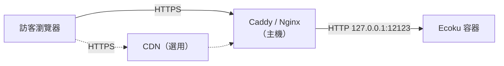

# 反向代理

Ecoku 容器只在主機的 `127.0.0.1:12123` 上提供 HTTP。要從公開網路存取，需要由同一台主機上的 Caddy 或 Nginx 終止 HTTPS，再轉送到這個連接埠。

本頁要完成兩件事：

1. 設定 HTTPS 轉送，讓 `https://ecoku.example.com` 可以存取；
2. 讓 Ecoku 辨識訪客的真實 IP，使速率限制依個人計算，而不是所有訪客共用同一份額度。

## 請求經過的路徑



反向代理連到 `127.0.0.1:12123` 時，Docker 會把連線轉交給容器。容器看到的對端位址不是訪客，而是 Docker 橋接網路的閘道（通常形如 `172.18.0.1`）。因此訪客的真實 IP 只能由反向代理寫進 `X-Forwarded-For` 請求標頭傳過去，而 Ecoku 只有在確認請求確實來自這個閘道時才會讀取它。

## 直接回源

### Caddy

Caddy 會自動申請和續期憑證。

```caddyfile
ecoku.example.com {
    encode zstd gzip

    reverse_proxy 127.0.0.1:12123 {
        # 以直連對端位址覆寫，捨棄瀏覽器自帶的 X-Forwarded-For
        header_up X-Forwarded-For {remote_host}
        header_up X-Forwarded-Proto {scheme}
    }
}
```

### Nginx

憑證路徑以 Certbot 的預設位置為例。

```nginx
server {
    listen 443 ssl;
    listen [::]:443 ssl;
    http2 on;
    server_name ecoku.example.com;

    ssl_certificate     /etc/letsencrypt/live/ecoku.example.com/fullchain.pem;
    ssl_certificate_key /etc/letsencrypt/live/ecoku.example.com/privkey.pem;

    gzip on;
    gzip_types text/plain text/css application/json application/javascript;

    location / {
        proxy_pass http://127.0.0.1:12123;
        proxy_set_header Host $host;
        # 覆寫而不是附加：$remote_addr 是目前的 TCP 對端
        proxy_set_header X-Forwarded-For $remote_addr;
        proxy_set_header X-Forwarded-Proto $scheme;
    }
}
```

兩份設定的關鍵都是**覆寫** `X-Forwarded-For`。如果改成附加（例如 Nginx 的 `$proxy_add_x_forwarded_for`），瀏覽器就可以自己帶一個偽造的值，繞過速率限制。

## 經過 CDN 回源

網域接上 Cloudflare 等 CDN 後，反向代理的直連對端就變成 CDN 節點。這時要從 CDN 提供的請求標頭取得訪客 IP。以 Cloudflare 和 Caddy 為例：

```caddyfile
ecoku.example.com {
    encode zstd gzip

    reverse_proxy 127.0.0.1:12123 {
        header_up X-Forwarded-For {http.request.header.CF-Connecting-IP}
        header_up X-Forwarded-Proto {scheme}
    }
}
```

`CF-Connecting-IP` 只有在請求確實經過 Cloudflare 時才可信。請在防火牆或 Caddy 中只放行 Cloudflare 的 IP 範圍，避免有人直連來源伺服器並自行填入這個請求標頭。

Ecoku 這一端的設定不變：`trusted_proxies` 仍然只填 Docker 閘道，不要把 CDN 的網段填進去。

## 設定 trusted_proxies {#trusted-proxies}

`app/config.yaml` 中的 `site.trusted_proxies` 決定 Ecoku 信任誰轉送的 `X-Forwarded-For`：

- **留空（預設）**：不讀取任何轉送標頭，一律依容器看到的對端位址進行速率限制。放在反向代理後面時，這個位址就是 Docker 閘道，於是所有訪客共用同一份速率限制額度。預設每分鐘只允許 5 次評論送出，流量稍大就會有人收到 `429`。
- **填入 Docker 閘道**：只有直連對端正好是閘道時，才從 `X-Forwarded-For` 取得訪客 IP。

查出 Ecoku 所在網路的閘道：

```bash
sudo docker inspect ecoku --format '{{range .NetworkSettings.Networks}}{{.Gateway}}{{"\n"}}{{end}}'
```

假設輸出為 `172.18.0.1`，把它寫進設定：

```yaml
site:
  trusted_proxies:
    - "172.18.0.1/32"
```

然後重新啟動容器：

```bash
cd ~/Ecoku && sudo docker compose up -d --force-recreate ecoku
```

::: danger
不要填 `0.0.0.0/0` 或 `::/0`，Ecoku 會拒絕啟動。信任任意來源等於允許任何人偽造 IP。
:::

## 檢查

在任何一台能連上網路的機器上執行：

```bash
for path in /api/health /client/ecoku-loader.js /admin/; do
  curl -sS -o /dev/null -w "%{http_code} $path\n" "https://ecoku.example.com$path"
done
```

三行都應以 `200` 開頭。健康檢查端點可以對公開網路開放，它只回傳狀態和時間戳記。

確認無誤後，開啟 `https://ecoku.example.com/admin/` 繼續[設定管理後台](./admin)。
