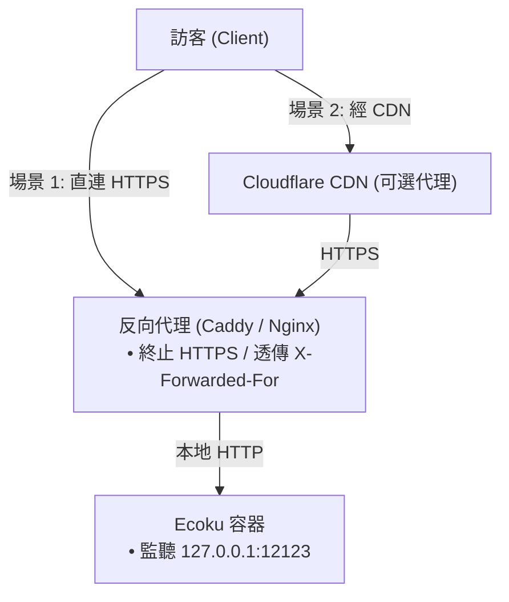

# 反向代理與網路限流

Ecoku 容器預設僅在 `127.0.0.1:12123` 監聽。在生產環境中，必須透過前端 Web 伺服器終止 HTTPS。

---

## 網路拓撲模型



---

## Caddy 設定（推薦）

```caddyfile
ecoku.example.com {
    encode zstd gzip

    reverse_proxy 127.0.0.1:12123 {
        header_up X-Forwarded-For {remote_host}
        header_up X-Forwarded-Proto {scheme}
    }
}
```

---

## Nginx 設定

```nginx
server {
    listen 443 ssl http2;
    server_name ecoku.example.com;

    ssl_certificate /etc/letsencrypt/live/ecoku.example.com/fullchain.pem;
    ssl_certificate_key /etc/letsencrypt/live/ecoku.example.com/privkey.pem;

    location / {
        proxy_pass http://127.0.0.1:12123;
        proxy_set_header Host $host;
        proxy_set_header X-Forwarded-For $remote_addr;
        proxy_set_header X-Forwarded-Proto $scheme;
    }
}
```

---

## `trusted_proxies` 設定

在 `app/config.yaml` 中填入 Docker 容器網關（例如 `172.18.0.1/32`），讓 Ecoku 能夠信任反代傳入的 `X-Forwarded-For`。
