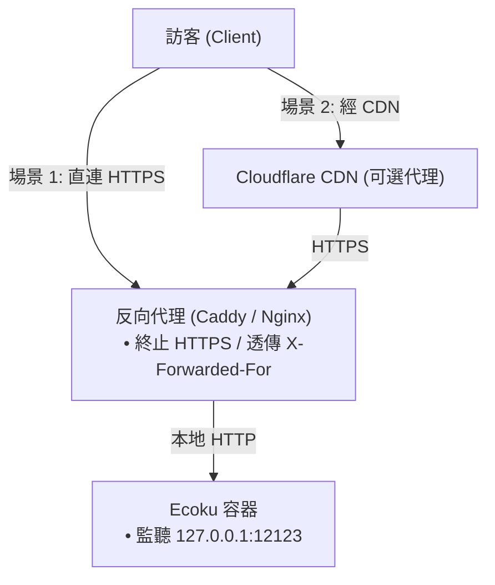

# 反向代理與網路限流

Ecoku 容器預設僅在宿主機本地回環 `127.0.0.1:12123` 監聽 HTTP 請求。在生產環境中，必須透過前端 Web 伺服器（如 Caddy 或 Nginx）終止 HTTPS，並將流量反向代理到容器連接埠。

---

## 網路拓撲模型



---

## 場景 1：直連來源站反向代理

### Caddy 設定（推薦）

Caddy 具備自動憑證申請與維護能力，設定最為精簡：

```caddyfile
ecoku.example.com {
    encode zstd gzip

    reverse_proxy 127.0.0.1:12123 {
        # 強制覆蓋 X-Forwarded-For 為對端直連 IP，防止客戶端偽造 Header 欺騙限流
        header_up X-Forwarded-For {remote_host}
        header_up X-Forwarded-Proto {scheme}
    }
}
```

### Nginx 設定

```nginx
server {
    listen 443 ssl http2;
    server_name ecoku.example.com;

    ssl_certificate /etc/letsencrypt/live/ecoku.example.com/fullchain.pem;
    ssl_certificate_key /etc/letsencrypt/live/ecoku.example.com/privkey.pem;

    # 啟用 Gzip 壓縮
    gzip on;
    gzip_types text/plain text/css application/json application/javascript;

    location / {
        proxy_pass http://127.0.0.1:12123;
        proxy_set_header Host $host;
        # 覆蓋 X-Forwarded-For 為目前直接 TCP 對端 IP
        proxy_set_header X-Forwarded-For $remote_addr;
        proxy_set_header X-Forwarded-Proto $scheme;
    }
}
```

---

## 場景 2：經 CDN（如 Cloudflare）反向代理

當網域名稱透過 Cloudflare CDN 代理時，直接對端是 CDN 節點。必須設定反向代理將 CDN 注入的真實客戶端 IP 寫入 `X-Forwarded-For`。

### Cloudflare + Caddy 設定

```caddyfile
ecoku.example.com {
    encode zstd gzip

    reverse_proxy 127.0.0.1:12123 {
        # 將 Cloudflare 鑑權後的訪客真實 IP 覆蓋寫入 X-Forwarded-For
        header_up X-Forwarded-For {http.request.header.CF-Connecting-IP}
        header_up X-Forwarded-Proto {scheme}
    }
}
```

> [!WARNING]
> - 開啟 CDN 時，來源站防火牆應嚴格限制僅放行 Cloudflare 官方 IP 區段，禁止透過公網 IP 繞過 CDN 直接回源。
> - 在 Ecoku 的 `trusted_proxies` 設定中，**仍舊只填寫 Docker 網關 IP**，絕不能將整個 CDN 龐大的網段填入 `trusted_proxies`。

---

## 客戶端 IP 判定與 `trusted_proxies`

Ecoku 內建嚴格的防偽造保護機制：

1. **預設不信任**：若 `trusted_proxies` 為空（`[]`），Ecoku 預設不解析任何 `X-Forwarded-For` 請求標頭，所有請求均按 TCP Socket 對端 IP（通常為反向代理網關 IP）處理。此時所有訪客共用一個限流桶。
2. **精確信任**：只有當 TCP 直接連線對端**精確匹配** `trusted_proxies` 中宣告的單一 IP 或 CIDR 時，Ecoku 才會從 `X-Forwarded-For` 讀取真實客戶端 IP 進行獨立限流。

### 查詢 Docker 網關 IP

執行以下指令取得目前容器所在的 Docker 橋接網路網關：

```bash
sudo docker inspect ecoku --format '{{range .NetworkSettings.Networks}}{{.Gateway}}{{"\n"}}{{end}}'
```

例如輸出為 `172.18.0.1`，則在 `app/config.yaml` 中設定：

```yaml
site:
  trusted_proxies:
    - "172.18.0.1/32"
```

> [!CAUTION]
> 絕對禁止在 `trusted_proxies` 中設定 `0.0.0.0/0` 或 `::/0`，否則任何外部請求均可透過偽造 `X-Forwarded-For` 繞過限流。

---

## 連通性測試

```bash
# 驗證反向代理健康檢查端點
curl -i https://ecoku.example.com/api/health

# 驗證前端靜態載入器腳本可存取
curl -i https://ecoku.example.com/client/ecoku-loader.js

# 驗證管理後台入口
curl -i https://ecoku.example.com/admin/
```
